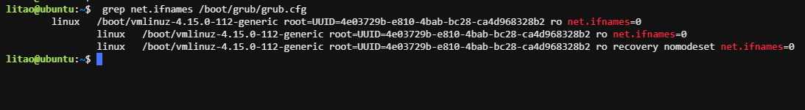

# 网卡名称

​默认ubuntu的网卡名称和 CentOS 7 类似，如：ens33，ens38等

修改网卡名称为传统命名方式

```bash
litao@ubuntu:~$ sudo vim /etc/default/grub
GRUB_CMDLINE_LINUX="net.ifnames=0"

litao@ubuntu:~$ sudo update-grub
```



```bash
最后需要重启生效
litao@ubuntu:~$ sudo rboot
```

Centos8设置

```plsql
[root@centos8 ~]# vi /etc/default/grub
GRUB_CMDLINE_LINUX="net.ifnames=0 biosdevname=0"

2. 为grub2生成其配置文件
在UEFI启动模式的系统上:
grub2-mkconfig -o /boot/efi/EFI/redhat/grub.cfg

在legacy启动模式的系统上：
grub2-mkconfig -o /boot/grub2/grub.cfg
grub2-mkconfig -o /etc/grub2.cfg

3. 重启系统
reboot 
```

# Ubuntu网卡配置

## 配置静态IP

```yaml
litao@ubuntu:~$ vim /etc/netplan/01-netcfg.yaml
network:
  version: 2
  renderer: networkd
  ethernets:
    eth0:
      addresses:
        - 172.31.4.2/16
      gateway4: 172.31.6.1
      nameservers:
        addresses: [223.5.5.5, 223.6.6.6]
```

配置生效

```xml
netplan apply
```