# 进程和内存管理

内核功能：进程管理、内存管理、文件系统、网络功能、驱动程序、安全功能等

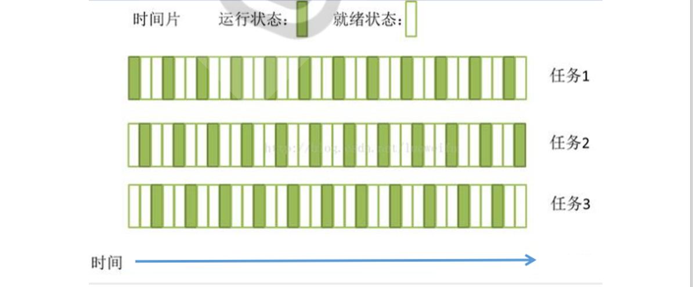

CPU时间切片，可以1秒切100个时间片，每个时间片处理不同任务，感官上是同时处理。

## 什么是进程

Process（进程）: 从硬盘读取程序的副本；被载入内存的一个指令集合，是资源分配的单位

-   进程ID（PID）号码被用来标记各个进程
-   UID、GID、和SELinux语境决定对文件系统的存取和访问权限
-   通常从执行进程的用户来继承
-   存在生命周期

进程创建

-   init：第一个进程，从 CentOS7 以后为systemd
-   进程：都由其父进程创建，fork()，父子关系。

**进程和线程由系统调度；** **协程是由程序员显式地管理的轻量级线程**

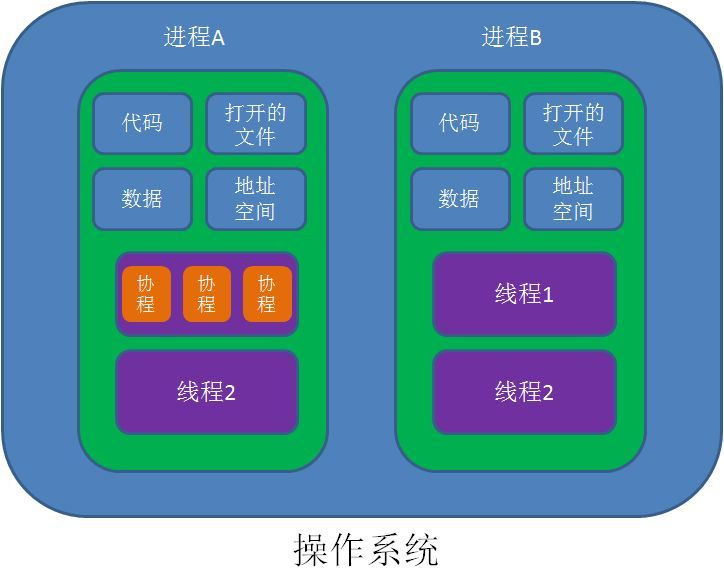

查看进程中的线程：

```yaml
cat /proc/PID/status |grep -i  threads
```


这里的mqnamesrv(2491) 2491是mqnamesrv程序的进程，PID是2491。

{java}(2496) 这里的{java}是mqnamesrv下的一个线程，线程通常用 {线程}去表示。

## 进程状态

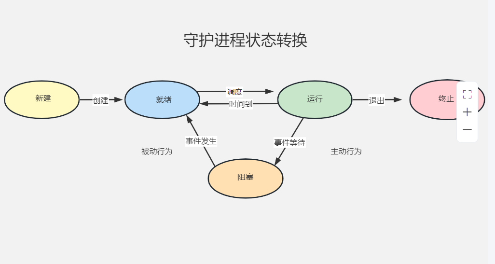

-   创建状态：进程在创建时需要申请一个空白PCB(process control block进程控制块)，向其中填写控制和管理进程的信息，完成资源分配。如果创建工作无法完成，比如资源无法满足，就无法被调度运行，把此时进程所处状态称为创建状态
-   就绪状态：进程已准备好，已分配到所需资源，只要分配到CPU就能够立即运行
-   执行状态：进程处于就绪状态被调度后，进程进入执行状态
-   阻塞状态：正在执行的进程由于某些事件（I/O请求，申请缓存区失败）而暂时无法运行，进程受 到阻塞。在满足请求时进入就绪状态等待系统调用
-   终止状态：进程结束，或出现错误，或被系统终止，进入终止状态。无法再执行

**状态之间转换六种情况**

-   **运行——>就绪** 1，主要是进程占用CPU的时间过长，而系统分配给该进程占用CPU的时间是有限的； 2，在采用抢先式优先级调度算法的系统中,当有更高优先级的进程要运行时，该进程就被迫让出CPU， 该进程便由执行状态转变为就绪状态 。
-   **就绪——>运行：**运行的进程的时间片用完，调度就转到就绪队列中选择合适的进程分配CPU 。
-   **运行——>阻塞：**正在执行的进程因发生某等待事件而无法执行，则进程由执行状态变为阻塞状态，如 发生了I/O请求 。
-   **阻塞——>就绪:**进程所等待的事件已经发生，就进入就绪队列

**以下两种状态是不可能发生的：**

-   阻塞——>运行：即使给阻塞进程分配CPU，也无法执行，操作系统在进行调度时不会从阻塞队列进行 挑选，而是从就绪队列中选取
-   就绪——>阻塞：就绪态根本就没有执行，谈不上进入阻塞态

**进程更多的状态：**

-   **运行态：running**
-   **就绪态：ready**
-   **睡眠态：分为两种，可中断：interruptable，不可中断：uninterruptable**
-   **停止态：stopped，暂停于内存，但不会被调度，除非手动启动**
-   **僵死态：zombie，僵尸态，结束进程，父进程结束前，子进程不关闭，杀死父进程可以关闭僵死 态 的子进程**

## 进程间通信

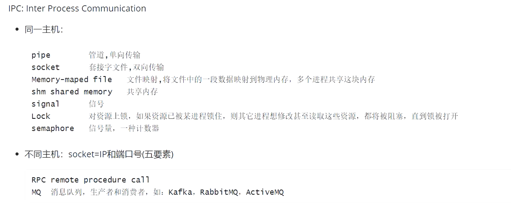

类型为P的管道文件可以进行通信，单向，socket可以双向

### **进程优先级**


程序使用的都是非实时进程的优先级；使用nice设置优先级的话从 -20到19，对应100-139.

## **程序/proc/[PID]路径**

-   **exe**：这是一个符号链接，指向进程的可执行文件。通过读取这个符号链接，你可以找到进程正在运行的可执行文件的路径。
-   **cwd**：同样是一个符号链接，指向当前工作目录。这个链接会显示进程当前正在工作的目录路径。

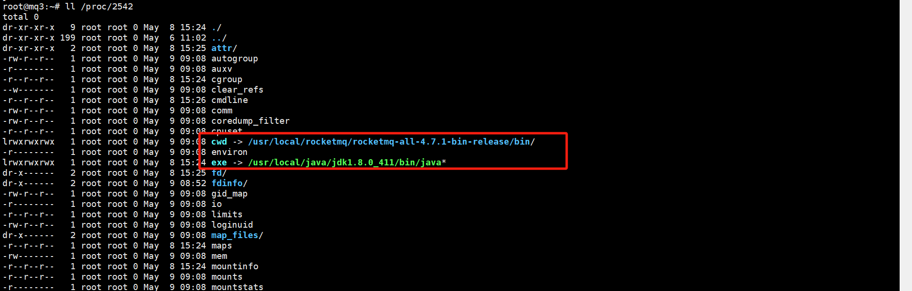

# **进程管理**

## **进程树 pstree**

```plsql
pstree   [OPTION] [ PID | USER ]      显示进程的父子关系，以树形结构显示
-p 显示PID
-T 不显示线程thread,默认显示线程
-u 显示用户切换
-H pid 高亮指定进程及其前辈进程

注意： {    }是线程，（  ）是进程。
```

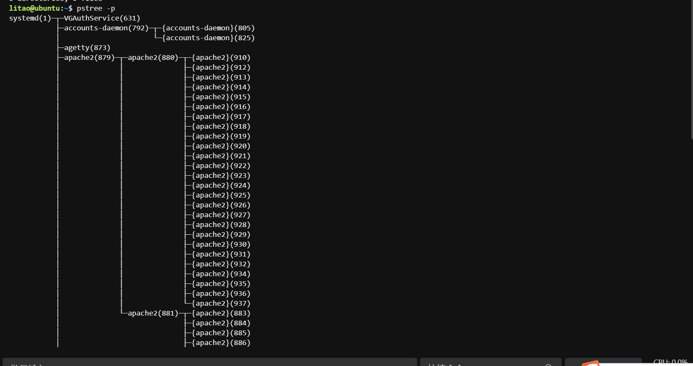

## **进程信息 ps**

命令格式：

1.  **UNIX 风格选项**

-   \-A 或 \-e：显示所有进程。
-   \-a：显示所有用户的进程，但不包括会话领导和没有控制终端的进程。
-   \-u：显示进程的用户格式。
-   \-f：显示完整格式的输出。
-   \-l：显示长格式。
-   \-p：通过进程 ID 过滤。
-   \-t：通过终端过滤。

```bash
ps -e
ps -ef
ps -u username
ps -p 1234
ps -t pts/0
```

2.  **BSD 风格选项**

-   a：显示所有用户的进程，包括那些没有控制终端的进程。
-   x：显示没有控制终端的进程。
-   u：以用户格式显示进程。
-   r：仅显示正在运行的进程。
-   o：指定输出的格式。 pid,ppid,user,%cpu,%mem,comm

```bash
ps aux
ps ax
ps au
```

3.  **GNU 长选项风格**

-   \--help：显示帮助信息。
-   \--version：显示版本信息。
-   \--forest：以树状结构显示进程。
-   \--sort：指定排序字段。
-   \--pid：通过进程 ID 过滤。
-   \--ppid：通过父进程 ID 过滤。

```bash
ps --help
ps --version
ps --forest
ps --pid 1234
ps --sort=-%mem

ps axo pid,cmd,%cpu,%mem k -%cpu   按CPU利用率倒序排序
ps axo pid,cmd,%cpu,%mem --sort -%mem  按内存倒序排序
```

4.  **BSD 风格输出说明**

`**ps aux**`**输出说明：**

```bash
USER       PID %CPU %MEM    VSZ   RSS TTY      STAT START   TIME COMMAND
root         1  0.0  0.1  19368  1348 ?        Ss   Mar30   0:01 /usr/lib/systemd/systemd --switched-root --system --deserialize 21
root         2  0.0  0.0      0     0 ?        S    Mar30   0:00 [kthreadd]
```

字段说明

-   **USER**：进程的所有者（用户）。

-   例如，root 表示这个进程是由 root 用户启动的。

-   **PID**：进程 ID。

-   例如，1 是系统初始化进程的 PID。

-   **%CPU**：进程使用的 CPU 时间的百分比。

-   例如，0.0 表示几乎没有使用 CPU。

-   **%MEM**：进程使用的物理内存的百分比。

-   例如，0.1 表示使用了系统总物理内存的 0.1%。

-   **VSZ**：虚拟内存集的大小（以 KB 为单位）。

-   例如，19368 表示虚拟内存大小为 19368 KB。

-   **RSS**：驻留集大小（以 KB 为单位），即进程实际使用的物理内存。

-   例如，1348 表示驻留内存大小为 1348 KB。

-   **TTY**：进程关联的终端。

-   例如，? 表示进程没有控制终端。

-   **STAT**：进程状态码。常见的状态码包括：

-   R：运行（Running）
-   S：休眠（Sleeping）
-   D：不可中断的睡眠（Uninterruptible sleep）
-   T：停止（Stopped）
-   Z：僵尸进程（Zombie）
-   Ss：主进程，处于睡眠状态
-   R+：在前台运行的进程

-   **START**：进程启动的时间或日期。

-   例如，Mar30 表示该进程在 3 月 30 日启动。

-   **TIME**：进程使用的总 CPU 时间。

-   例如，0:01 表示使用了 1 秒的 CPU 时间。

-   **COMMAND**：启动进程的命令及其参数。

-   例如，/usr/lib/systemd/systemd --switched-root --system --deserialize 21 是启动该进程的完整命令。

5.  **UNIX 风格选项 输出说明**

`ps -ef`输出说明：

```bash
UID        PID  PPID  C STIME TTY          TIME CMD
root         1     0  0 08:01 ?        00:00:01 /usr/lib/systemd/systemd --switched-root --system --deserialize 21
root         2     0  0 08:01 ?        00:00:00 [kthreadd]

```

-   **UID**：进程的所有者（用户）。

-   例如，root 表示该进程由 root 用户启动。

-   **PID**：进程 ID。

-   例如，1 是系统初始化进程的 PID。

-   **PPID**：父进程 ID。

-   例如，0 表示没有父进程（即系统初始化进程），2 表示父进程是 PID 为 2 的进程。

-   **C**：CPU 使用率，表示该进程使用的 CPU 时间的百分比。

-   例如，0 表示该进程几乎没有使用 CPU。

-   **STIME**：进程启动的时间或日期。

-   例如，08:01 表示该进程在当天的 08:01 启动。

-   **TTY**：终端类型。

-   例如，? 表示该进程没有控制终端。

-   **TIME**：进程使用的总 CPU 时间。

-   例如，00:00:01 表示使用了 1 秒的 CPU 时间。

-   **CMD**：启动进程的命令及其参数。

-   例如，/usr/lib/systemd/systemd --switched-root --system --deserialize 21 是启动该进程的完整命令。

**例子：**

```bash
ps -x  查询你拥有的进程
ps -fU apache   ps -fU 48  显示指定用户名(RUID)或用户ID的进程

ps -fG nginx 列出某个组拥有的所有进程（实际组ID：RGID或名称）

ps -fg mysql 列出有效组名称（或会话）所拥有的所有进程
ps -fg 27

面试题：找到未知进程的执行程序文件路径
ls -l /proc/1272/exe  

```

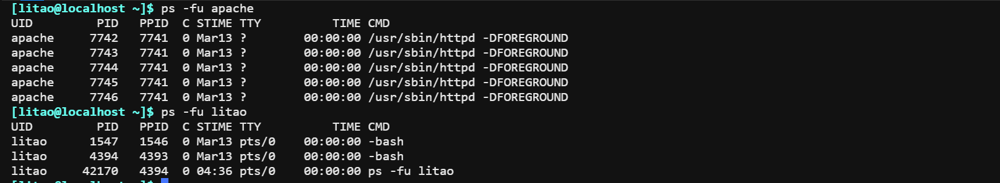

## **查看进程信息prtstat**

```bash
prtstat [options] PID ...
```

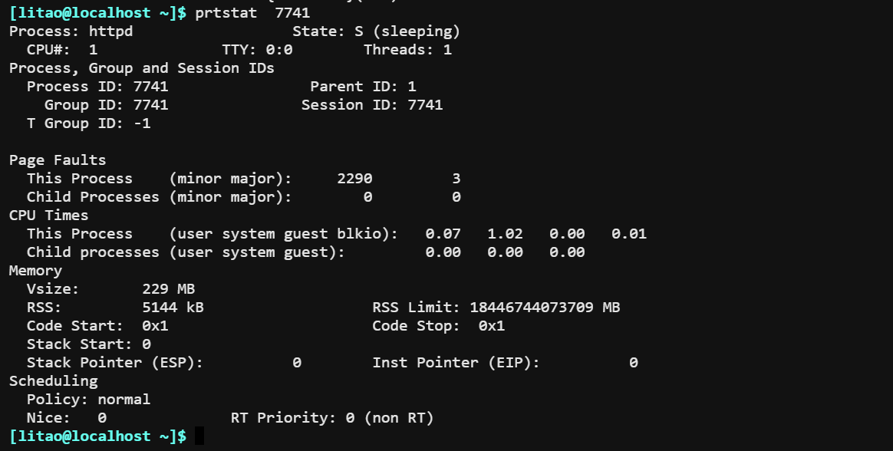

## 搜索进程

-   ps 选项 | grep 'pattern'
-   pgrep 按预定义的模式
-   /sbin/pidof 按确切的程序名称查看pid

### 查找进程 **pgrep**

命令格式：`pgrep [options] pattern`

```bash
-u 实际用户ID (Real User ID, ruid)
-U 有效用户ID (Effective User ID, euid)
-t terminal: 与指定终端相关的进程
-l: 显示进程名
-a: 显示完整格式的进程名
-P pid: 显示指定进程的子进程

u：ruid (Real User ID, ruid) 和 -U (Effective User ID, euid)区别。
● -u 选项：匹配进程的实际用户ID。
● 实际用户ID指的是启动进程的用户ID，也就是拥有该进程的用户。
● 即使进程以不同的权限运行，实际用户ID不会改变。

有效用户ID (Effective User ID, euid)
●-U 选项：匹配进程的有效用户ID。
● 有效用户ID指的是进程在运行时使用的用户ID。
● 进程可以通过某些机制（例如suid）获得与启动它的用户不同的权限，因此有效用户ID可能与实际用户ID不同。
```

😃 **ruid和euid例子：**

例如普通用户执行/usr/bin/passwd 命令时候，实际是继承了程序所有者的权限。

关于passwd程序特殊权限SUID[用户、组和权限](https://www.yuque.com/iverson-lhr7p/zixf8g/fr40mg6ms3gnf203)

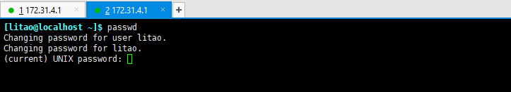

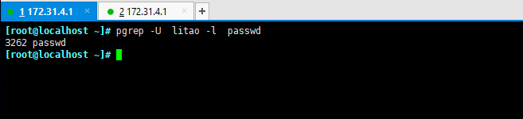

### **pidof 显示进程的PID**

`pidof <process_name> 获取指定进程名的 PID`

```bash
-x 按脚本名称查找pid；必须有shebang机制,否则pidof -x 也无法查找到
```

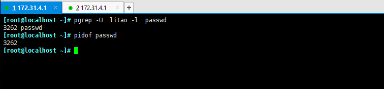

## **查看进程打开文件 lsof**

```bash
lsof -i :<port>   # 查找占用指定端口的进程
lsof <file>       # 查找打开了指定文件的进程
lsof -p <pid>     # 查找指定进程号的进程打开的文件
```

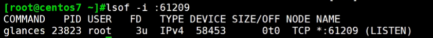

如果你的系统上有进程监听端口22，**lsof -i :22 -n**命令将列出所有相关的详细信息，包括进程ID（PID）、用户、进程路径等

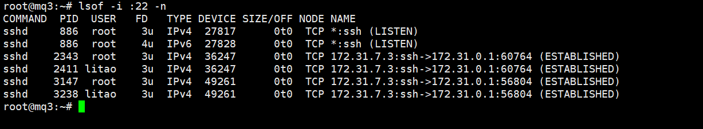

```plsql
#查看指定程序打开的文件
lsof -c httpd

#查看指定用户打开的文件
lsof -u root | more 
#查看指定目录下被打开的文件，参数+D为递归列出目录下被打开的文件，参数+d为列出目录下被打开的文件
lsof +D /var/log/ 
lsof +d /var/log/ 
 
#查看所有网络连接，通过参数-i查看网络连接的情况，包括连接的ip、端口等以及一些服务的连接情况，例
如：sshd等。也可以通过指定ip查看该ip的网络连接情况
lsof -i –n      
lsof -i@127.0.0.1 
 
#查看端口连接情况，通过参数-i:端口可以查看端口的占用情况，-i参数还有查看协议，ip的连接情况等
lsof -i :80 -n
 
#查看指定进程打开的网络连接，参数-i、-a、-p等，-i查看网络连接情况，-a查看存在的进程，-p指定进
程
lsof -i –n -a -p 9527
 
#查看指定状态的网络连接，-n:no host names, -P:no port names,-i TCP指定协议，-s指定协议
状态通过多个参数可以清晰的查看网络连接情况、协议连接情况等
lsof -n -P -i TCP -s TCP:ESTABLISHED
```

### 利用 lsof 恢复正在使用中的误删除的文件

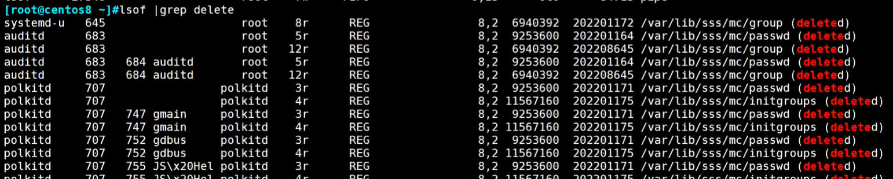

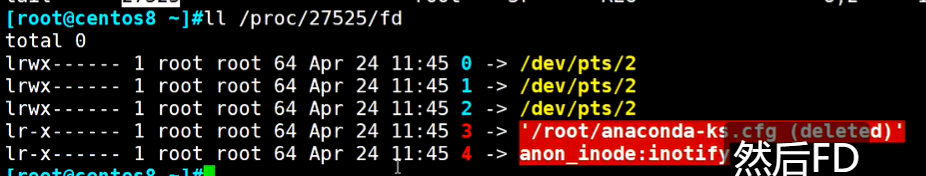

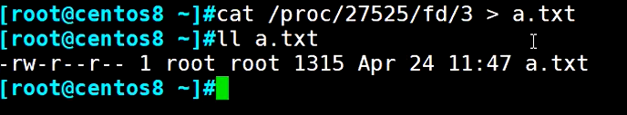

# **系统负载性能相关工具**

Load Average的三个数字，依次则是过去1分钟、5分钟、15分钟的平均负载。可以通过观察这三个数字的大小，可以简单判断系统的负载是下降的趋势还是上升的趋势。**负载值一般不超过cpu核数的1-1.5倍，如果超过1.5倍，那就要重视，此时会严重影响系统。**

-   如果 load average: 1.00, 5.00, 10.00 三个数字依次增大，则说明在过去的 1 分钟系统的负载比过去 15 分钟系统的负载小，表明系统的负载是下降的趋势。
-   如果 load average: 10.00, 5.00, 1.00 三个数字依次降低，则说明在过去的 1 分钟系统的负载比过去 15 分钟系统的负载大，表明系统的负载是上升的趋势。
-   如果 load average: 0.07, 0.04, 0.0 三个数字基本相同，或者相差不大， 表明系统的负载是平稳的。

## **负载查询 uptime**

```bash
[litao@localhost ~]$ uptime
 22:17:26 up  8:20,  1 user,  load average: 0.00, 0.01, 0.05
 
1. 系统时间-UP状态-开机时间-用户-1分钟、5分钟、15分钟系统负载。

2. Load average的值代表了系统中正在运行或等待运行的进程数量。负载平均值高表示系统上有更多的工作需要处理。一般来说，如果负载平均值超过CPU核心数量的70%~80%，就可以认为系统负载较高。

3. 如果你的系统只有一颗CPU，而每颗CPU有两个核心，那么你的系统总共有两个物理核心。一般来说，如果负载平均值超过1.4~1.6，即超过核心数的70%~80%，就可以认为系统负载较高。

```

## **查看进程实时状态 top**

命令格式：  
`` top -p ` ` ``

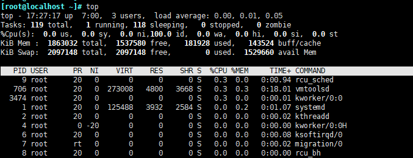

1.  **系统时间、系统运行时间、用户数、系统负载平均值：**

```bash
top - 17:27:59 up  7:01,  3 users,  load average: 0.00, 0.01, 0.05
```

-   15:32:03：当前时间。
-   up 10 days, 5:42：系统运行时间。
-   3 users：当前登录的用户数。
-   load average: 0.44, 0.27, 0.22：过去1分钟、5分钟和15分钟的系统平均负载。

2.  **任务摘要**：

```bash
Tasks: 119 total,   1 running, 118 sleeping,   0 stopped,   0 zombie
```

-   198 total：总任务数。
-   1 running：正在运行的任务数。
-   197 sleeping：处于休眠状态的任务数。
-   0 stopped：被停止的任务数。
-   0 zombie：僵尸进程数。

3.  **CPU状态**：

```bash
%Cpu(s):  0.0 us,  0.2 sy,  0.0 ni, 99.8 id,  0.0 wa,  0.0 hi,  0.0 si,  0.0 st
```

-   us：用户态CPU使用率。
-   sy：内核态CPU使用率。
-   ni：低优先级用户态CPU使用率。
-   id：空闲CPU比例。
-   wa：等待I/O的CPU时间比例。
-   hi：硬件中断使用的CPU时间比例。
-   si：软件中断使用的CPU时间比例。
-   st：虚拟机窃取的CPU时间比例。

| `mode` | 含义 | 说明 |
| --- | --- | --- |
| **user** | 用户态 | CPU 在执行用户进程（不含 nice 进程） |
| **nice** | 优先级调整过的用户进程 | 通常是低优先级的用户进程 |
| **system** | 内核态 | CPU 在执行内核代码（系统调用等） |
| **idle** | 空闲状态 | 没有任务执行，CPU在“休息” |
| **iowait** | 等待 IO | CPU 等磁盘或网络 IO 完成 |
| **irq** | 硬中断 | 处理中断请求（硬件） |
| **softirq** | 软中断 | 内核中处理任务较轻的中断 |
| **steal** | 被偷时间 | 虚拟机中，CPU 被其他虚机“抢走”了 |
| **guest** | 来宾态 | 虚拟机运行的时间（不常见） |
| **guest****_****nice** | 来宾+nice | 更罕见，虚拟机中低优先级进程运行时间 |

4.  **内存使用情况**：

```bash
KiB Mem :  4041784 total,  1501728 free,  1026888 used,  1513168 buff/cache
KiB Swap:  2097148 total,  2097148 free,        0 used.  2679768 avail Mem
```

-   KiB Mem：物理内存信息：
-   total：总内存大小。
-   free：空闲内存大小。
-   used：已使用内存大小。
-   buff/cache：用于缓存和缓冲的内存大小。
-   KiB Swap：交换分区信息：
-   total：总交换分区大小。
-   free：空闲交换分区大小。
-   used：已使用交换分区大小。
-   avail Mem：可用内存大小。

5.  进程信息

```bash
  PID USER      PR  NI    VIRT    RES    SHR S  %CPU %MEM     TIME+ COMMAND
```

-   PID：进程ID。
-   USER：进程所有者。
-   PR：优先级。
-   NI：nice值（影响进程优先级）。
-   VIRT：进程使用的虚拟内存总量。
-   RES：进程使用的驻留内存量。
-   SHR：进程使用的共享内存量。
-   S：进程状态（S：休眠，R：运行，T：停止，Z：僵尸）。
-   %CPU：进程的CPU使用率。
-   %MEM：进程的内存使用率。
-   TIME+：进程启动以来的总CPU时间。
-   COMMAND：启动进程的命令名。

### **top的内置命令**

1.  排序：

-   P：以占据的CPU百分比,%CPU
-   M：占据内存百分比,%MEM
-   T：累积占据CPU时长,TIME+
-   N：（PR字段）对进程进行排序。

2.  终止指定进程：k

-   在top命令运行的同时，按下小写的“k”键。  
    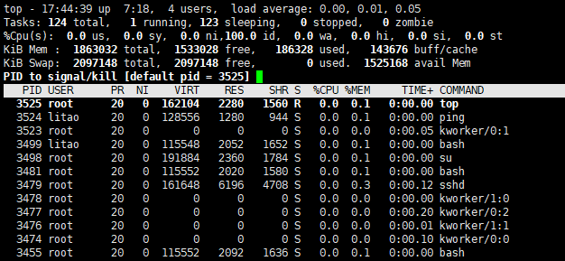
-   输入要终止进程的PID；回车  
    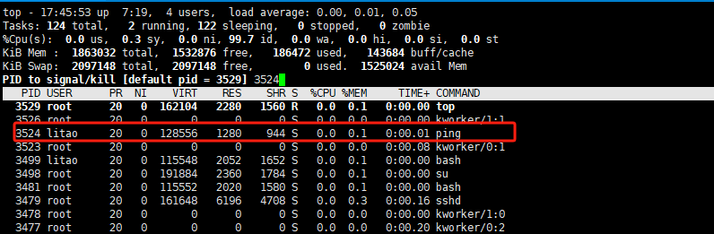
-   发送15信号；或者其他信号；回车  
    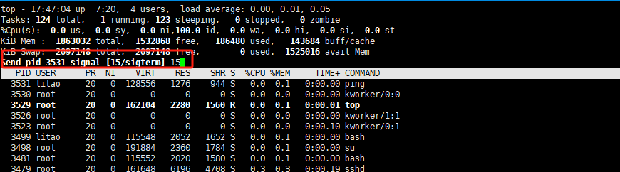

# 内存负载性能相关工具

## 查看内存 free

1.  命令格式： `free [OPTION]`

-   \-h：以人类可读的格式显示内存信息（使用单位如KB, MB, GB）。
-   \-m：以MB为单位显示内存信息。
-   \-g：以GB为单位显示内存信息。
-   \-b：以字节为单位显示内存信息。

2.  内容输出

```bash
              total        used        free      shared  buff/cache   available
Mem:        16347908     6138236     2386344      450364     7833328     9213072
Swap:       2097148           0     2097148
```

**Mem**行：

-   total：16347908 KiB（总内存量）
-   used：6138236 KiB（已使用的内存量）
-   free：2386344 KiB（空闲的内存量）
-   shared：450364 KiB（与tmpfs共享的内存量）
-   buff/cache：7833328 KiB（用于缓存和缓冲的内存量）
-   available：9213072 KiB（可用的内存量）

**Swap**行：

-   total：2097148 KiB（总交换分区量）
-   used：0 KiB（已使用的交换分区量）
-   free：2097148 KiB（空闲的交换分区量）

3.  字段意思

-   total = used + free + buff/cache
-   used = total - free - buff/cache
-   available ≈ free + reclaimable part of buff/cache + some active/inactive memory

## **进程对应的内存映射 pmap**

命令格式：`pmap <pid>`

-   \-x：显示扩展格式，包含更多详细信息。
-   \-d：显示设备和节点信息。
-   \-q：静默模式，只显示总计信息。
-   \-p：显示相关进程信息。
-   \-A：显示所有地址空间。
-   \-XX：显示更详细的扩展信息。

```shell
pmap -x 1234
```

输出

```shell
1234:   /usr/bin/someprocess
Address           Kbytes     RSS   Dirty Mode   Mapping
0000000000400000    1116     620       0 r-x--  /usr/bin/someprocess
0000000000615000      20      16       0 r----  /usr/bin/someprocess
000000000061a000       4       4       4 rw---  /usr/bin/someprocess
00000000006e9000     132      92      92 rw---    [ anon ]
00007f8a74000000   65536   15432   15432 rw---    [ anon ]
00007fffd7ed8000     132      12      12 rw---    [ stack ]
00007fffd7fdb000       8       4       4 r-x--    [ anon ]
 total            2812304  16232    16232

```

-   **Address**：内存区域的起始地址。
-   **Kbytes**：内存区域的大小（KB）。
-   **RSS**：驻留集大小（实际使用的物理内存）。
-   **Dirty**：脏页数（已修改但未写回磁盘的内存页）。
-   **Mode**：内存区域的权限。
-   **Mapping**：映射文件或区域描述。

## **虚拟内存信息 vmstat**

用于报告系统的虚拟内存、进程、CPU活动等的统计信息。注意；这里的si和so；bi和bo是以内存为参照。

命令格式：`vmstat [options] [delay [count]]`

-   delay：刷新间隔时间（秒）。
-   count：输出的刷新次数。

```shell
procs -----------memory---------- ---swap-- -----io---- -system-- ------cpu-----
 r  b   swpd   free   buff  cache   si   so    bi    bo   in   cs us sy id wa st
 1  0      0 154432  31884 398576    0    0    12     8  102  230  1  1 98  0  0
```

1.  **procs**

-   r：正在运行和可运行的进程数（正在等待 CPU 的进程数）。
-   b：在不可中断睡眠状态下的进程数。

2.  **memory**

-   swpd：使用的交换内存（单位：KB）。
-   free：空闲内存（单位：KB）。
-   buff：用于缓冲的内存（单位：KB）。
-   cache：用于缓存的内存（单位：KB）。

3.  **swap**

-   si：从交换区读入内存的数据量（单位：KB/s）。
-   so：从内存写入交换区的数据量（单位：KB/s）。

4.  **io**

-   bi：从块设备读入的数据量（单位：块/s）。
-   bo：写入块设备的数据量（单位：块/s）。

5.  **system**

-   in：每秒的中断数，包括时钟中断。
-   cs：每秒的上下文切换数。

6.  **cpu**

-   us：用户态 CPU 时间百分比。
-   sy：系统态 CPU 时间百分比。
-   id：空闲 CPU 时间百分比。
-   wa：等待 I/O 完成的 CPU 时间百分比。
-   st：被虚拟机窃取的时间百分比。

### 实现so增长：

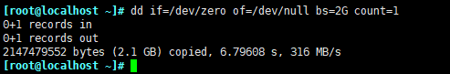

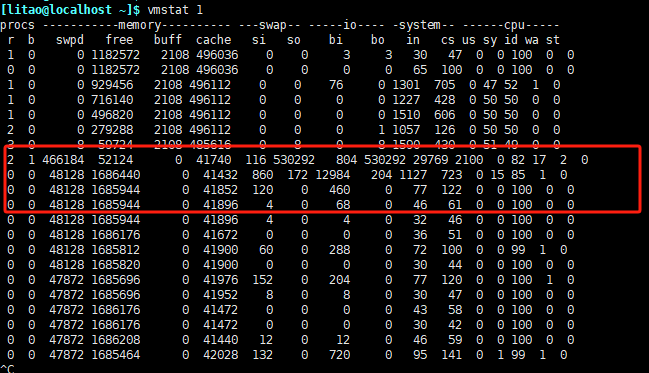

1\. 具体数值分析

```bash
 2  1 466184  52124      0  41740  116 530292   804 530292 29769 2100  0 82 17  2  0
 0  0  48128 1686440      0  41432  860  172 12984   204 1127  723  0 15 85  1  0

```

**交换到内存（Swap-in）**

-   si 值从 116 增至 860：

-   这表示在执行 dd 命令时，每秒有 116 KB 数据从磁盘交换到内存。命令执行完成后，这一速率增加到 860 KB/s，表示系统在命令执行期间需要频繁从交换空间读取数据以满足内存需求。

**交换到磁盘（Swap-out）**

-   so 值从 530292 降至 172：

-   这表示在执行 dd 命令时，每秒有 530292 KB 数据从内存交换到磁盘。这个值非常高，表明在命令执行期间，系统将大量数据交换到磁盘，以腾出内存来处理当前操作。
-   命令执行完成后，交换到磁盘的速率恢复正常，降至 172 KB/s，这说明交换操作主要在 dd 命令执行期间发生。

**bi 和 bo 的高值：**

-   bi = 804：

-   这表示每秒从块设备读取 804 块数据。

-   bo = 530292：

-   这表示每秒向块设备写入 530292 块数据。这个值非常高，表明在 dd 命令执行期间，有大量数据写入到块设备。

**so = 530292（交换到磁盘的速率）：与 bo 值相等。**

-   这表明在执行 dd 命令期间，系统确实将大量数据交换到磁盘，这导致了高 bo 值。交换操作的增加是由于内存压力或其他资源限制引起的。

### 实现bi增长：

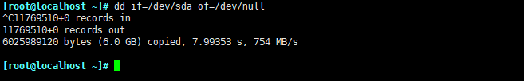

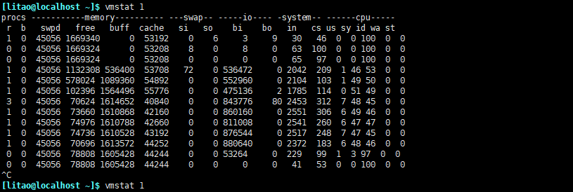

  

这里si 和 so代表从内存进出，以内存参照物品；bi 和 bo同理；bi从内存写进硬盘，bo从内存读出硬盘

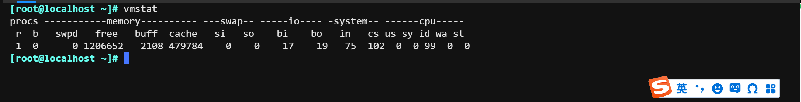

第一个bi大，第二个bo大

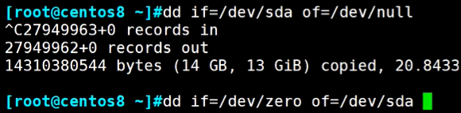

## 监视磁盘I/O iotop

显示了哪些进程正在进行磁盘 I/O 操作以及它们消耗的 I/O 带宽。使用 iotop 可以帮助你识别系统中哪些进程正在大量使用磁盘 I/O，从而有助于进行性能调优和问题排查。

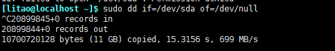

输出：

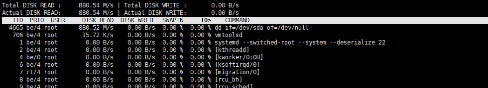

-   **PID**：进程 ID
-   **PRIO**：进程优先级
-   **USER**：运行进程的用户
-   **DISK READ**：每秒从磁盘读取的数据量
-   **DISK WRITE**：每秒写入磁盘的数据量
-   **SWAPIN**：每秒从交换分区读取的数据量
-   **IO**：每秒进行的 I/O 操作数量
-   **COMMAND**：进程的命令名

# CPU负载性能相关工具

## **mpstat-统计CPU性能和历史性能数据**

安装相关包：`yum install -y sysstat`

显示每个CPU的使用情况：`mpstat -P ALL`

输出：

```bash
Linux 5.4.0-54-generic (hostname) 	06/04/2024 	_x86_64_	(4 CPU)

09:30:01 AM  CPU    %usr   %nice    %sys %iowait    %irq   %soft  %steal   %idle
09:30:01 AM    0    3.00    0.00    1.50    1.00    0.00    0.50    0.00   94.00
09:30:01 AM    1    2.00    0.00    1.00    0.50    0.00    0.00    0.00   96.50
09:30:01 AM    2    2.50    0.00    1.25    0.75    0.00    0.25    0.00   95.25
09:30:01 AM    3    2.50    0.00    1.25    0.75    0.00    0.25    0.00   95.25
```

**1CPU**：显示统计信息的 CPU 核心编号。all 表示所有 CPU 的平均统计信息。

-   **%usr**（User）：在用户级别（应用程序）运行的时间百分比，不包括 nice 值调整的进程。

-   例如，%usr 为 2.50 表示 CPU 有 2.50% 的时间用于执行用户空间的进程。

-   **%nice**（Nice）：在用户级别运行的时间百分比，包括那些已调整 nice 值的进程。

-   例如，%nice 为 0.00 表示没有 CPU 时间用于执行调整了 nice 值的进程。

-   **%sys**（System）：在内核级别（系统）运行的时间百分比。

-   例如，%sys 为 1.25 表示 CPU 有 1.25% 的时间用于执行内核代码。

-   **%iowait**（I/O Wait）：CPU 等待 I/O 操作完成的时间百分比。

-   例如，%iowait 为 0.75 表示 CPU 有 0.75% 的时间在等待 I/O 操作。

-   **%irq**（IRQ）：处理硬中断的时间百分比。

-   例如，%irq 为 0.00 表示没有 CPU 时间用于处理硬中断。

-   **%soft**（Soft IRQ）：处理软中断的时间百分比。

-   例如，%soft 为 0.25 表示 CPU 有 0.25% 的时间用于处理软中断。

-   **%steal**（Steal）：虚拟化环境中被其他虚拟机窃取的时间百分比。

-   例如，%steal 为 0.00 表示没有 CPU 时间被其他虚拟机窃取。

-   **%guest**（Guest）：客户操作系统运行的时间百分比（虚拟化）。

-   例如，%guest 为 0.00 表示没有 CPU 时间用于执行虚拟机客户代码。

-   **%gnice**（Guest Nice）：客户操作系统的 nice 值调整的时间百分比（虚拟化）。

-   例如，%gnice 为 0.00 表示没有 CPU 时间用于执行调整了 nice 值的虚拟机客户代码。

-   **%idle**（Idle）：CPU 空闲时间百分比。

-   例如，%idle 为 95.25 表示 CPU 有 95.25% 的时间是空闲的。

# 硬盘负载性能相关工具

## **显示硬盘I/O iostat**

命令格式：`iostat [options] [interval [count]]`

-   \-c：显示CPU利用率统计信息。
-   \-d：显示磁盘设备的I/O统计信息。
-   \-x：显示扩展的磁盘I/O统计信息。
-   \-t：显示带有时间戳的信息。
-   \-k：以千字节为单位显示（默认以块为单位）。
-   \-m：以兆字节为单位显示。

输出：

```bash
Linux 3.10.0-1160.el7.x86_64 (localhost.localdomain) 	06/02/2024 	_x86_64_	(2 CPU)

avg-cpu:  %user   %nice %system %iowait  %steal   %idle
           0.02    0.00    0.04    0.01    0.00   99.94

Device:            tps    kB_read/s    kB_wrtn/s    kB_read    kB_wrtn
sda               0.32         6.72         7.21     244045     262002

```

设备利用率 :

```bash
Device:            tps    kB_read/s    kB_wrtn/s    kB_read    kB_wrtn
sda               0.32         6.72         7.21     244045     262002

```

1.  **tps**：0.32

-   每秒传输的次数（I/O操作数），非常低，表示每秒只有大约0.32次I/O操作。

2.  **kB\_read/s**：6.72

-   每秒读取的千字节数，表示每秒从设备读取约6.72千字节的数据。

3.  **kB\_wrtn/s**：7.21

-   每秒写入的千字节数，表示每秒向设备写入约7.21千字节的数据。

4.  **kB\_read**：244045

-   读取的总千字节数，自系统启动以来，总共从设备读取了244045千字节的数据。

5.  **kB\_wrtn**：262002

-   写入的总千字节数，自系统启动以来，总共向设备写入了262002千字节的数据。

## **监视磁盘I/O iotop（查看进程的io）**

命令：`iotop [options]`

-   \-o：只显示有I/O活动的进程。
-   \-b：以批处理模式运行，直接输出结果而不需要交互式界面。
-   \-n：指定显示的行数。
-   \-d：指定更新间隔（单位：秒）。

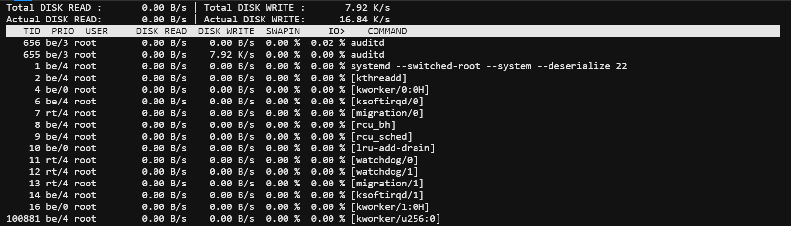

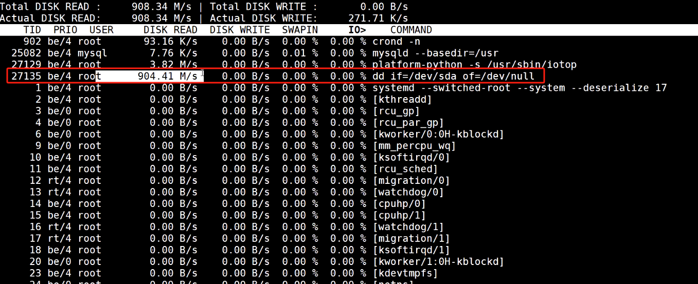


## **系统资源统计 dstat**

`yum -y install dstat`

一秒读一次；读取6次

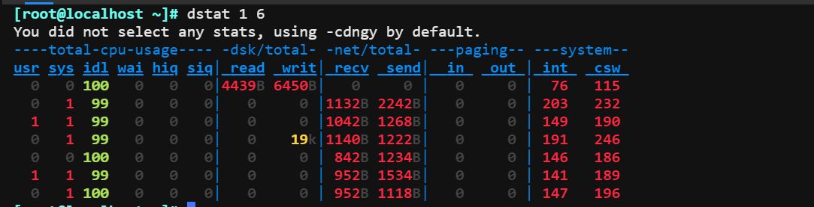

# **网络相关工具**

## **网络带宽使用情况 iftop；查看对端机器**

`sudo yum install iftop -y`

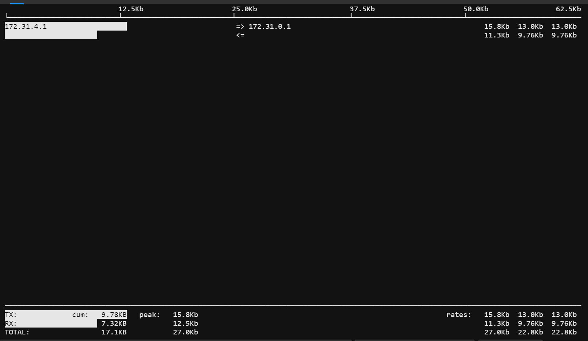

# 历史性能数据工具

## atop

命令格式：`atop [选项]`

输出：

```bash
ATOP - myhost                             2024/06/04  14:30:01                            10 seconds elapsed
PRC |  sys    0.10s |  user   1.30s |  #proc   125  |  #zombie    0  |  #exit     0  |
CPU |  sys     1%  |  user     3%  |  irq      0%  |  idle    95%  |  wait      1%  |  steal     0%  |  guest     0%  |
cpu |  sys     0%  |  user     2%  |  irq      0%  |  idle    98%  |  cpu000 w  2%  |
cpu |  sys     2%  |  user     4%  |  irq      0%  |  idle    94%  |  cpu001 w  3%  |
CPL |  avg1    0.01 |  avg5   0.05 |  avg15  0.10 |  csw  1050 |  intr   250  |
MEM |  tot    16.0G |  free  10.0G |  cache  2.0G |  buff   1.0G |  slab   0.5G |  anon   2.5G |
SWP |  tot     8.0G |  free   8.0G |  used    0.0G |  swin    0K/s |  swout    0K/s |
DSK |  sda  busy   5% |  read   50K/s |  write  100K/s |  xfer   20/s  |  dskxfer  2000 |
NET |  eno1  recv    0K/s |  send   0K/s |  pcki   0/s  |  pcko   0/s  |  rxerr    0  |  txerr    0  |

  PID   TID  RDDSK  WRDSK   WCANCL  DSK    CMD        1/1
    1     -      0      0      0      -    systemd
    2     -      0      0      0      -    kthreadd
  101     -      0      0      0      -    jbd2/sda1-8
  215     -      0      0      0      -    nginx
  230     -      0      0      0      -    mysqld
  301     -      0      0      0      -    atop
  305     -      0      0      0      -    sshd
  310     -      0      0      0      -    bash

```

1.  **总体信息**

-   顶部显示系统名称、日期和时间，以及自上次刷新以来的时间间隔。

2.  **PRC（进程信息）**

-   sys 和 user：系统和用户时间的消耗。
-   proc：进程总数。
-   zombie：僵尸进程数。
-   exit：退出的进程数。

3.  **CPU**

-   sys：系统时间占用百分比。
-   user：用户时间占用百分比。
-   irq：中断时间占用百分比。
-   idle：空闲时间占用百分比。
-   wait：IO等待时间占用百分比。
-   steal：虚拟机窃取时间百分比。
-   guest：客体时间占用百分比。
-   cpu：每个CPU的详细信息（如cpu000, cpu001）。

4.  **CPL（系统负载）**

-   avg1、avg5、avg15：1分钟、5分钟、15分钟的系统平均负载。
-   csw：上下文切换次数。
-   intr：中断次数。

5.  **MEM（内存）**

-   tot：总内存。
-   free：空闲内存。
-   cache：缓存的内存。
-   buff：缓冲的内存。
-   slab：slab缓存。
-   anon：匿名内存。

6.  **SWP（交换）**

-   tot：总交换空间。
-   free：空闲交换空间。
-   used：已用交换空间。
-   swin：交换进的数据速率。
-   swout：交换出的数据速率。

7.  **DSK（磁盘）**

-   busy：磁盘忙碌百分比。
-   read：读速率。
-   write：写速率。
-   xfer：传输次数。
-   dskxfer：每秒磁盘传输量。

8.  **NET（网络）**

-   recv：接收速率。
-   send：发送速率。
-   pcki：接收的包数量。
-   pcko：发送的包数量。
-   rxerr：接收错误数量。
-   txerr：发送错误数量。

9.  **进程列表**

-   PID：进程ID。
-   TID：线程ID。
-   RDDSK：读取磁盘量。
-   WRDSK：写入磁盘量。
-   WCANCL：取消写入量。
-   DSK：磁盘状态。
-   CMD：命令名称。

10.  分析历史数据：

```bash
atop -r /var/log/atop.log
```

11.  指定时间间隔

```bash
#执行12点的数据
atop -r /path/to/logfile 12:00

#在读取历史数据时，你可以使用 -b 和 -e 选项来指定开始和结束时间。例如：
atop -r /path/to/logfile -b 12:00 -e 14:00
```

# 内核日志查看

**\-T, --ctime**：将内核时间戳转换成人类可读的格式。

```bash
dmesg -T
```

**\-l, --level**：仅显示特定级别的消息（例如 emerg, alert, crit, err, warn, notice, info, debug）。

```bash
dmesg -l err
```

# **信号发送 kill**

## 常用的信号

```bash
1) SIGHUP     无须关闭进程而让其重读配置文件
2) SIGINT     中止正在运行的进程；相当于Ctrl+c
3) SIGQUIT    相当于ctrl+\
9) SIGKILL    强制杀死正在运行的进程,此信号慎用!
15) SIGTERM   终止正在运行的进程，默认信号
18) SIGCONT   继续运行
19) SIGSTOP   后台休眠,处于stop状态
```

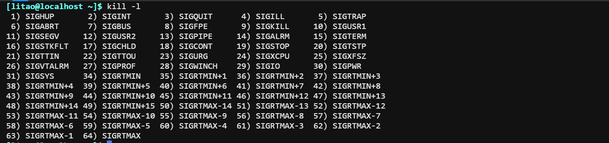

向进程发送信号：

按PID：

```plsql
kill -1   pid …
kill -n 9 pid
kill -s SIGINT pid
```

按名称：killall 来自于psmisc包

```plsql
killall [-SIGNAL] comm…
```

# **作业管理**

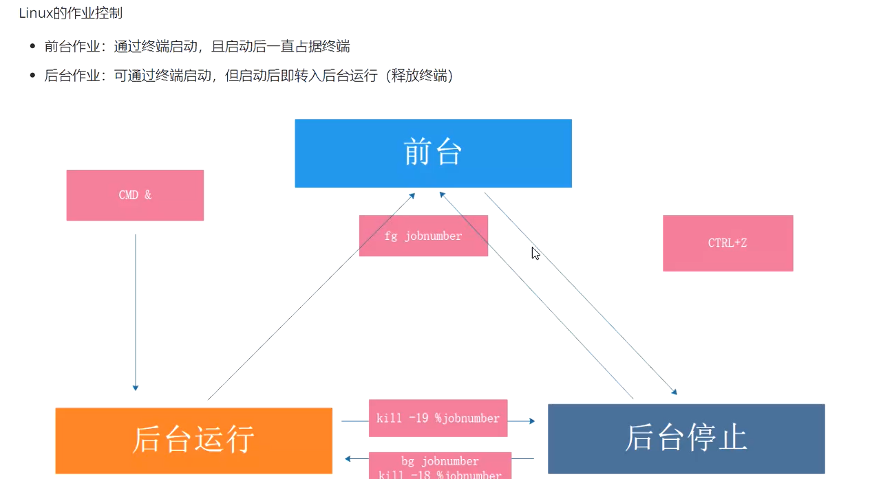

例子：4中状态转换

```bash
让运行中的作业后台停止： Ctrl+z
尚未启动的作业： COMMAND &
```

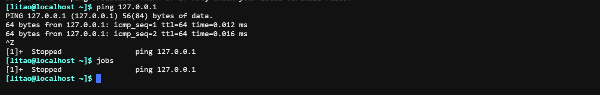

让后台停止的作业作用于后台运行

```bash
1. bg 2    2是jobs的编号    2. kill -18 `pidof `
```

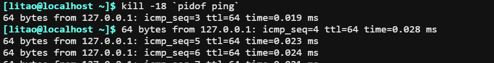

让后台运行的作业运行于前台运行

```plsql
fg 1
```

让命令继续后台运行

```plsql
ping 172.0.0.1
```
---

后台作业虽然被送往后台运行，但其依然与终端相关；退出终端，将关闭后台作业。如果希望送往后台

后，剥离与终端的关系。

```plsql
nohup COMMAND &>/dev/null & 
```

查看当前终端所有作业：

`jobs`

作业控制

```plsql
fg [[%]JOB_NUM]：把指定的后台作业调回前台
bg [[%]JOB_NUM]：让送往后台的作业在后台继续运行
kill [%JOB_NUM]： 终止指定的作业
```

# **并行运行**

利用后台执行，实现并行功能，即同时运行多个进程，提高效率

方法1

```plsql
cat all.sh
f1.sh&
f2.sh&
f3.sh&
```

方法2

```plsql
(f1.sh&);(f2.sh&);(f3.sh&)
```

方法3

```plsql
f1.sh&f2.sh&f3.sh&
```

案例脚本

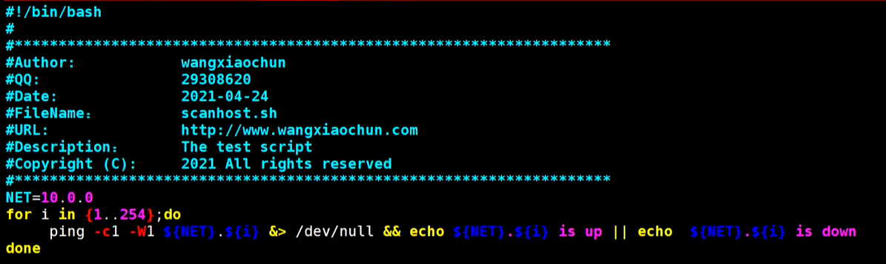

修改后的并行

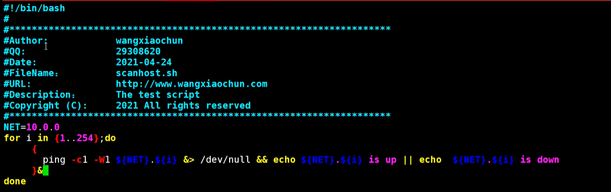

# **任务计划**

-   at 指定定时间点，执行一次性任务
-   batch 系统自行选择空闲时间去执行此处指定的任务
-   cron 周期的运行

任务计划里面不要有标准输出，否则会发送邮箱里面，系统邮箱

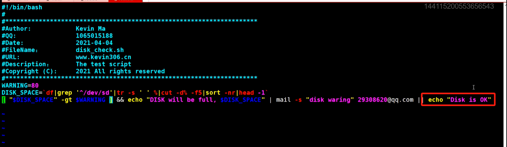

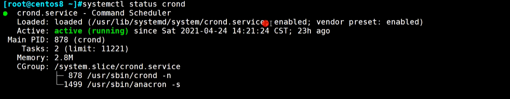

系统的计划任务

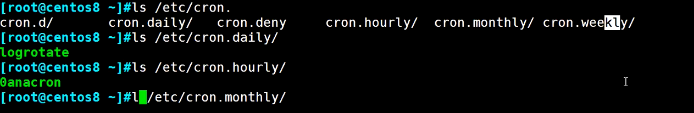

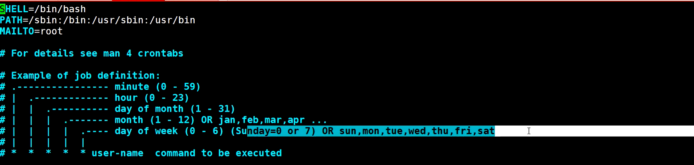

crontab命令格式

```plsql
crontab [-u user] [-l | -r | -e] [-i]

-l 列出所有任务
-e 编辑任务
-r 移除所有任务
-i 同-r一同使用，以交互式模式移除指定任务
-u user 仅root可运行，指定用户管理cron任务
```

计划任务的变量；命令需要写上绝对路径，否则无法执行


解决方法：1. 在计划任务配置中指定PATH 2 .在脚本中赋予变量；计划任务写成脚本执行

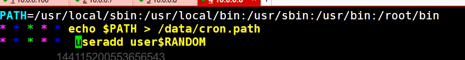


每个月的1 10 20 或者 周1 周6 都执行


# 总结：

```bash
查看线程方式：/proc/ststus  pstree   prtstat  每个进程都默认带一个线程；所以pstree会被其他看的少一个。

```

实验用到的命令

```plsql
/dev/zero读取数据（即无限制的零），并将其写入磁盘/dev/sda
dd if=/dev/zero of=/dev/sda bs=1M

从磁盘/dev/sda读取数据，并将其写入空设备/dev/null
dd if=/dev/sda of=/dev/null

使用ping命令向IP地址为192.168.10.1的主机发送一个ICMP数据包，数据包的大小为65507字节。参数-f表示发送数据包时不进行分段。这个命令通常用于测试网络的最大传输单元（MTU），以确定网络是否能够正确地处理大型数据包。
ping -f -s 65507 192.168.10.1
```