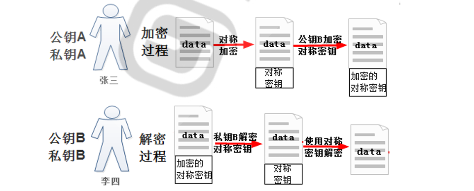
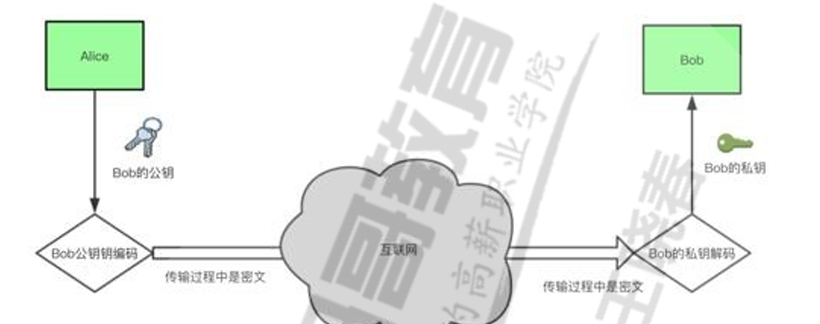
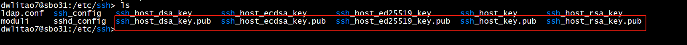
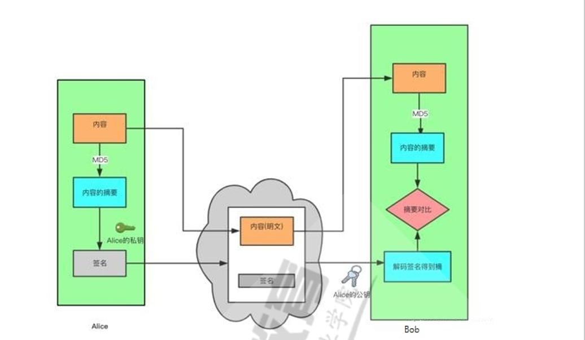
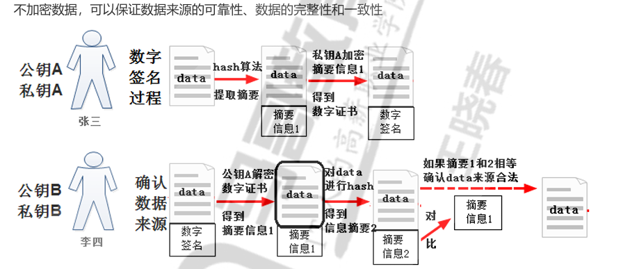
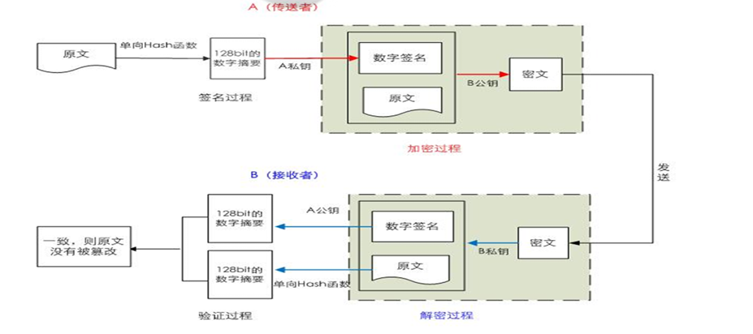
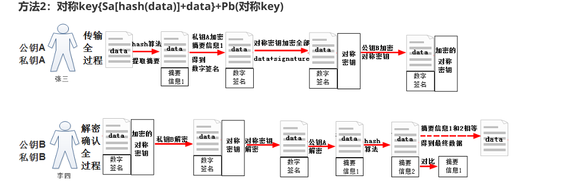
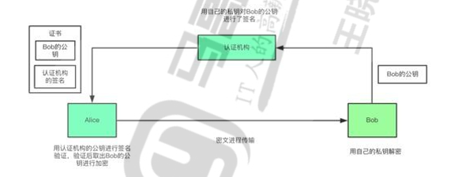
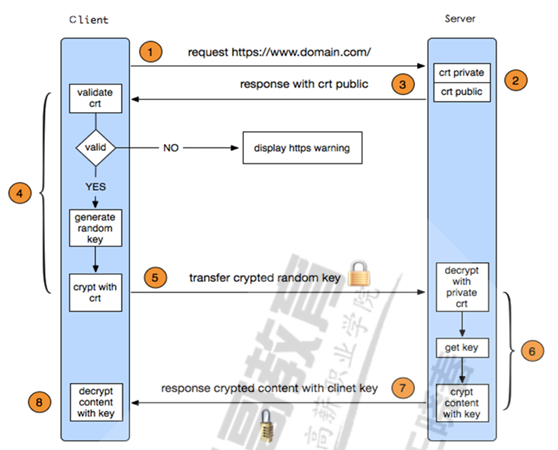

# 对称加密算法

加密：算法+key

对称加密：加密和解密使用同一个密钥 。

data明文 ---- 加密key1 ----- data'密文 -----解密 key2 -----data 明文

key1 = key2 对称；所以称为对称加密算法。

Bob无法确认数据是否来自Alice；存在安全风险。（无法确认数据来源确认）

1.  常见对称加密算法:

-   DES：Data Encryption Standard，56bits
-   3DES：Windows 2000
-   AES：Advanced (128, 192, 256bits)
-   Blowfish，Twofish
-   IDEA，RC6，CAST5

例子：

# 非对称加密算法

非对称加密：密钥是成对出现

-   公钥：public key，公开给所有人，主要给别人加密使用
-   私钥：secret key，private key 自己留存，必须保证其私密性，用于自已加密签名
-   特点：用公钥加密数据，只能使用与之配对的私钥解密；反之亦然

  

非对称重点：

key1 != key2 非对称

public key 公开

private(secret) key 不公开,成对使用

public key 加密,必须使用对应的Private key 解密,反之一样

​  

双方各自的钥匙：

Alice-Pa、Sa

Bob-Pb、Sb

​  

Alice ---> Bob 实现数据加密

data明文 ---- 加密key1 ----- data'密文 -----解密 key2 -----data 明文（key1=Pb key2=Sb ）

解释：加密key1使用Bob公钥加密；解密 key2解密时候使用Bob私钥解密。（双方的公钥是公开的；秘钥各自才有）

​  

SSH对应算法的公钥文件，反子，没有pub就是私钥。

  

非数据对称确认数据来源：

data明文 ---- 加密key1 ----- data'密文 -----解密 key2 -----data 明文（key1=Sa key2=Pa ）

解释：加密key1使用Alice的私钥；解密key2解密使用用alice公钥解密。这样确认了数据来源；也叫数字签名。

​  

代表算法：

RSA（银行那个令牌）和DSA

## 非对称秘钥和对称秘钥对比

能确认数据来源确认和数据加密。

​  

# 单向哈希算法

代表： md5: 128bits、sha1: 160bits、sha224 、sha256、sha384、sha512

常见的工具：

-   md5sum | sha1sum [ --check ] file
-   openssl、gpg
-   openssl、gpg

实现数字签名和数据一致;

​  

​  

# 综合加密和签名

即实现数据加密，又可以保证数据来源的可靠性、数据的完整性和一致性

# CA和证书

双方各自的证书

CA：Sca Pca Alice : Sa Pa Bob：Sb Pb

CA机构相当于派出所；给Alice和Bob颁发证书，双方可以根据证书进行数据交换。

​  

CA怎么给颁发证书给Bob和Alice？

1.  Alice向CA提供自己的身份信息；CA会替Alice生成Sa Pa；CA会使用自己的Sca私钥对Alice的公钥Pa进行签名+具体其他CA的信息=证书；然后将证书和Sa返回给Alice。Bob反之是一样的。
2.  Alice会将证书发给Bob(包含Pa)；Bob会使用CA的公钥Pca解密对比签名得到Alice的公钥是真实的。
3.  以上确认了双方公钥，可以进行数据交换。

# HTTPS

HTTPS双方的通信过程：

​  

​  

​  

​