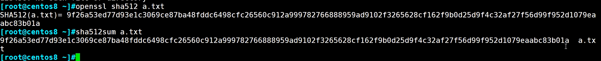
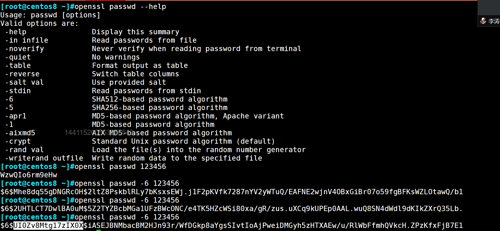
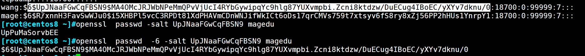
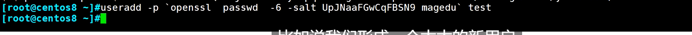
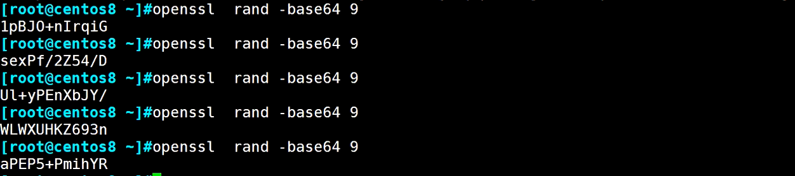
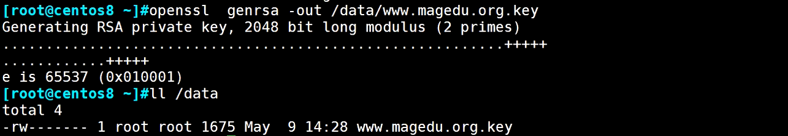
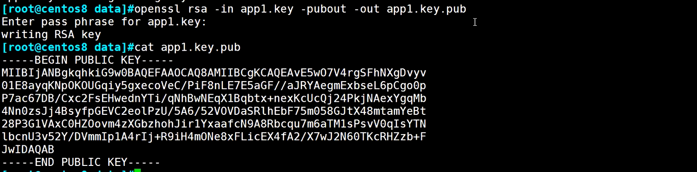

# Base64 编码

这是一种转换而不是加密。-

-   \-d的参数为解密

```bash
[root@nginx ~]# echo -n 124 | base64
MTI0
[root@nginx ~]# echo "MTI0" | base64 -d
124[root@nginx ~]#

```

# openssl

```bash
openssl <command> [command_options] [command_arguments]
```

-   `<command>`：要执行的 OpenSSL 命令，如 `genpkey`, `req`, `x509`, `enc` 等。

-   `genpkey`：用于生成密钥对。
-   `req`：用于处理证书签名请求和证书生成。
-   `x509`：用于查看和管理 X.509 证书。
-   `enc`：用于文件的加密和解密。

-   `[command_options]`：为该命令指定的选项，用于修改命令的行为。
-   `[command_arguments]`：命令的输入和输出文件、参数等。

## openssl命令对称加密

工具：openssl enc, gpg

算法：3des, aes, blowfish, twofish

加密：

```bash
openssl enc -e -des3 -a -salt -in testfile -out testfile.cipher
```

-   `-a`：表示将加密数据以 base64 编码格式输出，便于存储或传输。
-   `-salt`：在加密时使用盐值（salt），可以增强加密的安全性。盐值是一个随机生成的值，帮助防止彩虹表攻击。

解密：

```bash
openssl enc -d -des3 -a -salt -in testfile.cipher -out testfile
```

## 哈希运算

工具：openssl dgst

算法：md5sum, sha1sum, sha224sum,sha256sum…



## openssl命令生成用户密码

目前是有centos8支持 -6的加密算法；密码的$6$代表是-6的加密算法，"UI0Z.\*0X"（下面白色标注部分）代表的是salt盐的部分。



根据salt和密码推算/etc/passwd的密码字段。



创建用户



## openssl命令生成随机数



## openssl命令实现 PKI （公钥私钥）

```bash
openssl genpkey -algorithm <algorithm> -out <output_file> [options]
```

-   `-algorithm <algorithm>`：指定加密算法，如 RSA、DSA、EC 等。
-   `-out <output_file>`：指定输出文件。
-   `-pkeyopt <option>`：指定算法的附加选项，例如 `rsa_keygen_bits:2048` 设置 RSA 密钥长度为 2048 位。

1.  生成私钥文件例子：



  

2.  从私钥中提取出公钥 （公钥无法推出私钥）

```bash
openssl rsa -in PRIVATEKEYFILE -pubout -out PUBLICKEYFILE
```

-   `openssl`: OpenSSL 命令行工具，用于执行各种加密操作。
-   `rsa`: 表示将使用 RSA 算法处理密钥。
-   `-in PRIVATEKEYFILE`: 指定输入的私钥文件（`PRIVATEKEYFILE` 是私钥文件的路径）。
-   `-pubout`: 表示从私钥文件中提取公钥。
-   `-out PUBLICKEYFILE`: 指定输出的公钥文件（`PUBLICKEYFILE` 是公钥文件的路径）。

