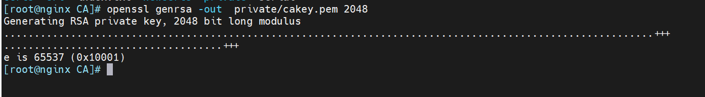
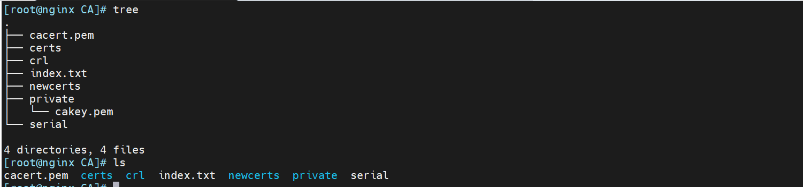

# `[ CA_default ]`配置项

在 OpenSSL 中，CA 的配置文件通常位于 `/etc/pki/tls/openssl.cnf` 或 `/etc/ssl/openssl.cnf`，这取决于你的操作系统和 OpenSSL 的安装位置。配置文件的 `[ CA_default ]` 部分定义了 CA 的默认行为，包括目录结构、证书存储位置、私钥文件路径等。

```bash
[ CA_default ]

# 设定 CA 的工作目录
dir             = /etc/pki/CA           # Where everything is kept

# 颁发的证书存放目录
certs           = $dir/certs            # Where the issued certs are kept

# 吊销证书列表（CRL）存放目录
crl_dir         = $dir/crl              # Where the issued crl are kept

# 颁发证书的数据库索引文件
database        = $dir/index.txt        # database index file.

# 如果允许创建多个具有相同主题的证书，则将其设置为 'no'
# unique_subject = no                    # Set to 'no' to allow creation of
                                        # several certificates with same subject.

# 存放新生成证书的目录
new_certs_dir   = $dir/newcerts         # default place for new certs.

# CA 自签名的根证书文件路径
certificate     = $dir/cacert.pem       # The CA certificate

# 当前序列号文件路径
serial          = $dir/serial           # The current serial number

# 当前吊销证书列表（CRL）编号文件路径
crlnumber       = $dir/crlnumber        # the current crl number
                                        # must be commented out to leave a V1 CRL

# 当前 CRL 文件路径
crl             = $dir/crl.pem          # The current CRL

# CA 的私钥文件路径
private_key     = $dir/private/cakey.pem # The private key

# 随机数文件路径
RANDFILE        = $dir/private/.rand    # private random number file

# 新证书中包含的扩展
x509_extensions = usr_cert              # The extensions to add to the cert

# 以下两行设置了证书主题名和字段的显示格式
# 注释掉以下两行可以使用“传统”的（但非常破损的）格式。
name_opt        = ca_default            # Subject Name options
cert_opt        = ca_default            # Certificate field options

```

# [ policy\_match ] 配置项

下面是 OpenSSL 配置文件中定义的 CA 策略部分 `[ policy_match ]` 的示例。这部分配置定义了 CA 在签发证书时的策略规则，确定哪些字段必须与申请者的 CSR（证书签名请求）中的信息相匹配。

```bash
# For the CA policy
[ policy_match ]

# 国家名称必须匹配
countryName             = match

# 州/省名称必须匹配
stateOrProvinceName     = match

# 组织名称必须匹配
organizationName        = match

# 组织单位名称是可选的
organizationalUnitName  = optional

# 通用名称（通常是域名）必须由申请者提供
commonName              = supplied

# 电子邮件地址是可选的
emailAddress            = optional

```

-   **三种策略详解**

1.  **match（匹配）**：  
    CA 要求 CSR 中的某个字段必须与 CA 的配置文件中的对应字段值完全匹配。例如，如果 `countryName` 设置为 `match`，则 CSR 中的国家名称必须与 CA 配置文件中预先定义的国家名称相同。如果不匹配，证书将不会被签发。
2.  **optional（可选）**：  
    该字段是可选的，CSR 中可以包含或不包含此字段。如果该字段存在于 CSR 中，CA 会接受它并在签发的证书中包括它；如果它不存在，CA 也不会拒绝签发证书。例如，`organizationalUnitName` 设置为 `optional` 意味着 CSR 可以包含或不包含组织单位名称。
3.  **supplied（提供）**：  
    该字段必须由 CSR 提供，但无需与 CA 配置中的值匹配。例如，`commonName` 设置为 `supplied` 表示 CSR 中必须提供通用名称（如域名），否则证书将不会被签发。但是，它不需要与 CA 的任何预定义值匹配。

# 创建私有CA

流程： CA私钥-CA自签名证书- 生成服务器证书的私钥和证书签名请求（CSR）

证书的目录

```bash
[root@nginx ~]# tree /etc/pki/CA
/etc/pki/CA
├── certs
├── crl
├── newcerts
└── private

4 directories, 0 files

```

创建CA所需要的文件

```bash
 #生成证书索引数据库文件
touch /etc/pki/CA/index.txt 

#指定第一个颁发证书的序列号
echo 01 > /etc/pki/CA/serial 
```

1.  生成CA私钥

```bash
cd /etc/pki/CA/

# private_key     = $dir/private/cakey.pem 已经指定了文件后缀名字，不可以更改。
openssl genrsa -out  private/cakey.pem 2048   # 生成 CA 私钥（2048位 RSA）

#这种方式也可以
openssl genrsa -out ca.key 2048
```



2.  生成CA自签名证书

在执行生成自签名根证书的 OpenSSL 命令后，系统会提示输入一些证书的详细信息。这些信息将会被包含在生成的证书中，用于标识 CA。你提供的填写信息示例如下：

```bash
[root@nginx CA]# openssl req -new -x509 -key /etc/pki/CA/private/cakey.pem -days 3650 -out /etc/pki/CA/cacert.pem

You are about to be asked to enter information that will be incorporated
into your certificate request.
What you are about to enter is what is called a Distinguished Name or a DN.
There are quite a few fields but you can leave some blank
For some fields there will be a default value,
If you enter '.', the field will be left blank.
-----
Country Name (2 letter code) [XX]:CN    # 国家名称，这里填写为 CN，表示中国。
State or Province Name (full name) []:beijing  # 省份名称
Locality Name (eg, city) [Default City]:beijing # 城市名称
Organization Name (eg, company) [Default Company Ltd]:litao  # 组织名称
Organizational Unit Name (eg, section) []:it  #组织单位名称
Common Name (eg, your name or your server's hostname) []:litao.com #通常填写服务器的主机名或域名
Email Address []:286365813@qq.com   #电子邮件地址
```

-   也可以通过下面形式：

```bash
# 生成自签名的 CA 根证书，有效期为 10 年
openssl req -new -x509 -key ca.key -out ca.crt -days 3650 -subj "/C=CN/ST=Beijing/L=Beijing/O=MyCompany/OU=IT/CN=MyCompany Root CA"
```

**关于两种命名区别：**

> -   `**cakey.pem**`**：**
> 
> `pem` 表示“Privacy Enhanced Mail”，是一种包含纯文本编码的格式，可以包含私钥、证书等内容。命名为 `cakey.pem` 通常表示这是一个CA的私钥文件。
> 
> -   `**ca.key**`**：**
> 
> `.key` 是一个更简单的文件扩展名，通常表示这是一个私钥文件。它也可以是PEM格式的文件，但文件名更直接。

生成了CA的证书文件和私钥文件



未加密证书文件转可视化：

```bash
[root@nginx CA]# openssl x509 -in cacert.pem -noout -text
Certificate:
    Data:
        Version: 3 (0x2)
        Serial Number:
            fc:88:83:e4:76:a1:0d:dd
    Signature Algorithm: sha256WithRSAEncryption
        Issuer: C=CN, ST=beijing, L=beijing, O=litao, OU=it, CN=litao.com/emailAddress=286365813@qq.com
        Validity
            Not Before: Sep  3 08:43:32 2024 GMT
            Not After : Sep  1 08:43:32 2034 GMT
        Subject: C=CN, ST=beijing, L=beijing, O=litao, OU=it, CN=litao.com/emailAddress=286365813@qq.com
        Subject Public Key Info:
            Public Key Algorithm: rsaEncryption
                Public-Key: (2048 bit)
                Modulus:
                    00:af:87:fe:df:bf:6e:ff:47:82:f9:1d:5e:f9:0c:
                    bc:21:1b:54:1b:b3:e8:6d:87:1a:50:58:37:41:2d:
                    5e:df:7a:c9:7e:ca:55:fb:01:d4:c6:38:eb:6e:bb:
                    cf:be:ff:a5:8e:2c:87:a0:cb:6e:eb:a6:9e:d4:bb:
                    68:6a:3c:4e:55:b9:69:d9:6e:11:98:a3:5c:2f:e3:
                    7d:44:b2:b8:fa:d2:2e:ba:0a:9c:50:75:a0:3e:e1:
                    ec:fe:be:cb:cf:d3:50:b9:49:b8:87:4f:8a:f6:5e:
                    16:e8:7f:d5:71:8b:da:b1:45:96:54:ed:7a:09:fe:
                    cd:7c:ed:5f:f9:d3:70:4c:0a:b2:ae:29:54:da:7c:
                    4d:23:99:da:43:d4:21:25:1f:38:58:98:2e:a6:c3:
                    5f:8f:5b:44:50:ab:58:84:3c:5f:db:b8:3b:ff:e1:
                    80:44:b2:3d:5d:cd:e2:9b:08:da:eb:b2:7d:a7:cc:
                    28:c0:86:c1:1f:aa:9b:a4:36:6b:5d:b1:b7:b5:9e:
                    b7:da:8f:c5:be:65:f4:a9:8d:0d:e4:2c:b2:f8:e8:
                    f0:ab:b1:67:7f:7b:28:87:bb:60:41:72:60:f7:eb:
                    8a:6c:e9:8c:b3:7b:1f:5a:53:ef:00:c1:5b:3f:39:
                    f8:67:70:06:8a:c2:fc:68:7c:c4:7d:53:40:78:ff:
                    d1:d5
                Exponent: 65537 (0x10001)
        X509v3 extensions:
            X509v3 Subject Key Identifier:
                17:1E:2D:52:6C:32:6B:4A:A8:3B:3E:74:52:7B:90:9C:9A:0B:D5:F8
            X509v3 Authority Key Identifier:
                keyid:17:1E:2D:52:6C:32:6B:4A:A8:3B:3E:74:52:7B:90:9C:9A:0B:D5:F8

            X509v3 Basic Constraints:
                CA:TRUE
    Signature Algorithm: sha256WithRSAEncryption
         5f:28:f8:12:21:ed:8f:51:7e:c4:c1:b5:1e:ca:f1:6b:4c:56:
         5f:e8:02:b7:60:55:f5:07:79:d4:ef:75:77:99:7d:f8:7f:53:
         03:86:c7:65:91:3b:9b:95:86:e3:c6:79:0c:5d:b6:d3:a2:a8:
         81:29:a7:b7:69:d9:18:25:c4:0c:d6:bb:95:68:f0:4c:c6:7b:
         20:3a:6c:10:84:01:4c:e8:fb:5e:93:0c:56:07:65:8c:bd:51:
         e2:5c:c4:bf:98:09:f0:db:a5:41:fd:78:00:36:fc:c2:f9:5c:
         1e:89:5c:2a:6f:0f:e8:b5:50:04:b4:56:a3:0c:2e:6c:87:b4:
         bb:0c:7b:e4:ac:f4:c9:39:28:b8:63:03:b5:bb:8d:ff:66:27:
         a4:af:05:c6:0d:b2:a0:c1:73:93:c1:05:f2:a2:a3:43:73:82:
         e4:30:41:fa:cb:5b:85:a6:e0:cb:ab:9f:fe:28:e7:75:35:a0:
         a9:17:8a:de:9a:f5:d7:bd:d9:34:61:6c:4d:63:48:61:e2:ae:
         e8:1c:89:c3:7a:9c:0c:06:11:7e:91:16:bf:c3:9c:ea:b3:70:
         76:0f:7f:02:a7:0a:70:8f:19:01:a8:75:10:42:8d:d3:8e:16:
         7d:f5:82:e3:4b:bb:64:31:26:c4:12:5b:1e:36:62:14:01:cc:
         61:35:a7:e6
```

## 为其他组织颁发证书

1.  为需要使用证书的主机生成生成私钥

```bash

[root@nginx CA]# openssl genrsa -out   /data/test.key 2048
Generating RSA private key, 2048 bit long modulus
.....................................+++
..............................+++
e is 65537 (0x10001)

```

2.  为需要使用证书的主机生成证书申请文件

```bash
[root@nginx CA]# openssl req -new -key /data/test.key -out /data/test.csr
You are about to be asked to enter information that will be incorporated
into your certificate request.
What you are about to enter is what is called a Distinguished Name or a DN.
There are quite a few fields but you can leave some blank
For some fields there will be a default value,
If you enter '.', the field will be left blank.
-----
Country Name (2 letter code) [XX]:CN
State or Province Name (full name) []:beijin
Locality Name (eg, city) [Default City]:beijin
Organization Name (eg, company) [Default Company Ltd]:litao
Organizational Unit Name (eg, section) []:sre
Common Name (eg, your name or your server's hostname) []:www.litao.com
Email Address []:

Please enter the following 'extra' attributes
to be sent with your certificate request
A challenge password []:
An optional company name []:

```

**注意：默认要求 国家，省，公司名称三项必须和CA一致**

3.  在CA签署证书并将证书颁发给请求者

```bash
[root@nginx CA]# openssl ca -in /data/test.csr  -out   /etc/pki/CA/certs/test.crt -days 1000
Using configuration from /etc/pki/tls/openssl.cnf
Check that the request matches the signature
Signature ok
The stateOrProvinceName field needed to be the same in the
CA certificate (beijing) and the request (beijin)

```

4.  查看颁发的证书

```bash

[root@nginx CA]# tree
.
├── cacert.pem
├── certs
│   └── test.crt
├── crl
├── index.txt
├── newcerts
├── private
│   └── cakey.pem
└── serial

4 directories, 5 files

```

5.  这样就生成了服务器的私钥/data/test.key和证书文件 /etc/pki/CA/certs/test.crt

### 颁发证书相关脚本、

-   给一个用户颁发

```bash
#!/bin/bash
#
#********************************************************************
#Author:		wangxiaochun
#QQ: 			29308620
#Date: 			2020-02-07
#FileName：		certificate.sh
#URL: 			http://www.liwenliang.org
#Description：		本脚本纪念武汉疫情鸣笛人李文亮医生
#Copyright (C): 	2020 All rights reserved
#********************************************************************
CA_SUBJECT="/O=magedu/CN=ca.magedu.org"
SUBJECT="/C=CN/ST=henan/L=zhengzhou/O=magedu/CN=www.magedu.org"
SERIAL=34
EXPIRE=202002
FILE=magedu.org

openssl req  -x509 -newkey rsa:2048 -subj $CA_SUBJECT -keyout ca.key -nodes -days 202002 -out ca.crt

openssl req -newkey rsa:2048 -nodes -keyout ${FILE}.key  -subj $SUBJECT -out ${FILE}.csr

openssl x509 -req -in ${FILE}.csr  -CA ca.crt -CAkey ca.key -set_serial $SERIAL  -days $EXPIRE -out ${FILE}.crt

chmod 600 ${FILE}.key ca.key

```

-   给多个用户颁发

```bash
#!/bin/bash
#
#********************************************************************
#Author:		wangxiaochun
#QQ: 			29308620
#Date: 			2020-02-29
#FileName：		test.sh
#URL: 			http://www.magedu.com
#Description：		The test script
#Copyright (C): 	2020 All rights reserved
#********************************************************************

#证书存放目录
DIR=/data

#每个证书信息
declare -A CERT_INFO
CERT_INFO=([subject0]="/O=heaven/CN=ca.god.com" \
           [keyfile0]="cakey.pem" \
           [crtfile0]="cacert.pem" \
           [key0]=2048 \
           [expire0]=3650 \
           [serial0]=0    \
           [subject1]="/C=CN/ST=hubei/L=wuhan/O=Central.Hospital/CN=master.liwenliang.org" \
           [keyfile1]="master.key" \
           [crtfile1]="master.crt" \
           [key1]=2048 \
           [expire1]=365
           [serial1]=1 \
           [csrfile1]="master.csr" \
           [subject2]="/C=CN/ST=hubei/L=wuhan/O=Central.Hospital/CN=slave.liwenliang.org" \
           [keyfile2]="slave.key" \
           [crtfile2]="slave.crt" \
           [key2]=2048 \
           [expire2]=365 \
           [serial2]=2 \
           [csrfile2]="slave.csr"   )

COLOR="echo -e \\E[1;32m"
END="\\E[0m"

#证书编号最大值
N=`echo ${!CERT_INFO[*]} |grep -o subject|wc -l`

cd $DIR 

for((i=0;i<N;i++));do
    if [ $i -eq 0 ] ;then
        openssl req  -x509 -newkey rsa:${CERT_INFO[key${i}]} -subj ${CERT_INFO[subject${i}]} \
            -set_serial ${CERT_INFO[serial${i}]} -keyout ${CERT_INFO[keyfile${i}]} -nodes \
	    -days ${CERT_INFO[expire${i}]}  -out ${CERT_INFO[crtfile${i}]} &>/dev/null
        
    else 
        openssl req -newkey rsa:${CERT_INFO[key${i}]} -nodes -subj ${CERT_INFO[subject${i}]} \
            -keyout ${CERT_INFO[keyfile${i}]}   -out ${CERT_INFO[csrfile${i}]} &>/dev/null

        openssl x509 -req -in ${CERT_INFO[csrfile${i}]}  -CA ${CERT_INFO[crtfile0]} \
	    -CAkey ${CERT_INFO[keyfile0]}  -set_serial ${CERT_INFO[serial${i}]}  \
	    -days ${CERT_INFO[expire${i}]} -out ${CERT_INFO[crtfile${i}]} &>/dev/null
    fi
    $COLOR"**************************************生成证书信息**************************************"$END
    openssl x509 -in ${CERT_INFO[crtfile${i}]} -noout -subject -dates -serial
    echo 
done
chmod 600 *.key
echo  "证书生成完成"
$COLOR"**************************************生成证书文件如下**************************************"$END
echo "证书存放目录: "$DIR
echo "证书文件列表: "`ls $DIR`
```

1.  给多个用户颁发

[certificate6.sh](https://www.yuque.com/attachments/yuque/0/2024/sh/12520784/1725549585933-9c136805-d532-4603-99f4-33f370f033d3.sh)

2.  给一个用户颁发

[certificate.sh](https://www.yuque.com/attachments/yuque/0/2024/sh/12520784/1725549600403-9303b165-f88f-4f0d-b4a4-7b2eb6f282b4.sh)