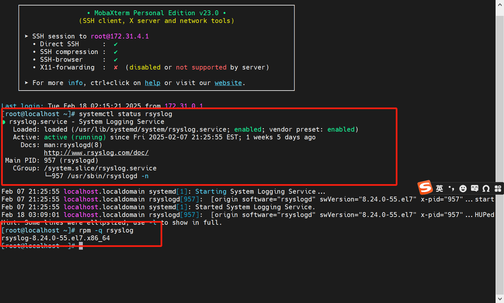
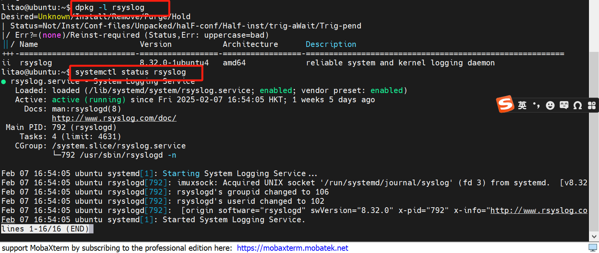
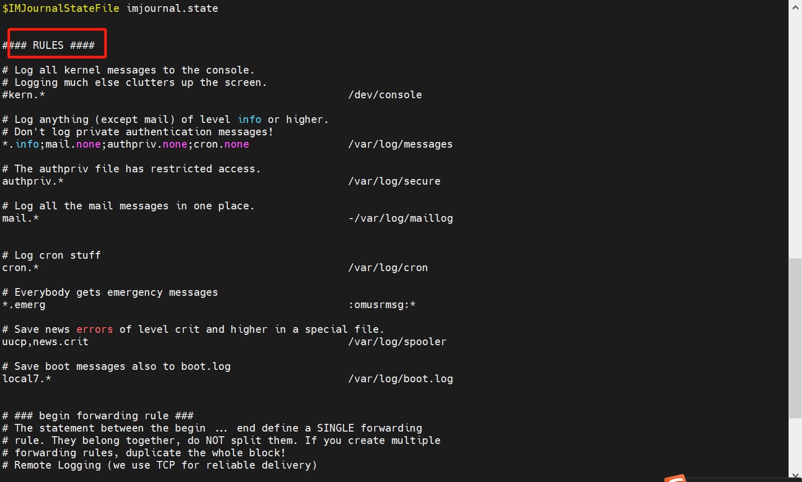
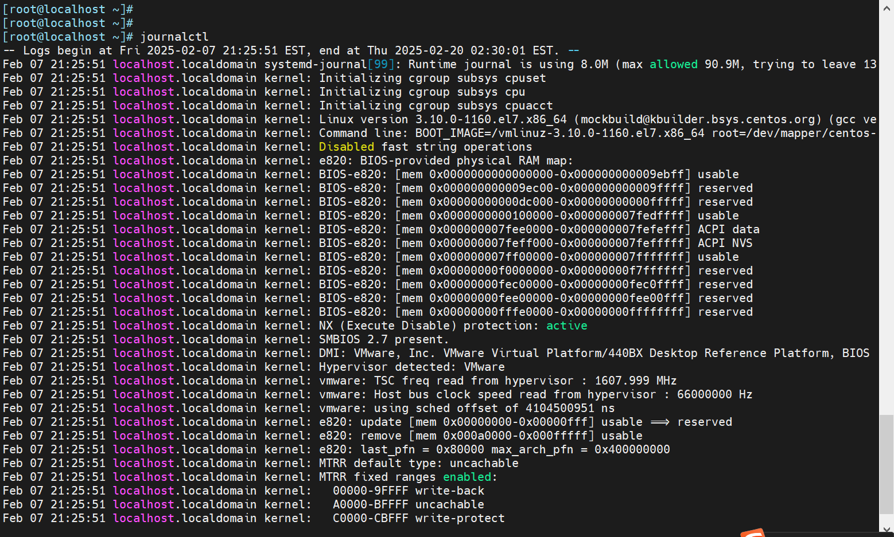
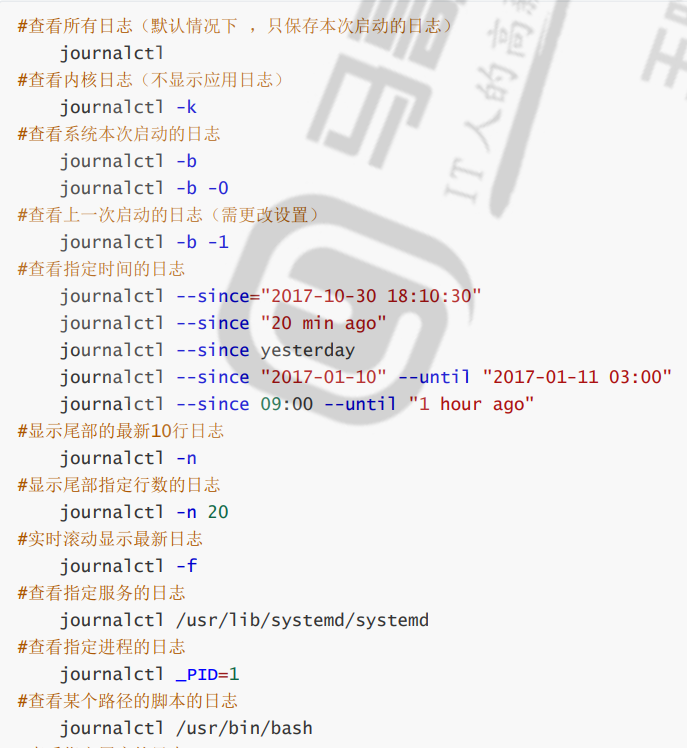
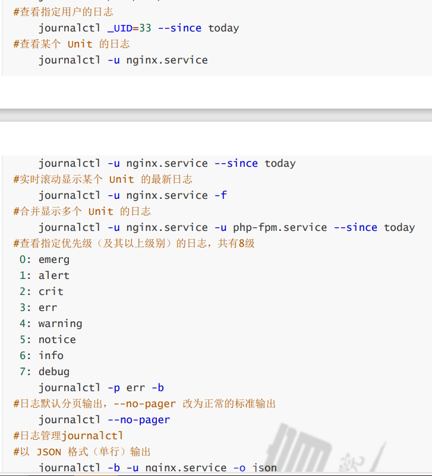
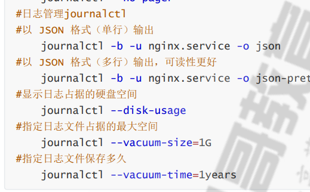

# rsyslog 管理

## 系统日志术语

1.  **facility：设施，从功能或程序上对日志进行归类**

> auth, authpriv, cron, daemon,ftp,kern, lpr, mail, news, security(auth), user, uucp, syslog
> 
> \# 自定义的分类
> 
> local0-local7

-   auth：与身份验证相关的日志，比如登录和认证的事件。
-   authpriv：和 auth 类似，但包含了更敏感的认证信息，通常仅限于管理员查看。
-   cron：与 cron 作业相关的日志，记录定时任务的执行情况。
-   daemon：记录系统守护进程（如 sshd、httpd 等）的日志。
-   ftp：记录与 FTP 服务相关的日志。
-   kern：记录 内核 相关的日志，包括硬件驱动、内核模块等信息。
-   lpr：打印相关的日志，记录打印机或打印作业的事件。
-   mail：与邮件服务相关的日志，记录邮件发送和接收的事件。
-   news：与新闻组服务（如 NNTP）相关的日志。
-   security(auth)：特指与系统安全、认证相关的日志信息。
-   user：用户级应用程序的日志，通常指普通用户进程生成的日志。
-   uucp：与 UUCP（Unix-to-Unix Copy Protocol）相关的日志，通常涉及文件传输和通信。
-   syslog：系统日志的通用设施，记录来自各种服务的通用信息。

2.  **Priority 优先级别，从低到高排序**

> debug, info, notice, warn(warning), err(error), crit(critical), alert, emerg(panic)

​  

## centos 系统配置

```markdown
# Log all kernel messages to the console.
# Logging much else clutters up the screen.
#kern.*                                                 /dev/console

# Log anything (except mail) of level info or higher.
# Don't log private authentication messages!
*.info;mail.none;authpriv.none;cron.none                /var/log/messages

# The authpriv file has restricted access.
authpriv.*                                              /var/log/secure

# Log all the mail messages in one place.
mail.*                                                  -/var/log/maillog

# Log cron stuff
cron.*                                                  /var/log/cron
```

\*.info：表示 所有设施（包括认证、邮件、守护进程等）中 信息级别及更高级别的日志（例如 info、notice、warning 等）都会被记录。**mail.none;authpriv.none;cron.none 表示排除了3个设施的。**

mail.\* 说明 -/var/log/maillog 带有 “-”是异步，并不是立即写入日志中，而是先写进去缓冲区中。

## rsyslog配置文件



RULES：日志记录相关的规则配置 说明：

RULES配置格式：

```markdown
facility.priority; facility.priority… target
```

facility格式：

```markdown
* #所有的facility  
facility1,facility2,facility3,...          #指定的facility列表
```

priority格式：

```markdown
*: 所有级别
none：没有级别，即不记录
PRIORITY：指定级别（含）以上的所有级别
=PRIORITY：仅记录指定级别的日志信息
```

target格式：

```markdown
文件路径：通常在/var/log/，文件路径前的-表示异步写入
用户：将日志事件通知给指定的用户，* 表示登录的所有用户
日志服务器：@host，把日志送往至指定的远程UDP日志服务器 @@host 将日志发送到远程TCP日志服务器
管道： | COMMAND，转发给其它命令处理
```

例如：将ssh服务的日志记录至自定义的local的日志设备

```markdown
# 修改sshd服务的配置
Vim /etc/ssh/sshd_config
SyslogFacility local2
Service sshd reload

# 修改rsyslog的配置
Vim /etc/rsyslog.conf
Local2.* /var/log/sshd.log
Systemctl  restart rsyslog 

# 测试
Ssh登录后，查看/var/log/sshd.log有记录

# logger测试
logger -p local2.info "hello sshd"
tail /var/log/sshd.log有记录

```

# 常见的日志

1.  **/var/log/secure**

-   **用途**：系统安全日志，记录与系统安全相关的事件，如用户认证、权限更改等。
-   **格式**：文本格式
-   **分析**：应定期查看，进行安全审计。

  

2.  **/var/log/btmp**

-   **用途**：记录用户登录失败的尝试。
-   **格式**：二进制格式
-   **查看**：使用 `lastb` 命令查看。

```markdown
   # 找出失败登录次数最多的前10个IP  
   lastb -f btmp-test1 | awk '{print $3}'|sort | uniq -c|sort - nr|head  
```

3.  **/var/log/wtmp**

-   **用途**：记录系统上用户的正常登录、注销等信息。
-   **格式**：二进制格式
-   **查看**：使用 `last` 命令查看。

  

4.  **/var/log/lastlog**

-   **用途**：记录每个用户的最后一次登录信息。
-   **格式**：二进制格式
-   **查看**：使用 `lastlog` 命令查看。

  

5.  **/var/log/dmesg**

-   **用途**：记录系统启动过程中以及开机后的硬件信息（如设备检测、内核消息等）。
-   **格式**：文本格式
-   **查看**：使用 `dmesg` 命令查看。开机后硬件变化的记录将不再持续。

  

6.  **/var/log/boot.log**

-   **用途**：记录系统启动时服务的启动信息。
-   **格式**：文本格式
-   **查看**：可以查看系统服务启动的详细信息。

​  

7.  **/var/log/messages**

-   **用途**：系统中大多数的日志信息，如系统错误、警告、信息等。
-   **格式**：文本格式
-   **查看**：适用于系统故障排除，查看系统重要事件。

​  

8.  **/var/log/anaconda**

-   **用途**：记录系统安装过程中的日志信息（如果系统通过 Anaconda 安装）。
-   **格式**：文本格式
-   **查看**：适用于安装故障排除。

# 日志管理工具 journalctl

命令行输入 journalctl 是记录当次当前开机的日志记录。



一些用法：





