# 管理目录文件命令

## 查看目录 -tree

```plain
-d 只显示文件
-L 指定显示的层级数目
-p 列出权限
-f 显示文件的绝对路径
```

1.  查看目录树结构

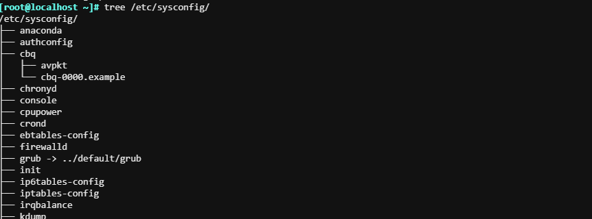

2.  查看目录树指定的层级

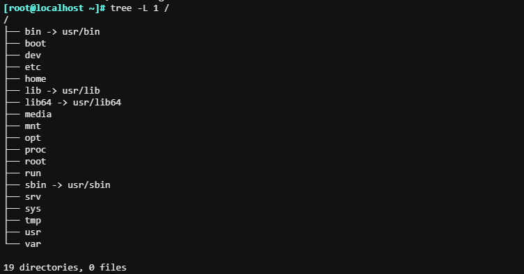

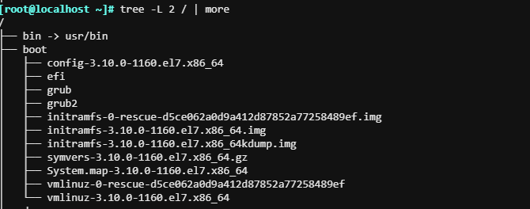

3.  查看目录树的子目录，不包含文件

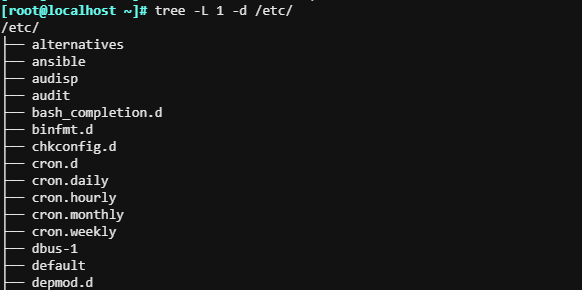

4.  显示目录树下面的文件权限和绝对路径

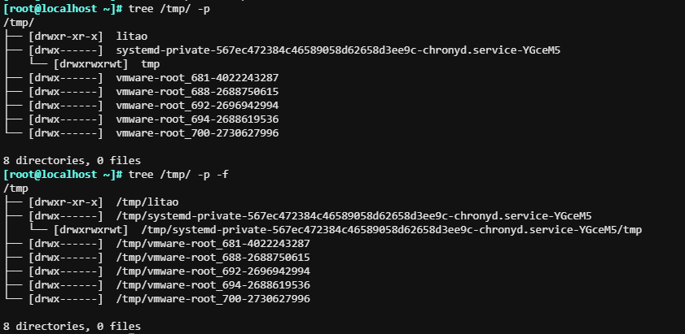

# 管理文件的命令

## 查看文件列表-ls

`ls [OPTION]... [FILE]...`

```bash
-a			包含隐藏文件  
-l  	  显示额外信息
-R  	  目录递归，遍历
-ld			目录和符号链接信息 ；查看目录本身
-1    	分行排
--color=auto
-S   		 按从大到小排序  
-t   		 按照mitime（修改时间）排序，最新的往前。
-u    	 按照atime（访问时间）排序；配合-t选项，显示并按atime从新到旧排序
-h				文件大小以KB、MB或GB等单位显示
```

> 说明：
> 
> 1.  ls 查看不同后缀文件时的颜色由 /etc/DIR\_COLORS 决定；
> 2.  ls -l 默认看到的是mitime时间，需要看acess time 访问时间和chang time状态更改时间需要使用命令stat命令；只有

1.  查看隐藏文件

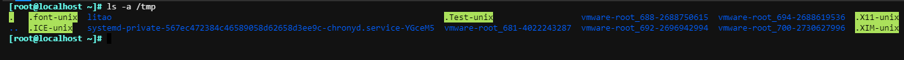

2.  列出文件的详细信息

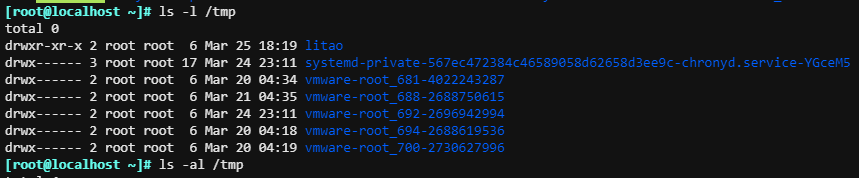

3.  显示文件或者目录，以人容读的形式

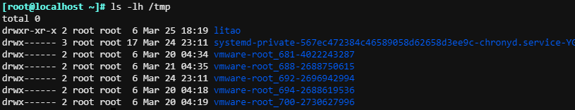

4.  以修改时间新到旧排序

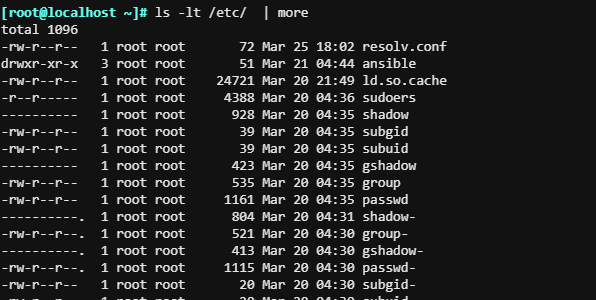

5.  以递归的形式显示目录文件

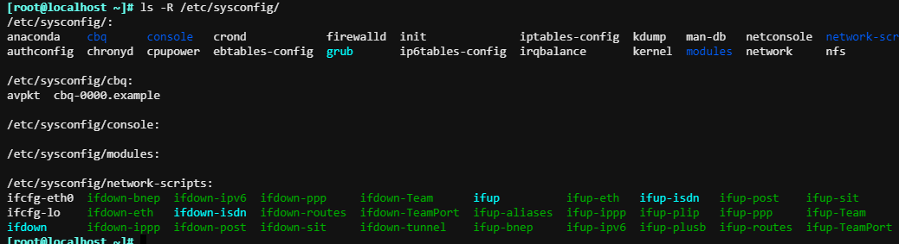

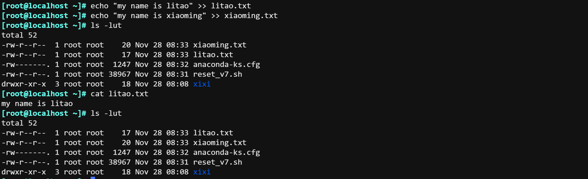

只显示当前文件夹

```plsql
[root@localhost ~]# ls -d */
xixi/
```

unbunt会在文件夹后面添加 / ；

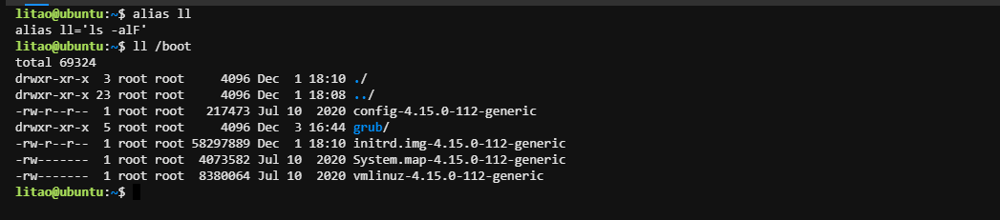

### 文件时间属性

每个文件有三个时间戳：

-   access time 访问时间，atime，读取文件内容
-   modify time 修改时间，mtime，改变文件内容（数据）
-   change time 改变时间，ctime，元数据发生改变

> 说明：atime并不是访问一次就改变一次；每次读取文件都会即时更新，会额外的对磁盘有写的操作。  
> 从centos 6开始默认了开启relatime的挂载选项；只有满足条件后才会更新;  
> 条件1：
> 
> 文件的atime超过一天以上
> 
> 条件2：
> 
> 文件的mtime比atime时间晚

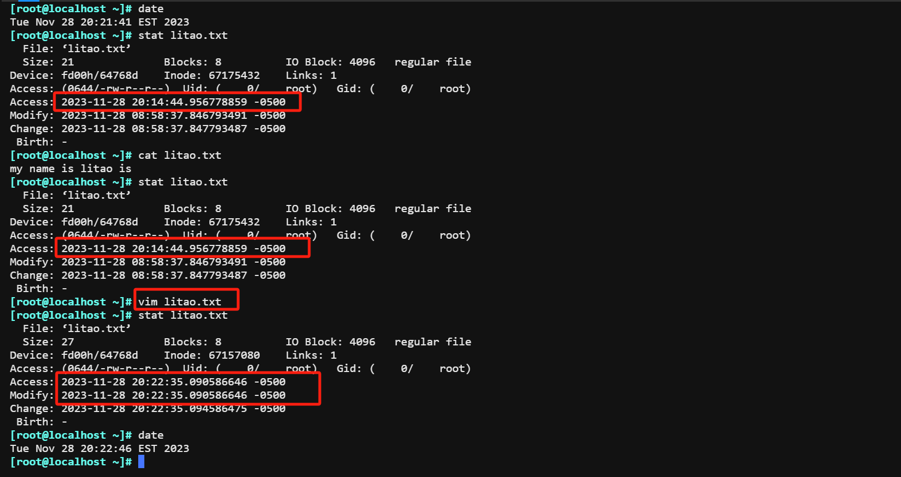

**一些可能导致这些时间戳变动的具体情况：**

> -   **Access Time (atime):**
> 
> -   当文件被读取。
> -   一些文件系统可能支持atime的延迟更新，以提高性能。
> 
> -   **Modify Time (mtime):**
> 
> -   当文件内容被修改。
> -   当文件被重命名。
> -   当文件被移动。
> 
> -   **Change Time (ctime):**
> 
> -   当文件的元数据（如权限、所有权）被修改。
> -   当文件被创建。
> -   当文件被重命名。
> -   当文件被移动。

**在Linux系统中，每个文件都有一些元数据，这些元数据包含有关文件的信息。以下是一些常见的文件元数据：**

> 1.  **文件名（Name）：** 文件的名称，用于唯一标识文件在文件系统中的位置。
> 2.  **文件路径（Path）：** 文件在文件系统中的完整路径，指明文件的位置。
> 3.  **文件大小（Size）：** 文件所占用的磁盘空间的大小，通常以字节为单位。
> 4.  **文件类型（Type）：** 文件的类型，例如普通文件、目录、符号链接等。
> 5.  **文件权限（Permissions）：** 用于定义文件的读取、写入和执行权限，分别对应用户、组和其他用户。
> 6.  **所有者（Owner）：** 文件的所有者，即文件创建者或拥有者。
> 7.  **所属组（Group）：** 文件的所属组，决定了文件的一些权限。
> 8.  **创建时间（Creation Time）：** 文件创建的时间戳，表示文件的创建时间。
> 9.  **修改时间（Modification Time）：** 文件内容最后一次修改的时间戳。
> 10.  **访问时间（Access Time）：** 文件最后一次被访问的时间戳。
> 11.  **链接计数（Link Count）：** 文件的硬链接数量，即指向该文件的硬链接的数量。
> 12.  **inode 号码（Inode Number）：** 文件在文件系统中的唯一标识号码。
> 13.  **用户标识（User ID）：** 与所有者相关联的用户标识号码。
> 14.  **组标识（Group ID）：** 与所属组相关联的组标识号码。

## 查看文件属性- stat

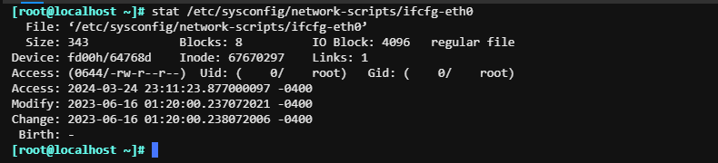

## 创建文件

待补充 -- touch

## 复制文件和目录-cp

`cp [OPTION]... [-T] SOURCE DEST`

`cp [OPTION]... SOURCE... DIRECTORY（目录）`

`cp [OPTION]... -t DIRECTORY SOURCE...`

```bash
-i  如果目标已存在，覆盖前提示是否覆盖  
-r  -R 递归复制目录及内部的所有内容 
-a 归档，相当于-dR --preserv=all，常用于备份功能  ；-a 也包含-r和-R的递归属性
-d  --no-dereference --preserv=links 不复制原文件，只复制链接名  
    --preserv[=ATTR_LIST] mode: 权限 ownership: 属主属组 还有三个时间戳
-v --verbose  显示过程
-b 目标存在，覆盖前先备份，默认形式为 `filename~`,只保留最近的一个备份  
-u --update 只复制源比目标更新文件或目标不存在的文件  
-b 目标存在，覆盖前先备份，默认形式为 `filename~`,只保留最近的一个备份
--backup=numbered 目标存在，覆盖前先备份加数字后缀，形式为`filename.~#~`，可以保留多个版本  
```

1.  不添加 -a 参数的话，属性会变化。

```plsql
[litao@localhost ~]$ who am i
root     pts/0        2023-12-02 11:57 (172.31.0.1)
[litao@localhost ~]$ touch litao.txt
[litao@localhost ~]$ ll litao.txt 
-rw-rw-r-- 1 litao litao 0 Dec  2 12:10 litao.txt

切换root用户之后；没有添加-a 属性改变了
[root@localhost ~]# cp /home/litao/litao.txt .
cp: overwrite ‘./litao.txt’? y
[root@localhost ~]# ll litao.txt 
-rw-r--r-- 1 root root 0 Dec  2 12:11 litao.txt

添加-a之后，属性并没发生改变
[root@localhost ~]# cp -a /home/litao/litao.txt .
cp: overwrite ‘./litao.txt’? y
[root@localhost ~]# ll litao.txt 
-rw-rw-r-- 1 litao litao 0 Dec  2 12:10 litao.txt
```

2.  cp命令只复制文件；复制文件夹的话需要添加参数 -r 或者 -R；

```plsql

[root@localhost xixi]# cp /home/litao/folder/ ./xixi/
cp: omitting directory ‘/home/litao/folder/’

[root@localhost xixi]# cp -r /home/litao/folder/ ./xixi/
[root@localhost xixi]# ll xixi/simida.txt 
-rw-r--r-- 1 root root 0 Dec  2 12:28 xixi/simida.txt
```

3.  备份文件

```plsql
[root@localhost ~]# cp litao.txt{,.bak}
[root@localhost ~]# ls
anaconda-ks.cfg  litao.txt  litao.txt.bak  reset_v7.sh  xiaoming.txt  xixi

[litao@localhost ~]$ echo /etc/issue{,.bak}
/etc/issue /etc/issue.bak
```

4.  复制的不同情况

| 源目标 | 目标不存在 | 目标存在且文件 | 目标存在且目录 |
| --- | --- | --- | --- |
| 一个文件 | 新建目标，并将源目标中 内容填充至新建目标中 | 存在且为文件；会提示是否覆盖 | 会成为目标目录下的子文件 |
| 多个文件 | 报错 | 报错 | 会成为目录下的子文件 |
| 目录{ 必须使用递归参数} | 新建目标目录，源文件也会跟着过去 | 报错 | 在DEST下新建与原目录同 名的目录，并将SRC中内容 复制至新目录中 |

-   源目标一个文件

```plsql
目标不存在；
[root@localhost ~]# cp /home/litao/litao.txt  /opt
[root@localhost ~]# ls /opt
boot  litao.txt

存在且为文件；会提示是否覆盖
[root@localhost ~]# cp /home/litao/litao.txt /opt/litao.txt 
cp: overwrite ‘/opt/litao.txt’? 

目标存在且目录；会成为目标目录下的子文件
[root@localhost ~]# cp /home/litao/litao.txt /opt/test
[root@localhost ~]# ls /opt/test/
litao.txt

```

-   多个文件

```plsql
目标存在且目录：
[root@localhost ~]# cp -a /root/xixi/litao.txt /root/xixi/simida.txt /opt
```

-   目录

目标目录不存在：新建目标目录，源文件也会跟着过去

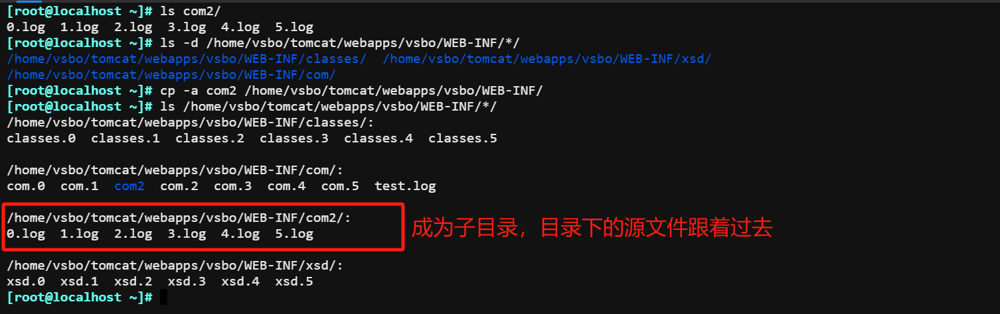

目标目录存在：在DEST下新建与原目录同名的目录，并将SRC中内容 复制至新目录中。

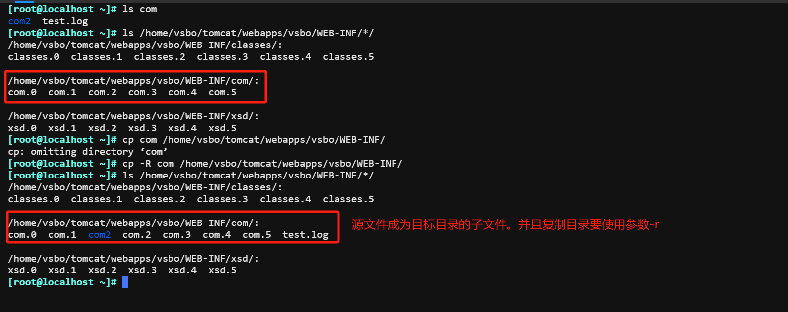

目标存在且文件；报错

```plsql
[root@localhost ~]# cp -a /root/xixi   /opt/litao.txt 
cp: cannot overwrite non-directory ‘/opt/litao.txt’ with directory ‘/root/xixi’

```

## 移动重命名文件-mv

待补充--mv

## 删除文件-rm

`rm [OPTION]... FILE...`

```bash
-f, --force：强制删除文件或目录，无论文件是否可写或是否存在其他权限限制。
-i, --interactive：交互式删除，删除前提示用户确认。当删除多个文件时，会逐个询问是否删除
-r, -R, --recursive：递归地删除目录及其所有内容。使用此选项时要小心，因为它会删除指定目录中的所有文件和子目录。
-d, --dir：删除空目录。只有在目录为空的情况下才会生效，否则会报错。
```

注意：删除/opt下面目录的话，需要写到/opt/litao 绝对路径或者/opt的相对路径；否则只指定 rm -r /opt目录的话，会提示你是否删除/opt的目录本身。

例如：**rm -rf /test/**会删除**/test**目录本身及其所有内容。

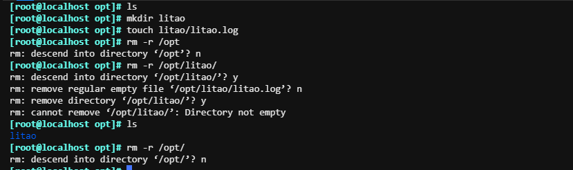