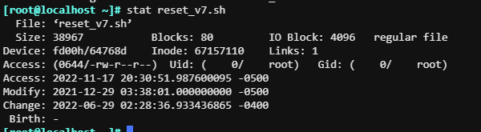
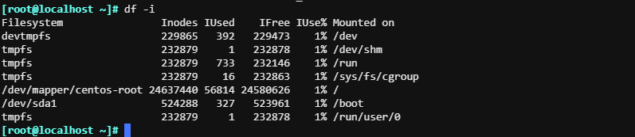
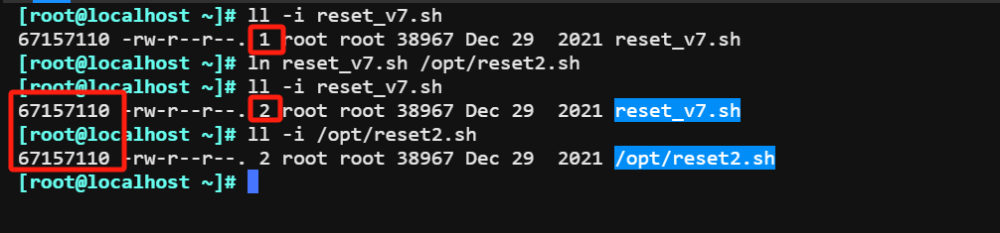
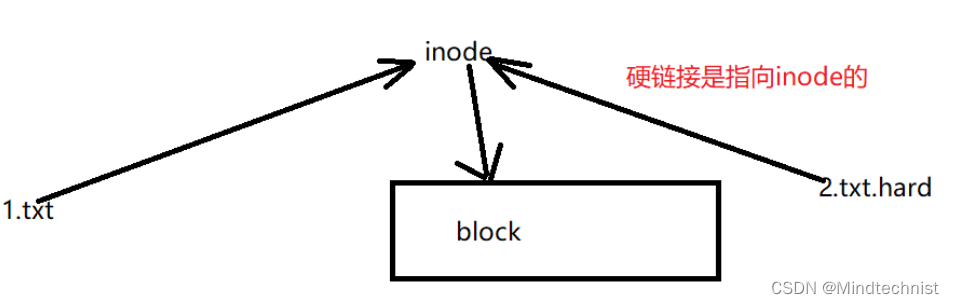
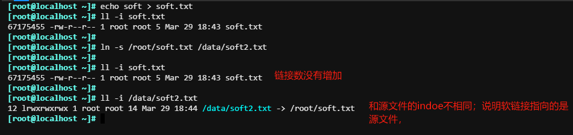
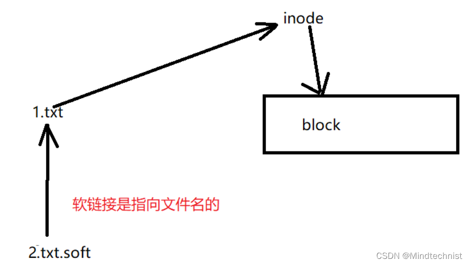

# 软链接和硬链接-ln

一个文件会被分成两部分；数据和元数据。数据指的是存放文件真实内容的地方，元数据则是文件的附加属性，（inode、文件类型、权限、UID、GID、链接数、该文件的大小和不同的时间戳）；可以使用`stat`命令查看元数据。



Inode的值在每个分区中唯一。`df -i`查看分区支持多少个和使用的inode值。



命令格式：

```bash
ln [OPTION]... [-T] TARGET LINK_NAME   (1st form)
ln [OPTION]... TARGET                  (2nd form)
ln [OPTION]... TARGET... DIRECTORY     (3rd form)
ln [OPTION]... -t DIRECTORY TARGET...  (4th form)

说明：TARGET表示需要创建链接文件的目标文件；LINK_NAME表示要生成的链接文件。
```

## 硬链接

创建硬链接，实际指向同一个inode；链接数+1，因为每个分区的inode值唯一，所以不能跨分区和对目录创建硬链接





## 软连接：

创建软链接，实际指向的是源文件本身；并不是Inode。所以链接数没有+1。

注意：创建软链接源文件要写绝对路径；或者写链接文件的绝对路径。软连接无法相对于当前路径。



  



案例：

读取大量快写入文件，另外个xshll编辑文件。删除文件后依然发现空间没下来，

1.  \> 重定向文件
2.  把程序停了。

软连接和硬链接图。

