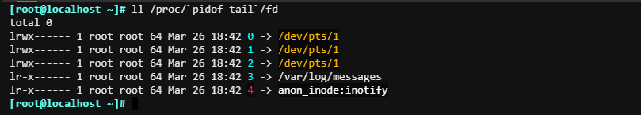
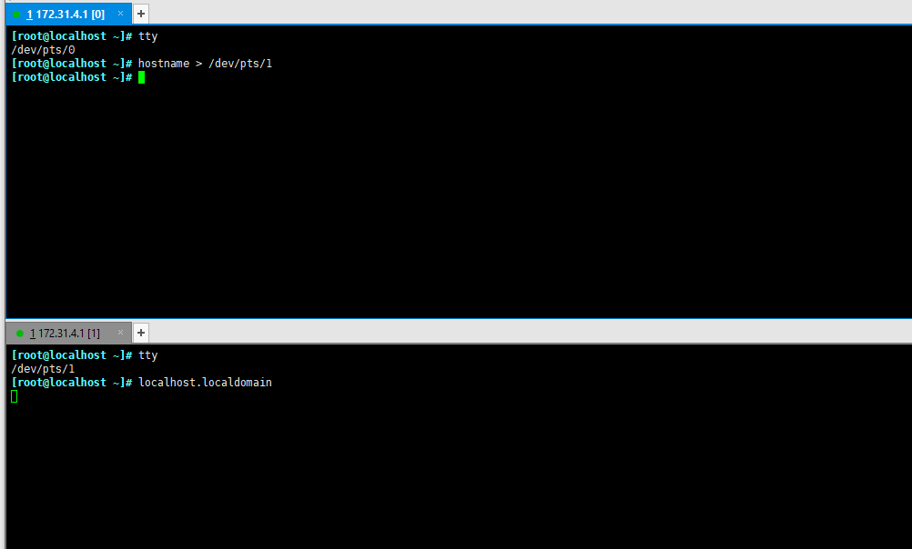
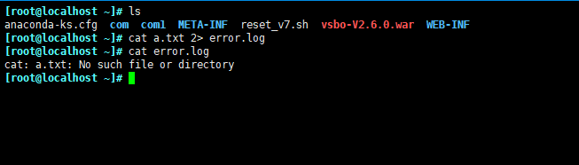
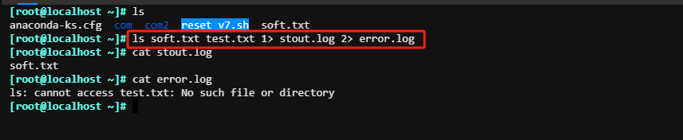
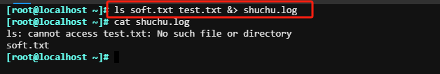
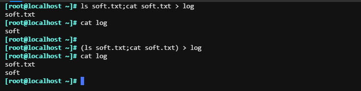
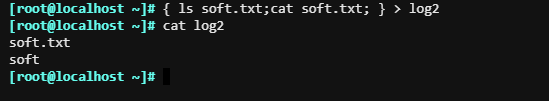

# 重定向和管道

`/proc/$BASHID/fd{0、1、2}`

输入重定向：描述代码为0；使用 "0<" 或者 "<" 实现标准输入的重定向，其中 0 是可以省略的。

输出重定向：描述代码为；使用 "1 > " 或者 ">" 实现标准输出的重定向，其中1 是可以省略的。

错误重定向： 描述代码为2；使用 "2 >" 或者 "2 >>"实现错误输出重定向，其中2 是可以省略的。

###### 标准输出重定向

通过重定向可以在另外个tty把执行结果显示出来。

###### 标准错误重定向

###### 正确和错误重定向分开放

###### 正确和错误重定向一个文件

###### 合并多个命令的结果至一个文件中

不使用括号的话，标准输出会出现当前的窗口

注意：{ }的用法需要前后空格，并且命令要使用"；"结束。

