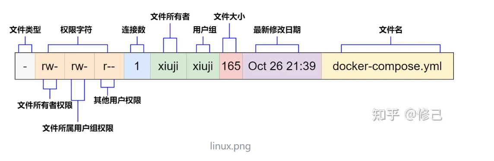
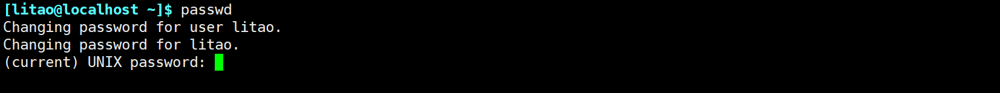
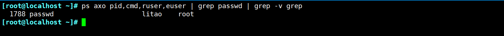

# 用户和组的配置文件

## 用户和组的主要配置文件

1.  **/etc/passwd**：用户及其属性信息(名称、UID、主组ID等）

```bash
[root@localhost ~]# getent passwd | grep litao
litao:x:1000:1000::/home/litao:/bin/bash
用户:密码:UID:GID:用户全名或注释:用户家目录:用户默认使用shell    7个键值对
```

2.  **/etc/shadow**：用户密码及其相关属性

```bash
[root@localhost ~]# getent shadow | grep itao
litao:$6$7JB9kuZ4$0d.FsvHsM2bJz.CRmdndVIPlCCNg53XLVpol2j.YT5q2XkBJNzLN3XZsMy3Msc7XcdbJMoybGTfPagShQjfEP/:19693:0:99999:7:::

8个键值对意思
用户名
sha512加密密码
从1970年1月1日起到密码最近一次被更改的时间(按天计算)
密码再过几天可以被变更（0表示随时可被变更)
密码再过几天必须被变更（99999表示永不过期)
密码过期前几天系统提醒用户（默认为一周)
密码过期几天后帐号会被锁定：从1970年1月1日算起，多少天后帐号失效
```

-   例子：计算时间最近被更改时间

```bash
[root@localhost ~]# date --help | grep  %s 
  %s   seconds since 1970-01-01 00:00:00 UTC
[root@localhost ~]# echo "$(date +%s) / 3600 / 24" | bc
19697
```

3.  **/etc/group**：组及其属性信息

```bash
[root@localhost ~]# getent group | grep itao
litao:x:1000:
群组名称:群组密码:群组ID：以当前组为附加组的用户列表(分隔符为逗号)
```

4.  /etc/gshadow：组密码及其相关属性

```bash
[root@localhost ~]# getent gshadow | grep itao
litao:!::
群组名称:群组密码:组管理员列表:组管理员的列表，更改组密码和成员:以当前组为附加组的用户列表;多个用户间用逗号分隔
```

# 用户和组管理命令

## 用户管理命令

**命令：**`**useradd、userdel、usrmod**`

1.  useradd 格式

`useradd [options] LOGIN`

```bash
/usr/sbin/useradd -d /var/spool/postfix -s /sbin/nologin -g postfix -G mail -M -r -U 89 postfix 2>/dev/null

useradd -r -u 48 -g apache -s /sbin/nologin -d /var/www -c "Apache" apache
```
> **\-d: 指定家目录**
> 
> **\-S：指定shell类型 /sbin/nologin /bin/false or /usr/bin/nologin**
> 
> **\-g：主组 主要岗位；CEO,CTO 只有一个**
> 
> **\-G：辅助组 次要岗位；CTO，可有可无，可有多个**
> 
> **\-M：不创建创建家目录**
> 
> **\-m: 创建家目录**
> 
> **\-r：系统账号**
> 
> **\-u: 用户ID**
> 
> **\-c：对于用户的注释**

2.  userdel

删除用户不指定-r参数，则用户的家目录不会删除，重新创建用户的话会继承上一个用户家目录、uid和gid

指定-r参数之后，会删除家目录和元数据。

```bash
[root@localhost ~]# useradd haha
[root@localhost ~]# ll /home/
total 0
drwx------ 2 haha  haha  62 Dec 27 07:50 haha
drwx------ 2 litao litao 99 Dec 27 04:39 litao

[root@localhost ~]# userdel haha
[root@localhost ~]# ll /home
total 0
drwx------ 2  1001  1001 62 Dec 27 07:50 haha
drwx------ 2 litao litao 99 Dec 27 04:39 litao

[root@localhost ~]# useradd xixi
[root@localhost ~]# ll /home/
total 0
drwx------ 2 xixi  xixi  62 Dec 27 07:50 haha
drwx------ 2 litao litao 99 Dec 27 04:39 litao
drwx------ 2 xixi  xixi  62 Dec 27 07:51 xixi

指定-r参数
[root@localhost ~]# ll /home/
total 0
drwx------ 2 shabi shabi 62 Dec 27 07:50 haha
drwx------ 2 litao litao 99 Dec 27 04:39 litao
drwx------ 2 shabi shabi 62 Dec 27 07:54 shabi
[root@localhost ~]# userdel -r shabi
[root@localhost ~]# ll /home/
total 0
drwx------ 2  1001  1001 62 Dec 27 07:50 haha
drwx------ 2 litao litao 99 Dec 27 04:39 litao
[root@localhost ~]# 
```

3.  用户属性修改

`usermod [OPTION] login`

> \-u UID: 新UID
> 
> \-g GID: 新主组
> 
> \-G GROUP1[,GROUP2,...\[,GROUPN]\]\]：新附加组，原来的附加组将会被覆盖；若保留原有，则要同时使 用-a选项
> 
> \-s SHELL：新的默认SHELL -c 'COMMENT'：新的注释信息
> 
> \-d HOME: 新家目录不会自动创建；若要创建新家目录并移动原家数据，同时使用-m选项
> 
> \-l login\_name: 新的名字
> 
> \-L: lock指定用户,在/etc/shadow 密码栏的增加 !
> 
> \-U: unlock指定用户,将 /etc/shadow 密码栏的 ! 拿掉
> 
> \-e YYYY-MM-DD: 指明用户账号过期日期 -f INACTIVE: 设定非活动期限，即宽限期

### 批量修改用户口令

```bash
1. echo username:passwd | chpasswd 
2. echo '密码' | passwd --stdin 用户名
[root@localhost ~]# echo litao:"litao" | chpasswd

```

## 组帐号维护命令

`groupdd、groupmod、groupdel`

> \-f，——force exit successfully如果组已经存在，
> 
> 如果GID已被使用，则取消-g
> 
> \-g，——gid gid为新创建的组使用gid
> 
> \-h，——help显示帮助信息并退出
> 
> \-K，——key key =VALUE覆盖/etc/login.defs默认值
> 
> \-o，——non-unique允许创建重复组 (非唯一)GID
> 
> \-p，——password password使用这个加密后的密码创建新组
> 
> \-r，——system创建系统帐户
> 
> \-R，——root CHROOT\_DIR chroot进入的目录
> 
> \-P，——prefix PREFIX\_DIR目录前缀
```bash
groupadd -g 48 -r apache
```

# 文件/目录的权限

**在普通文件上：**

> **r：可读，可以使用类似cat等命令查看文件内容；读是文件的最基本权限，没有读权限，普通文件的一切操作行为都被限制。**
> 
> **w：可写，可以编辑此文件；**
> 
> **x：可执行，表示文件可由特定的解释器解释并运行。可以理解为windows中的可执行程序或批处理脚本，双击就能运行起来的文件。**

**在目录上：**

> **r：可以对目录执行ls以列出目录内的所有文件；读是文件的最基本权限，没有读权限，目录的一切操作行为都被限制。**
> 
> **w：可以在此目录创建或删除文件/子目录；**
> 
> **x：可进入此目录，可使用ls -l查看文件的详细信息。可以理解为windows中双击就进入目录的动作。**

一般来说，普通文件的默认权限是644(没有执行权限)，目录的默认权限是755(必须有执行权限，否则进不去)，链接文件的权限是777。当然，默认文件的权限设置方法是可以通过umask值来改变的。

另外值得一提的是；删除目录下面的文件，和文件权限没有关系，只和目录有关系。（参照inode table：当你删除一个目录下的文件时，实际上是删除了这些文件对应的inode（索引节点）的链接）

**针对目录设置权限：**

```bash
使用root用户创建一个/data/test.log

640权限：无法进入目录和权限
[root@localhost ~]# chmod 640 /data/

[litao@localhost ~]$ cd /data/
-bash: cd: /data/: Permission denied
[litao@localhost ~]$ ls /data/
ls: cannot open directory /data/: Permission denied

641权限：可以进入目录，但是无法查看目录下的文件
[litao@localhost ~]$ cd /data/
[litao@localhost data]$ ls /data/
ls: cannot open directory /data/: Permission denied

645权限：可以进入文件并且查看文件内容，但是没有w权限，无法创建
[litao@localhost ~]$ cd /data/
[litao@localhost data]$ ls
test.log
[litao@localhost data]$ touch heihei
touch: cannot touch ‘heihei’: Permission denied
[litao@localhost data]$ 
```

## 权限的表示方式



权限的数字表示：”-“代表没有权限,用0表示。

例如：rwx rw- r--对应的数字权限是764，732代表的权限数值表示为rwx -wx -w-

特殊的权限表示法：SUID=4、SGID=3、STID=1

```bash
 chmod 7777 quanxiang
 ls -dl quanxiang drwsrwsrwt 2 root root 6 Jan  5 19:19 quanxiang
```

### 修改文件的所有者和所属组

#### 修改文件所有者-chown

`chown [OPTION]... [OWNER][:[GROUP]] FILE...`

`chown [OPTION]... --reference=RFILE FILE...`

```bash
1. 用法1 针对文件
# 查看file1.txt的所有者和组信息
$ ls -l file1.txt
-rw-r--r-- 1 user1 group1 100 Jan 1 10:00 file1.txt

# 查看file2.txt的所有者和组信息
$ ls -l file2.txt
-rw-r--r-- 1 user2 group2 150 Jan 1 11:00 file2.txt

# 使用--reference选项将file1.txt的所有者和组信息应用到file2.txt
$ chown --reference=file1.txt file2.txt

# 再次查看file2.txt的所有者和组信息，它们应该与file1.txt相同
$ ls -l file2.txt
-rw-r--r-- 1 user1 group1 150 Jan 1 11:00 file2.txt

2. 用法2 
# 使用chown命令将example.txt的所有者更改为user2，组更改为group2
$ sudo chown user2:group2 example.txt

# 再次查看example.txt的所有者和组信息
$ ls -l example.txt
-rw-r--r-- 1 user2 group2 100 Jan 1 12:00 example.txt
```

-   使用-R参数递归，遍历目录下面的所有文件

```bash

[root@localhost ~]# mkdir /data/test
[root@localhost ~]# touch /data/test/R.log
[root@localhost ~]# ls -al /data/
total 4
drw-r--rwx   3 root  root   71 Dec 27 21:44 .
dr-xr-xr-x. 19 root  root  268 Dec 27 09:30 ..
-rw-rw-rwx   1 litao litao   0 Dec 27 21:34 litao.log
drwxr-xr-x   2 root  root   19 Dec 27 21:44 test
-rw-r--r--   1 root  root    2 Dec 27 09:30 test.log
-rw-rw-r--   1 litao litao   0 Dec 27 21:37 xiaoming.log

[root@localhost ~]# chown -R litao:litao /data/
[root@localhost ~]# ls -l /data/
total 4
-rw-rw-rwx 1 litao litao  0 Dec 27 21:34 litao.log
drwxr-xr-x 2 litao litao 19 Dec 27 21:44 test
-rw-r--r-- 1 litao litao  2 Dec 27 09:30 test.log
-rw-rw-r-- 1 litao litao  0 Dec 27 21:37 xiaoming.log
[root@localhost ~]# ls -l /data/test
total 0
-rw-r--r-- 1 litao litao 0 Dec 27 21:44 R.log
```

-   chown也可以单独的修改所有者和所属组

```bash
1. 修改所有者
[root@localhost ~]# chown  root -R /data/
[root@localhost ~]# ll /data/
total 4
-rw-rw-rwx 1 root litao  0 Dec 27 21:34 litao.log
drwxr-xr-x 2 root litao 19 Dec 27 21:44 test
-rw-r--r-- 1 root litao  2 Dec 27 09:30 test.log
-rw-rw-r-- 1 root litao  0 Dec 27 21:37 xiaoming.log

2.修改所属组
[root@localhost ~]# chown  :root -R /data/
[root@localhost ~]# ll /data/
total 4
-rw-rw-rwx 1 root root  0 Dec 27 21:34 litao.log
drwxr-xr-x 2 root root 19 Dec 27 21:44 test
-rw-r--r-- 1 root root  2 Dec 27 09:30 test.log
-rw-rw-r-- 1 root root  0 Dec 27 21:37 xiaoming.log
```

# umask说明

umask值用于设置用户在创建文件时的默认权限；新建文件的权限为666-umask，奇数+1，偶数不变。新建目录为777-umask。

```bash

666-022=644
[root@localhost ~]# umask
0022
[root@localhost ~]# touch quanxiang.log
[root@localhost ~]# ls -l quanxiang.log 
-rw-r--r-- 1 root root 0 Jan  5 19:18 quanxiang.log

777-022=755 
[root@localhost ~]# mkdir quanxiang
[root@localhost ~]# ls -ld quanxiang
drwxr-xr-x 2 root root 6 Jan  5 19:19 quanxiang
[root@localhost ~]# 
```

# Linux文件系统上的特殊权限

## 特殊权限SUID

通过下面例子可以看到，/etc/shadow 是0权限，那为什么用户本身可以执行passwd命令修改自身的密码呢？仔细查看passwd的执行程序的所有者拥有s权限；那么可以得知：

> 当一个程序的所有者权限拥有s，那么该用户执行该程序的时候，该用户继承此文件所有者的权限。

**添加suid权限** `**chmod u+s FILE...**`

**数字表示法：SUID权限为4**

```bash
[root@localhost ~]# ll /etc/shadow
---------- 1 root root 982 Dec 28 04:39 /etc/shadow

#passwd命令真正执行的路径
[root@localhost ~]# which passwd
/usr/bin/passwd

#表示为文件权限的-rws（代替x）
[root@localhost ~]# ll `which passwd`
-rwsr-xr-x. 1 root root 27856 Mar 31  2020 /usr/bin/passwd
```

当普通用户执行一个拥有SUID位的二进制文件（如/usr/bin/passwd）时，该进程以文件所有者（通常是root）的权限运行。





**ruser (Real User)**: 实际用户。表示启动进程的用户，即拥有进程的用户。这是进程真正所属的用户，不会因为权限提升而改变。

**euser (Effective User)**: 有效用户。表示进程当前的有效用户，通常是进程执行期间的用户身份。有效用户可以通过权限提升（例如使用sudo或setuid程序）而改变。

## 特殊权限SGID

SGID和SUID同理；但是SGID是作用在所属组上面。**SGID和SUID都是针对二进制的可执行文件上 （/usr/bin/passwd）**

**注意：SGID作用在目录，这个目录里新建文件的所属组自动继承目录的所属组**

**添加SGID权限** `**chmod g+s FILE...**`

**数字表示法：SUID权限为3**

😘例子：SGID作用在目录，创建文件自动继承所属组

```bash
[root@localhost ~]# chgrp admins /Sticky/
[root@localhost ~]# ls -ld /Sticky/
drwxr-x-wt 2 root admins 43 Jan  5 19:45 /Sticky/

[root@localhost ~]# chmod g+s /Sticky/
[root@localhost ~]# ls -ld /Sticky/
drwxr-s-wt 2 root admins 59 Jan  5 20:01 /Sticky/

[root@localhost ~]# touch /Sticky/heihei.log
[root@localhost ~]# ls -l /Sticky/heihei.log
-rw-r--r-- 1 root admins 0 Jan  5 20:02 /Sticky/heihei.log
```

## 特殊权限 Sticky 位

例如：/data 目录 other 具备wx权限；设置Sticky位的时候，只有文件本身的所有者才能删除。

注意：Sticky只作用于目录，不作用于文件。

```bash
1. 使用root权限创建sticky目录
[root@localhost ~]# mkdir /Sticky
[root@localhost ~]# chmod o=wx /Sticky
[root@localhost ~]# ls -ld /Sticky/
drwxr-x-wx 2 root root 6 Jan  5 19:40 /Sticky/
[root@localhost ~]# 

2. 使用litao和xiaoming在目录下创建文件
[root@localhost ~]# su - litao
Last login: Fri Jan  5 19:39:04 EST 2024 on pts/1
[litao@localhost ~]$ touch /Sticky/litao.log

[root@localhost ~]# su - xiaoming
[xiaoming@localhost ~]$ touch /Sticky/xiaoming.log

3.给目录添加sticky权限
[root@localhost ~]# ls -ld /Sticky/
drwxr-x-wt 2 root root 43 Jan  5 19:45 /Sticky/

4.使用litao账号删除xiaoming.log提示权限不足
[litao@localhost ~]$ rm -rf /Sticky/xiaoming.log
rm: cannot remove ‘/Sticky/xiaoming.log’: Operation not permitted
[litao@localhost ~]$ rm -rf /Sticky/liao.log

```

## 总结特殊权限四种场景

1.  特殊权限SUID作用在二进制文件上面，会继承文件的所有者。
2.  特殊权限SGID作用在在二进制文件上面，会继承文件的所有组。
3.  特殊权限SGID作用在目录，创建文件会继承文件的所有组。
4.  特殊权限 Sticky作用在目录，用户只能删除权限为所有者的文件。

# 设置文件的特殊属性

设置文件的特殊属性，可以访问 root 用户误操作删除或修改文件

不能删除，改名，更改

`chattr +i file 和 chattr - i file`

只能追加内容，不能删除，改名

`chattr +a file chattr -a file`

显示特定属性

`lsattr`

😘例子：

```bash
[root@localhost ~]# chattr +i quanxiang.log 
[root@localhost ~]# lsattr quanxiang.log 
----i----------- quanxiang.log
[root@localhost ~]# rm -rf quanxiang.log 
rm: cannot remove ‘quanxiang.log’: Operation not permitted
```

# 访问控制列表

setfacl 可以设置ACL权限 getfacl 可查看设置的ACL权限

`setfacl [选项] 文件或目录`

> -   **\-m**：添加 ACL 条目。例如，**\-m u:user:rw** 表示为用户 "user" 添加读写权限。
> -   **\-x**：移除 ACL 条目。例如，**\-x g:group** 表示移除组 "group" 的权限。
> -   **\-b**：移除所有 ACL 条目。
> -   **\-R**：递归地应用 ACL 到子目录和文件。
```bash
[root@localhost ~]# ll /data
total 4
-rw-rw-rwx 1 root root  0 Dec 27 21:34 litao.log
drwxr-xr-x 2 root root 19 Dec 27 21:44 test
-rw-r--r-- 1 root root  2 Dec 27 09:30 test.log
-rw-rw-r-- 1 root root  0 Dec 27 21:37 xiaoming.log
[root@localhost ~]# ls -ld /data
drw-r--rwx 3 root root 71 Dec 27 21:44 /data

[root@localhost ~]# setfacl -m u:litao:0 /data/litao.log 
[root@localhost ~]# getfacl /data/litao.log 
getfacl: Removing leading '/' from absolute path names
# file: data/litao.log
# owner: root
# group: root
user::rw-
user:litao:---
group::rw-
mask::rw-
other::rwx

切换litao查看
[litao@localhost ~]$ cat /data/litao.log 
cat: /data/litao.log: Permission denied
```