# 常见的文本处理工具

文本处理工具：`cat、tac、rev、more、less、head、tail、cut、sort、wc`

## cat 命令

`Usage: cat [OPTION]... [FILE]...**​**`

```bash
-E：显示行结束符$
-A：显示所有控制符
-n：对显示出的每一行进行编号
-b：非空行编号
-s：压缩连续的空行成一行
```

连续空行压缩成一行

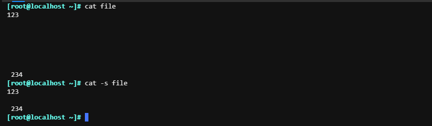

显示所有控制符号

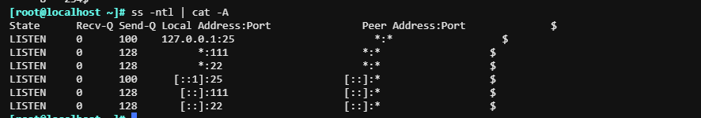

## more和less

more：按下回车建向下一行；按住 b 往上翻页；空格键向下翻页；到最后一页自动退出

```bash
[root@localhost ~]# more /etc/init.d/functions 
```

less：空格下个屏幕内容；按下 b 往上屏幕内容；上下箭头是上下行；使用 g 切换到开头行；使用 G 切换到文件最后屏幕内容；输入/string回车；向下搜索string内容；？string向上屏幕查找；配合n和N实现同相和反相查找。

```bash
[root@localhost ~]# less /etc/init.d/functions
```

## head和tail

`Usage: head [OPTION]... [FILE]...`

```bash
-n 正数：指定显示的前几行。
-n 负数：指定第一行到负几行之间的内容。
```

head：默认显示前十行

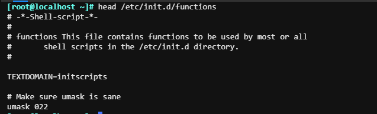

\-n 显示前面11行

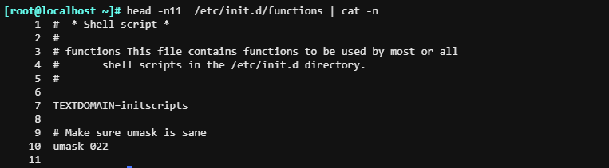

\-n 显示倒数；显示第一行和-8行之间的内容。

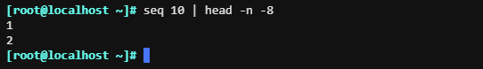

---

`Usage: tail [OPTION]... [FILE]...`

```bash
-n 正数：查看后几行的内容
-n +3 ：查看排除前3行后的内容
```

tail 查看文件的后几行

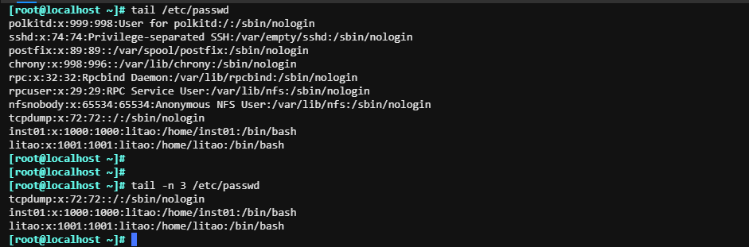

显示除了前3行以外的行

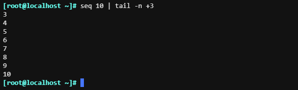

## cut和paste

cut：按列以指定的分隔符号；对文件的标准输入或者文件内容进行切割，默认的切割符号为TAB。

`Usage: cut OPTION... [FILE]...`

```bash
-d DELIMITER: 指明分隔符，默认tab
-f FILEDS:
     #: 第#个字段,例如:3
     #,#[,#]：离散的多个字段，例如:1,3,6
     #-#：连续的多个字段, 例如:1-6
     混合使用：1-3,7
```

指定分割符号取特定列

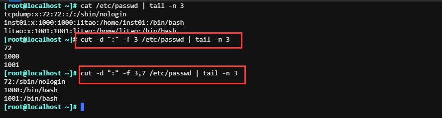

取分区利用率

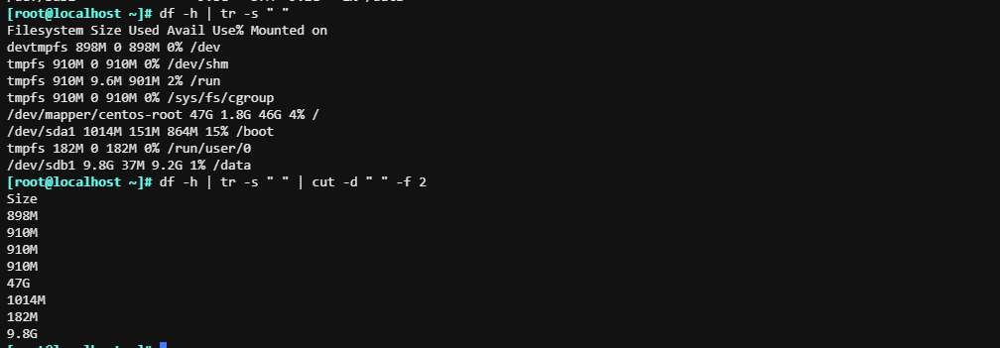

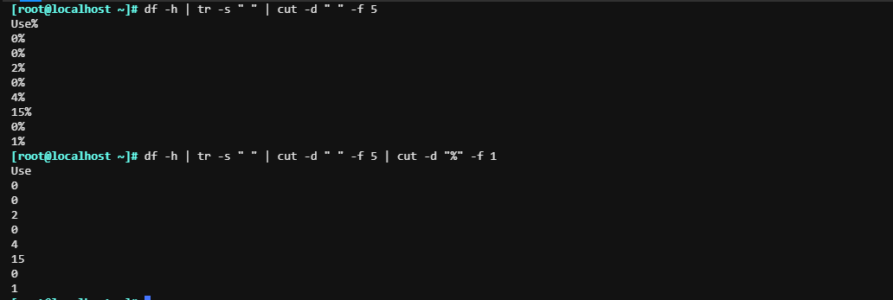

## sort和uniq命令

sort: 默认按照字母顺序进行排序

`sort [OPTION]... [FILE]...`

```bash
-r 执行反方向（由上至下）整理
-R 随机排序
-n 执行按数字大小整理
-f 选项忽略（fold）字符串中的字符大小写
-u 选项（独特，unique），合并重复项，即去重
-t 指定X做为字段界定符
-k 配合-t进行使用；-k 指定第几列
```

按照UID进行排序，并且按照数字大小进行排序

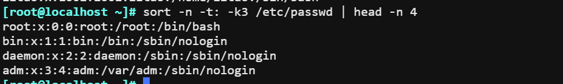

---

uniq:过滤重复行

`uniq [OPTION]... [FILE]...`

```bash
-c: 显示每行重复出现的次数
-d: 仅显示重复过的行
-u: 仅显示不曾重复的行
```

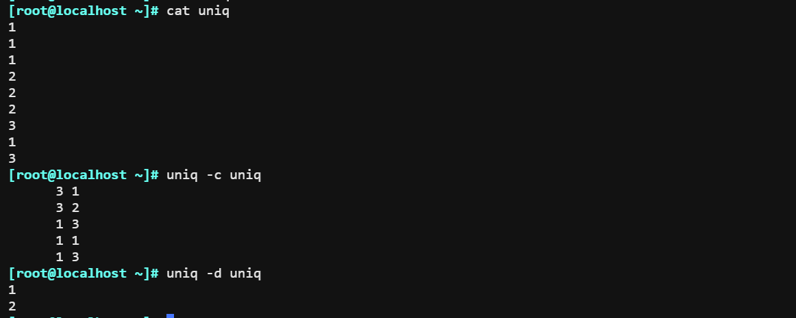

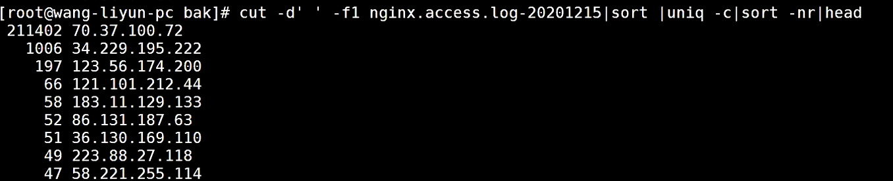

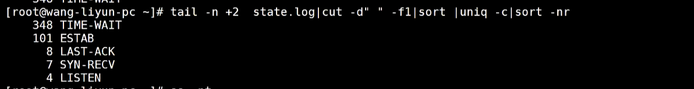

## tr 命令

`tr [OPTION]... SET1 [SET2]`

```bash
 -d --delete：删除所有属于第一字符集的字符
 -s --squeeze-repeats：把连续重复的字符以单独一个字符表示,即去重
 -t --truncate-set1：将第一个字符集对应字符转化为第二字符集对应的字符
 -c –C --complement：取字符集的补集

\\：反斜杠，用于表示一个反斜杠字符。
\b：退格（backspace），用于向前删除一个字符。
\n：换行（new line），用于在输出中插入一个新的行。
\r：回车（return），用于将光标移到当前行的开头。
```

###### 去重

会把多余的空格去重

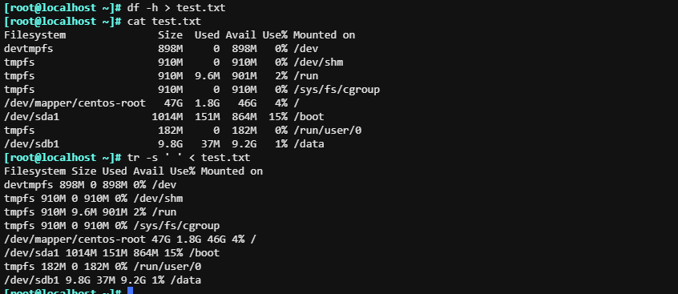

删除字符集

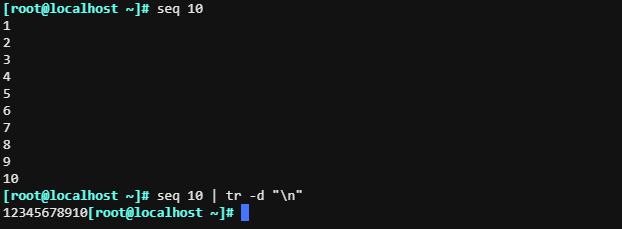