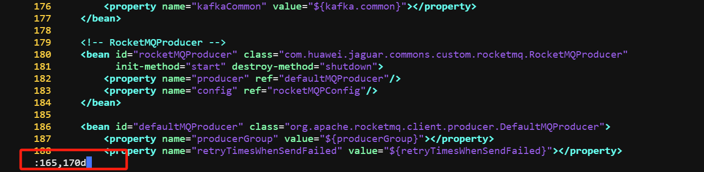
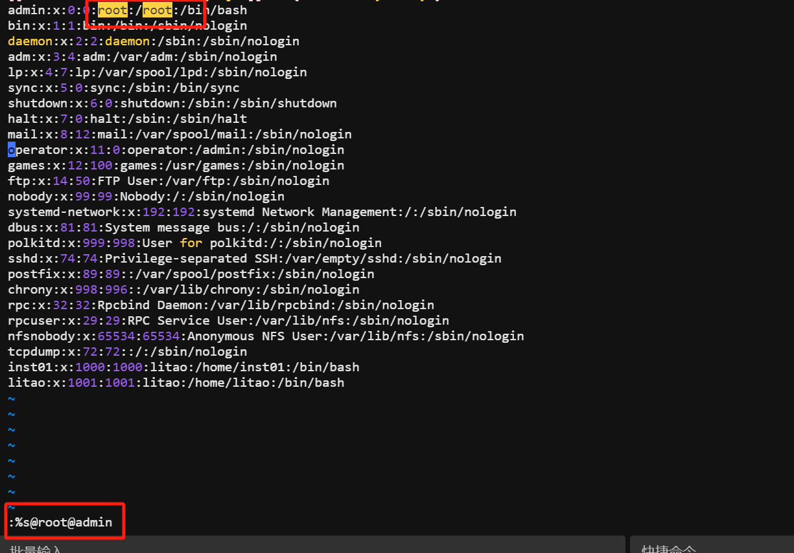
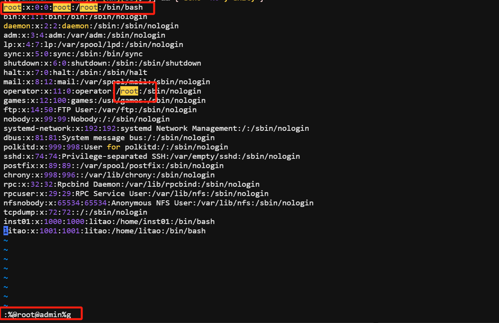
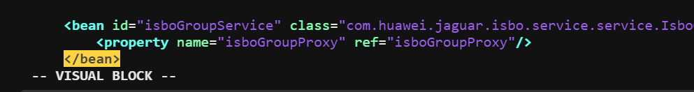
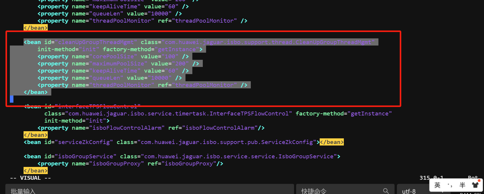
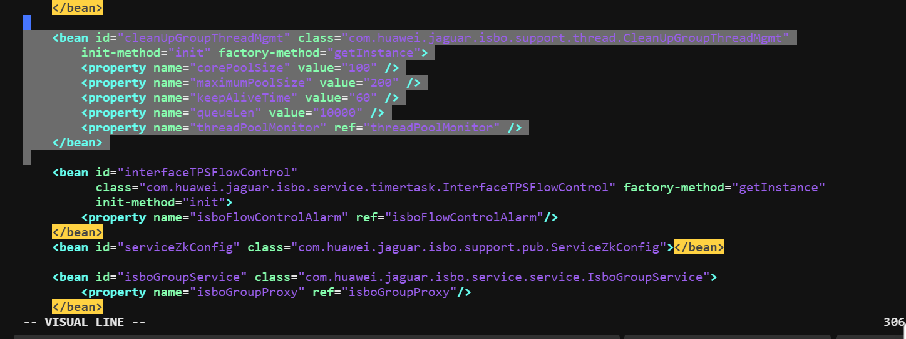
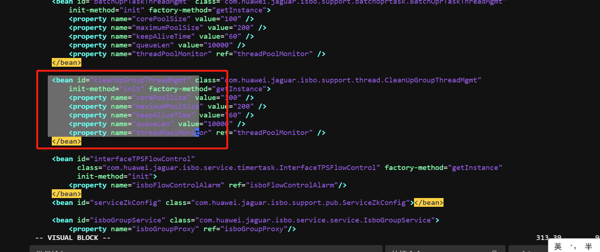

三种主要模式 ：

-   命令或普通(Normal)模式：可以实现移动光标，剪切/粘贴文本 。
-   插入(Insert)或编辑模式：用于修改文本
-   命令(末)行模式：保存，退出等

# 命令(末)行模式

```xml
X:加密
r:读取文件追加
```

r 选项读取文件追加


## 地址定界

```bash
格式：
:start_pos,end_pos CMD

#         具体第#行，例如2表示第2行     
#,#       从左侧#表示起始行，到右侧#表示结尾行 
#,+#      从左侧#表示的起始行，加上右侧#表示的行数，范例：2,+3  表示2到5行
.         当前行
$         最后一行
.,$-1     当前行到倒数第二行
%         全文, 相当于1,$

/pattern/              从当前行向下查找，直到匹配pattern的第一行,即:正则表达式   
/pat1/,/pat2/          从第一次被pat1模式匹配到的行开始，一直到第一次被pat2匹配到的行结束
#,/pat/                从指定行开始，一直找到第一个匹配pattern的行结束
/pat/,$                向下找到第一个匹配patttern的行到整个文件的结尾的所有行
```

1.  删除165到170行。



### 地址定界后跟一个编辑命令

```bash
d         删除    
y         复制 
w file    将范围内的行另存至指定文件中  
r  file   在指定位置插入指定文件中的所有内容
```

## 查找并替换

```bash
1. 格式：
s/要查找的内容/替换为的内容/修饰符  

修饰符：
i   #忽略大小写
g   #全局替换，默认情况下，每一行只替换第一次出现
gc  #全局替换，每次替换前询问

2. 查找替换中的分隔符/可替换为其它字符，如：#,@
s@/etc@/var@g
s#/boot#/#i
```

1.  将root修改为admin

`:%s@root@admin` 这样只会把全文中的第一个root改为admin。这里的%s代表的是全文。



`:%@root@admin%g`这样会把全文的root都改为admin



# 命令行模式

## 光标跳转

```bash
h: 左    
L: 右     
j: 下    
k: 上
```

## 行首行尾跳转

```bash
^    跳转至行首的第一个非空白字符
0    跳转至行首
$   跳转至行尾
```

## 行间移动

```bash
#G      跳转至由第#行，相当于在扩展命令模式下 :#   
G       最后一行
1G, gg  第一行
```

## 删除命令

```bash
d    删除命令，可结合光标跳转字符，实现范围删除
d$   删除到行尾
d^  删除到非空行首
d0  删除到行首
#dd  多行删除  例如：3dd
```

## 查找

```plsql
/PATTERN：从当前光标所在处向文件尾部查找
?PATTERN：从当前光标所在处向文件首部查找
n：与命令同方向
N：与命令反方向
```

# 可视化模式

ctrl+v 可以触发可视化模式，如下；



```plsql
v 面向字符，在末行会显示：-- VISUAL -
V 面向整行，在末行会显示：-- VISUAL LINE -- 
ctrl-v 面向块（也称为列模式），在末行会显示：-- VISUAL BLOCK -- 
```

1.  v 面向字符，在末行会显示：-- VISUAL -



2.  V 面向整行，在末行会显示：-- VISUAL LINE --



3.  ctrl-v 面向块（也称为列模式），在末行会显示：-- VISUAL BLOCK -- 可以截取一个方块。



4.  在文件行首插入#

```plsql
输入ctrl+v  进入可视化模式
输入 G 跳到最后1行，选中每一行的第一个字符
输入 I 切换至插入模式
输入 # 
按 ESC 键
```

# 定制 vim 的工作特性

高亮搜索

```plsql
启用：set hlsearch,   简写：set hls
禁用：set nohlsearch  简写：nohl
```

语法高亮

```plsql
启用：syntax on  简写：syn on
禁用：syntax off 简写：syn off
```

显示Tab和换行符 ^I 和$显示

```plsql
启用：set list
禁用：set nolist
```