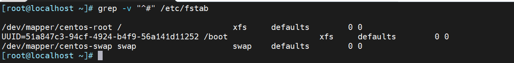
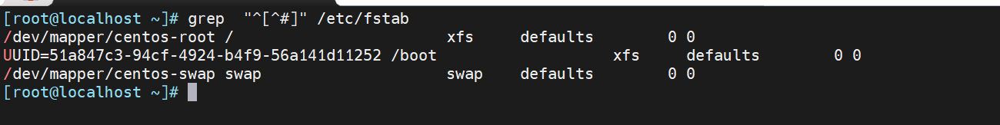
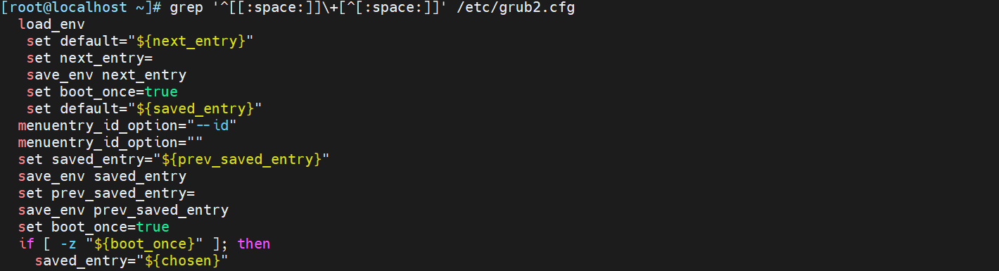
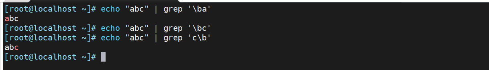

-   `^` 行首锚定, 用于模式的最左侧
-   `$` 行尾锚定，用于模式的最右侧
-   `^$` 空行
-   `\< 或 \b` 词首锚定，用于单词模式的左侧
-   `\> 或 \b` 词尾锚定，用于单词模式的右侧
-   `\<PATTERN\>` 匹配整个单词

注意: 单词是由字母,数字,下划线组成

# 例子

1.  找出非 # 开头行

2.  找出非 "#"和非空白行

3.  显示CentOS7的/etc/grub2.cfg文件中，至少以一个空白字符开头的且后面有非空白字符的行

4.  单词的词首和词尾

