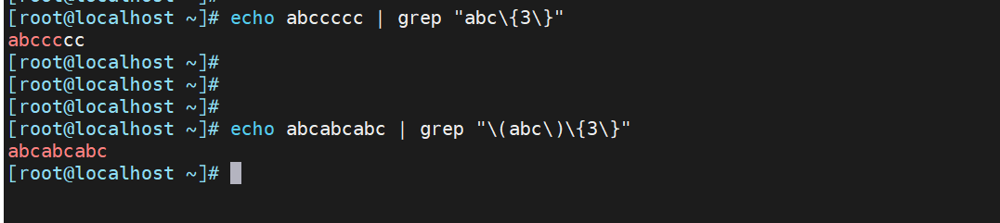
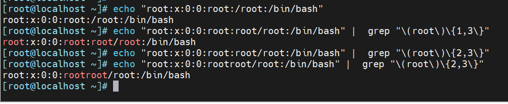
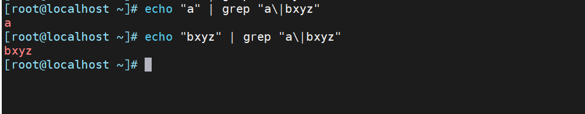
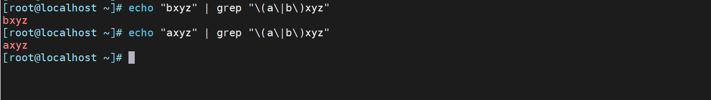

# 分组

分组："( )" 将多个字符捆绑在一起，当作一个整体处理，如：\\(root\\)+

后向引用：分组括号中的模式匹配到的内容会被正则表达式引擎记录于内部的变量中，这些变量的命名 方式为: \\1, \\2, \\3, ..

# 或者

`\|`

```xml
a\|b    #a或b  

```

# 例子：

1.  使用"( )"作为整体匹配。



2.  利用分组；匹配root出现的次数。



# 例子： " | "

1.    
    



2.  利用分组axyz和bxyz

