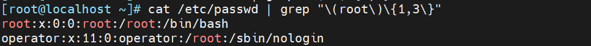
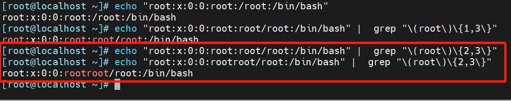
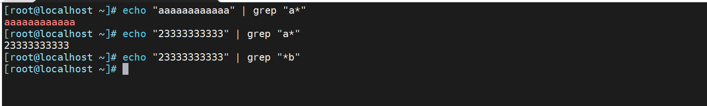
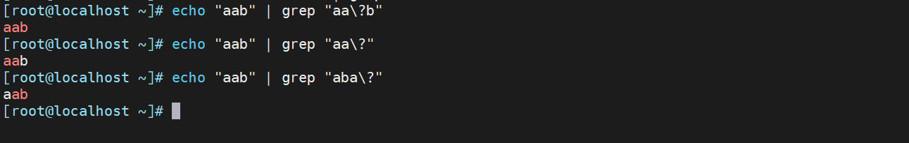
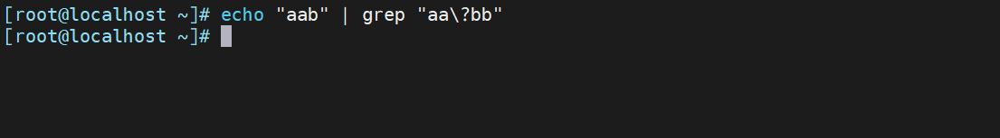
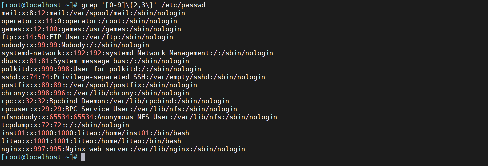
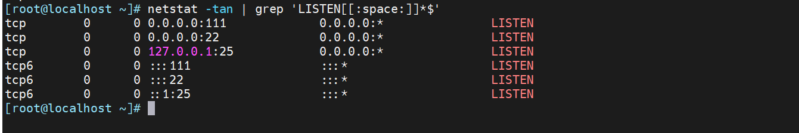
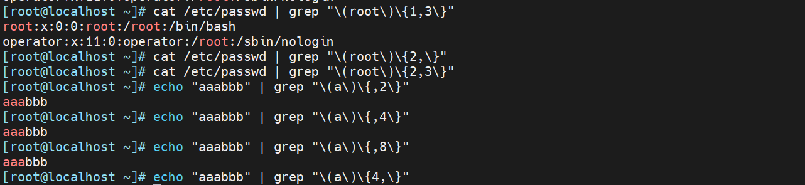

用在要指定次数的字符后面，用于指定前面的字符要出现的次数

-   `*` 匹配前面的字符任意次，包括0次，贪婪模式：尽可能长的匹配，如：a\* 表示a出现了任意次，也包括0次。
-   `.*` 任意长度的任意字符
-   `\?` 匹配其前面的字符出现0次或1次,即:可有可无
-   `\+` 匹配其前面的字符出现至少1次,即:肯定有且 >=1 次
-   `\{n\}` 匹配前面的字符n次,如：a\\{10\\}
-   `\{m,n\}` 匹配前面的字符至少m次，至多n次
-   `\{,n\}` 匹配前面的字符至多n次,<=n
-   `\{n,\}` 匹配前面的字符至少n次

注意：这里的次数匹配必须是连续的，否则无法匹配，例如：下面会匹配两行，但是不是连续的root；符合{1,3}匹配规则出现1次。



连续root和不连续root的匹配；只有root连续出现两次以上，{2,3}才会正常的匹配。



# 例子

1.  "\*"贪婪的匹配



> 正则的"\*"代表前面字符的任意次，而通配符则是 匹配零个或多个字符

2.  匹配前面字符“ \\? ”单次或者多次





```bash
echo "aab" | grep "aa\?b"   aa\?b: 匹配 aab 或 ab；b: 后面必须是字符 b。
echo "aab" | grep "aa\?"    aa\?: 匹配 a 或 aa。
echo "aab" | grep "aba\?"   aba\?: 匹配 ab 或 aba。 
echo "aab" | grep "aa\?bb"  "aa\?bb      匹配abb，或者aabb
```

3.  找出/etc/passwd中的两位或三位数



4\. 找出“netstat -tan”命令结果中以LISTEN后跟任意多个空白字符结尾的行



5.  次数匹配；

