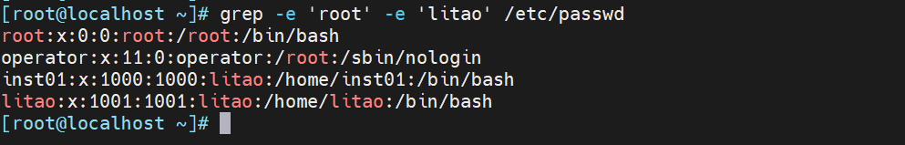
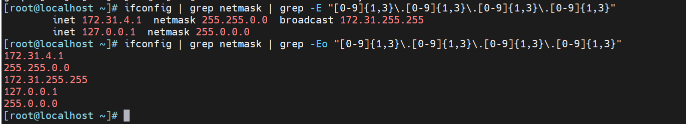
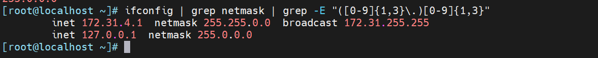

# `grep`：查找匹配的文本

`grep [OPTIONS] PATTERN [FILE...]`

```markdown
● -i：忽略大小写。
● -v：显示不匹配的行。
● -n：显示行号。
● -r：递归搜索目录中的所有文件。
● -l：仅显示包含匹配文本的文件名。
● -c：只显示匹配的行数。
● --color=auto   对匹配到的文本着色显示  
● -q   静默模式，不输出任何信息  
● -A   after, 后#行  
● -B  before, 前#行  
● -C   context, 前后各#行  
● -e 实现多个选项间的逻辑or关系,  
●  -r     递归目录，但不处理软链接  
●  -R   递归目录，但处理软链接 
● -o  只显示正则匹配的内容
其中 --PATTERN 是你要搜索的模式（pattern），通常是一个字符串或者正则表达式。  
```

1.  字符串匹配

```shell
grep 'hello' file.txt     #查找 file.txt 中包含 hello 的所有行。
```

2.  正则表达式匹配

`grep` 默认支持基本正则表达式（BRE）。如果需要使用扩展正则表达式（ERE），可以使用 `-E` 选项（等同于 `egrep`）。

```shell
grep 'h.llo' file.txt        # 使用基本正则表达式，'.' 匹配任意单个字符
grep -E 'h.*o' file.txt      # 使用扩展正则表达式，'.*' 匹配任意长度的任意字符
```

3.  字符类

使用方括号 `[ ]` 定义一个字符类，可以匹配字符类中的任意一个字符。

```shell
grep 'h[aeiou]llo' file.txt  # 匹配 'hallo', 'hello', 'hillo', 'hollo', 'hullo'
```

4.  锚点

-   `^`：行首
-   `$`：行尾

```shell
grep '^hello' file.txt       # 匹配以 'hello' 开头的行
grep 'world$' file.txt       # 匹配以 'world' 结尾的行
grep  -n '^$' xixi.txt            #匹配空白行
grep '^[[:space:]]*$' xixi.txt     #匹配空白行
grep 
```

5.  \-e 包含root或litao的行



6.  使用grep取IP地址



