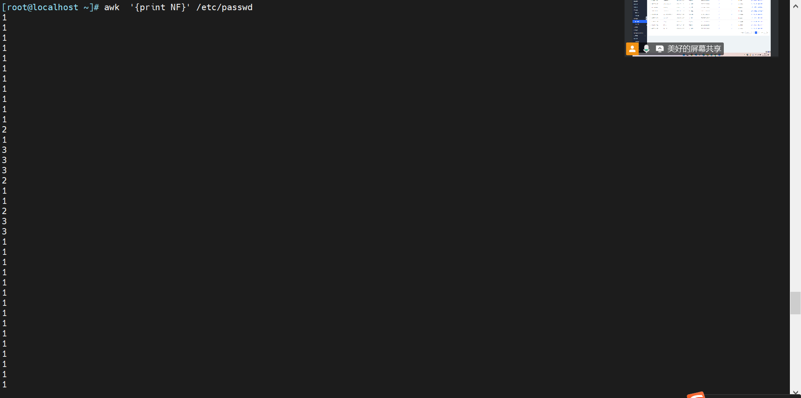
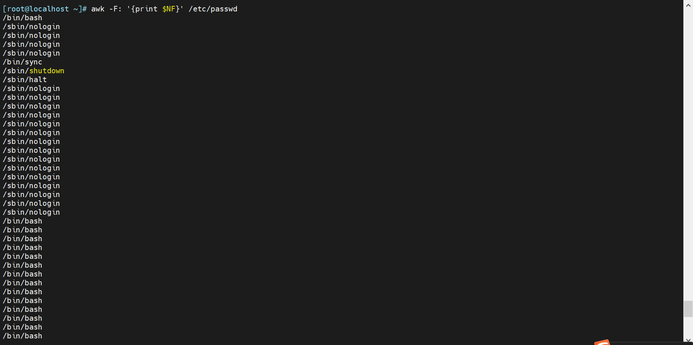
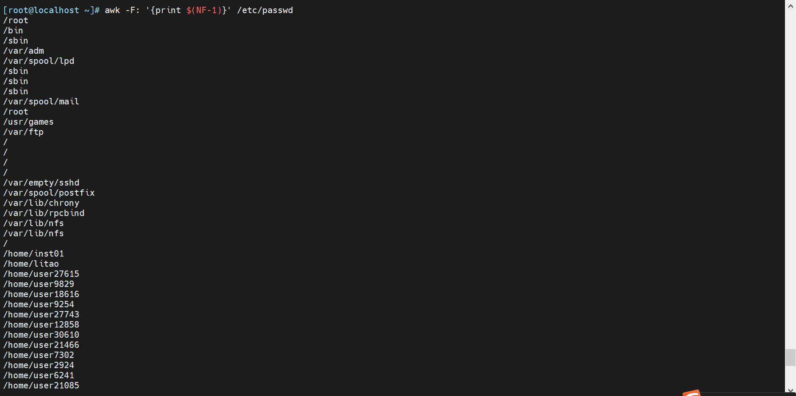
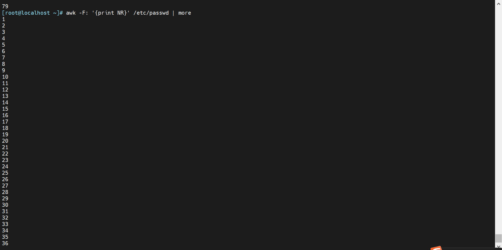

# **AWK 基本用法**

1.  直接在命令行执行

```shell
awk '{print $0}' file.txt
```

📌 **作用**：打印 `file.txt` 的所有内容，相当于 `cat file.txt`。

2.  处理指定字段

```shell
awk '{print $1, $3}' file.txt
```

📌 **作用**：打印 `file.txt` 中的第 1 和第 3 列。

3.  过滤匹配行

```shell
awk '/error/ {print $0}' log.txt
```

📌 **作用**：只打印 `log.txt` 中包含 `error` 关键字的行。

4.  条件筛选

```shell
awk '$3 > 20 {print $1, $3}' file.txt
```

📌 **作用**：筛选**第 3 列值大于 20**的行，并打印**第 1 列和第 3 列**。

# **AWK 语法详解**

```bash
awk  [options] [var=value] 'pattern1 { action1 } pattern2 { action2 } ...' input_file
```

-   `pattern1`, `pattern2`：用于匹配的模式（可以是正则表达式、条件等）。
-   `action1`, `action2`：与模式对应的动作。
-   `input_file`：输入文件，若省略，则从标准输入读取。

常见选项：

-   \-F “分隔符” 指明输入时用到的字段分隔符，默认的分隔符是若干个连续空白符
-   \-v var=value 变量赋值

> **awk默认以空白符号为分割符号； 例如 ifconfig eth0 | awk '/netmask/ {print $2}' ;****会检查每一行是否包含**`**netmask**` **这个字符串，然后再以空白符号分割**

​  

## 常见模式

| 模式 | 作用 |
| --- | --- |
| /text/ | 匹配包含 `"text"` 的行 |
| NR==3 | 只处理**第 3 行** |
| NF==5 | 只处理**列数为 5** 的行 |
| $1 == "hello" | 只处理**第 1 列为 "hello"** 的行 |
| $3 > 50 | 只处理**第 3 列大于 50** 的行 |

```bash
awk 'NR==1 {print "第一行：" $0}' file.txt
```

📌 **作用**：处理 **第一行**，打印 `"第一行："` + 该行内容。

# 变量

| 内置变量 | 说明 |
| --- | --- |
| **$0** | 当前记录的整个文本行 |
| $1,$2 | 当前行的第 1、2、…个字段（字段默认由空白字符分隔） |
| **NF** | 当前记录中的字段数 |
| **NR** | 已经读入的记录数（即当前行号） |
| **FNR** | 当前文件的行号（当处理多个文件时很有用） |
| **FS** | 输入字段分隔符，默认值为空格或制表符，可通过 -F 选项或在脚本中赋值修改（如 FS=":"） |
| **OFS** | 输出字段分隔符，默认是一个空格 |
| **RS** | 记录分隔符，默认是换行符 \n |
| **ORS** | 输出记录分隔符，默认也是换行符 |

```bash
[root@localhost ~]# awk '{print "hanghoa:",NR,"字段数:",NF}' a.txt
hanghoa: 1 字段数: 6
hanghoa: 2 字段数: 6
hanghoa: 3 字段数: 6
hanghoa: 4 字段数: 6
hanghoa: 5 字段数: 6
hanghoa: 6 字段数: 6
hanghoa: 7 字段数: 6
hanghoa: 8 字段数: 6
hanghoa: 9 字段数: 6
hanghoa: 10 字段数: 6
hanghoa: 11 字段数: 6
```

# 运算符与表达式

1.  算术运算符

| 运算符 | 说明 |
| --- | --- |
| + | 加 |
| - | 减 |
| * | 乘 |
| / | 除 |
| % | 求余 |
| ^ | 乘幂（部分 AWK 版本支持） |

---

2.  关系运算符

| 运算符 | 说明 |
| --- | --- |
| == | 等于 |
| != | 不等于 |
| < | 小于 |
| > | 大于 |
| <= | 小于等于 |
| >= | 大于等于 |

---

3.  逻辑运算符

| 运算符 | 说明 |
| --- | --- |
| && | 逻辑与 |
| \|\| | 逻辑或 |
| ! | 逻辑非 |

# 例子：

1.  取出网站访问量最大的前3个IP

```bash

[root@nginx ~]# head -n 3 test.log
172.31.0.1 - - [07/Jun/2024:20:57:58 -0400] "GET / HTTP/1.1" 200 612 "-" "Mozilla/5.0 (Windows NT 10.0; Win64; x64) AppleWebKit/537.36 (KHTML, like Gecko) Chrome/125.0.0.0 Safari/537.36"
172.31.0.1 - - [07/Jun/2024:20:57:59 -0400] "GET /favicon.ico HTTP/1.1" 404 555 "http://172.31.5.1/" "Mozilla/5.0 (Windows NT 10.0; Win64; x64) AppleWebKit/537.36 (KHTML, like Gecko) Chrome/125.0.0.0 Safari/537.36"
172.31.4.1 - - [08/Jun/2024:23:41:18 -0400] "HEAD / HTTP/1.1" 200 0 "-" "curl/7.29.0"
[root@nginx ~]#

[root@nginx ~]# awk '{print $1}' test.log | uniq -c | sort -nr | head -n 3
   6997 172.31.4.2
    188 172.31.4.1
     95 172.31.0.1
```

2.  取分区利用率

```bash

[root@nginx ~]# df | awk '{print $5}'
Use%
0%
0%

#使用扩展的正则表达式
[root@nginx ~]# df | awk -F "[[:space:]]+|%" '{print $5}'
Use
0
0
2

[root@nginx ~]# df | awk -F "[ %]+" '{print $5}'
Use
0
0
2

[root@nginx ~]# df | awk -F "[ %]+" '/^\/dev\/sd/ {print $5}'
15

[root@nginx ~]# df | grep /dev/sd | awk -F '[ %]+' '{print$5}'
15

[root@localhost ~]# df | awk -F '[ %]+' '{print $(NF-1)}'
Mounted
0
0
2
0
5
96
0

```

3\. 取 ifconfig 输出结果中的IP地址

```bash

[root@nginx ~]# ifconfig eth0 | awk '/netmask/ {print$2}'
172.31.5.1

匹配 一个或多个连续的空格 或者 冒号。
[root@nginx ~]# ifconfig eth0 | awk -F " +|:" '/mask/{print $3}'
172.31.5.1

[root@localhost ~]# ifconfig eth0 | awk 'NR==2 {print $2}'
172.31.4.1
[root@localhost ~]#

```

4.  文件host\_list.log 如下格式，请提取”.magedu.com”前面的主机名部分并写入到回到该文件中

```bash

[root@localhost ~]# cat host_list.log
1 www.magedu.com
2 blog.magedu.com
3 study.magedu.com
4 linux.magedu.com
5 python.magedu.com

[root@localhost ~]# awk -F "[ .]" '{print $2}' host_list.log
www
blog
study
linux
python
```

## 变量例子

1.  FS 变量可以引用在 { action1 } 中

```bash

[root@localhost ~]# awk -v FS=':'  '{print $1,$3}' /etc/passwd | head -n  3
root 0
bin 1
daemon 2

[root@localhost ~]# awk -v FS=':'  '{print $1FS,$3}' /etc/passwd | head -n  3
root: 0
bin: 1
daemon: 2
[root@localhost ~]#
```

2.  OFS 变量执行输出割符号

```bash
[root@localhost ~]# awk -v FS=':'  -v OFS=';' '{print $1 OFS $3}' /etc/passwd | head -n  3
root;0
bin;1
daemon;2
```

3\. RS：输入记录record分隔符，指定输入时的换行符 。

空白符还是分割符号，但是RS指定了分割符号。

```bash

[root@localhost ~]# cat test2.txt
aa b c d;
d e; f g h;
i z k;

[root@localhost ~]# awk -v RS=';' '{print $2}' test2.txt
b
e
g
z

```

4\. NF：字段数量

```bash
[root@localhost ~]# awk  '{print NF}' /etc/passwd
```

这里以空白符号为分割符号



```bash
[root@localhost ~]# awk -F: '{print NF}' /etc/passwd
```

这里以 ： 为符号；所以显示这里有 7个分段


```bash
[root@localhost ~]# awk -F: '{print $NF}' /etc/passwd
```



```bash

[root@localhost ~]# awk -F: '{print $(NF-1)}' /etc/passwd
```



```bash
[root@localhost ~]# df | awk -F '[ %]+' '{print $(NF-1)}'
Mounted
0
0
2
0
5
96
0

```

5.  NR：记录的行号

```bash
[root@localhost ~]# awk -F: '{print NR}' /etc/passwd | more
```



```bash

[root@localhost ~]# seq 10 | awk 'NR==2 {print$0}'
2

[root@localhost ~]# ifconfig eth0 | awk 'NR==2 {print $2}'
172.31.4.1

[root@localhost ~]# awk '{print NR, $0}' /etc/issue
1 \S
2 Kernel \r on an \m
3

[root@localhost ~]# awk  '{print NR}' /etc/issue
1
2
3

```

## 比较操作符例子

```bash
==, !=, >, >=, <, <=
```
```bash
[root@localhost ~]# awk 'NR==2' /etc/issue
Kernel \r on an \m

[root@localhost ~]# awk -F: '$3>10000 {print $0}' /etc/passwd
nfsnobody:x:65534:65534:Anonymous NFS User:/var/lib/nfs:/sbin/nologin

[root@localhost ~]# awk -F: '$NF=="/bin/bash" {print $1,$NF}' /etc/passwd
root /bin/bash
inst01 /bin/bash
litao /bin/bash
user27615 /bin/bash
user9829 /bin/bash
user18616 /bin/bash
user9254 /bin/bash

[root@localhost ~]# awk -F: '$3 > 10000 && $NF == "/bin/bash" {print $1, $NF}' /etc/passwd

```
```bash
Awk  -F: '$3>=1000{print $1,$3}' /etc/passwd
awk  -F: '$3<1000{print $1,$3}' /etc/passwd
awk  -F: '$NF=="/bin/bash"{print $1,$NF}' /etc/passwd
awk -F: '$NF=="/bin/bash"{print $1,$NF}' /etc/passwd
awk -F: '$NF ~ /bash$/{print $1,$NF}' /etc/passwd

```

## 逻辑操作符：

```bash
[root@centos8 ~]#awk 'BEGIN{print i}'
[root@centos8 ~]#awk 'BEGIN{print !i}'
1
[root@centos8 ~]#awk -v i=10 'BEGIN{print !i}'
0
[root@centos8 ~]#awk -v i=-3 'BEGIN{print !i}'
0
[root@centos8 ~]#awk -v i=0 'BEGIN{print !i}'
1
[root@centos8 ~]#awk -v i=abc 'BEGIN{print !i}'
0
[root@centos8 ~]#awk -v i='' 'BEGIN{print !i}'
1
```
```bash
awk -F:   '$3>=0 && $3<=1000 {print $1,$3}' /etc/passwd
awk -F:   '$3==0 || $3>=1000 {print $1,$3}' /etc/passwd 
awk -F:   '!($3==0) {print $1,$3}'     /etc/passwd
awk -F:   '!($3>=500) {print $1,$3}' /etc/passwd

```

## 模式 PATTERN

/regular expression/：仅处理能够模式匹配到的行，需要用/ /括起来

```bash
awk   '/^UUID/{print $1}'     /etc/fstab

df | awk '/^\/dev\/sd/'
```