# 语法：

`**sed OPTIONS SCRIPT INPUT_STREAM**`**;**`**sed [选项] '命令' 输入文件**`

## 常用选项

-   `-n`：禁止默认输出，只打印处理过的行
-   `-e`：允许多个编辑命令（可省略单个命令时）
-   `-f`：从文件读取 sed 脚本
-   `-i`：直接修改文件内容（慎用）
-   `-r` 或 `-E`：使用扩展正则表达式

## **SCRIPT格式**

`sed [选项] '地址命令' 输入文件`

### 地址格式

1.  不给地址

-   对全文进行处理

---

2.  单地址：

-   #：指定第#行，$：最后一行

-   /pattern/：被此处模式(正则表达式)所能够匹配到的每一行

---

3.  地址范围

-   #,# 从#行到第#行，3,6 从第3行到第6行
-   #,+# 从#行到+#行，3,+4 表示从3行到第7行
-   /pat1/,/pat2/
-   \# , /pat/

---

#### **有地址 vs 无地址例子**

```bash
全文替换（每行的第一个 foo 替换为 bar）
sed 's/foo/bar/' file.txt

仅第 3 行 替换 foo 为 bar
sed '3s/foo/bar/' file.txt	

仅匹配 pattern 的行 替换 foo 为 bar
sed '/pattern/s/foo/bar/' file.txt	

删除 1-5 行
sed '1,5d' file.txt	

删除全文的空行
sed '/^$/d' file.txt	
```

#### $ 最后一行

```bash
仅对 最后一行 执行替换，将 old 替换为 new。
sed '$s/old/new/' file.txt

删除最后一行
sed '$d' file.txt

在最后一行后追加内容
sed '$a\这是追加的内容' file.txt

在最后一行前插入内容
sed '$i\这是插入的内容' file.txt
```

### 命令：

下面是整理后的 `sed` 命令及其示例的表格：

| **命令** | **说明** | **示例** |
| --- | --- | --- |
| p | 打印当前模式空间内容，追加到默认输出之后 | `sed -n '/pattern/p' file` |
| I p | 忽略大小写输出 | `sed 'Ip' file` |
| d | 删除模式空间匹配的行，并立即启用下一轮循环 | `sed '/pattern/d' file` |
| ! | 取反匹配的行 | `sed '/pattern/!d' file` |
| a \text | 在匹配行后追加文本 | `sed '/pattern/a Text to append' file` |
| i \text | 在匹配行前插入文本 | `sed '/pattern/i Text to insert' file` |
| c \text | 替换行为指定文本 | `sed '/pattern/c Text to replace' file` |
| w file | 保存匹配行到文件 | `sed '/pattern/w output.txt' file` |
| r file | 读取文件内容并追加到匹配行后 | `sed '/pattern/r otherfile.txt' file` |
| = | 打印行号 | `sed '=' file` |

#### 搜索替代

以下是 `sed` 中替换命令 `s/pattern/string/修饰符` 的详细表格，包括替换修饰符及其示例：

| **命令** | **说明** | **示例** |
| --- | --- | --- |
| s/pattern/string/ | 查找 `pattern` 并替换为 `string`，支持使用其他分隔符 | `sed 's/pattern/string/' file` |
| g | 行内全局替换，即替换行内所有匹配的 `pattern` | `sed 's/pattern/string/g' file` |
| p | 显示替换成功的行 | `sed -n 's/pattern/string/p' file` |
| w /PATH/FILE | 将替换成功的行保存至指定文件 `/PATH/FILE` | `sed 's/pattern/string/w output.txt' file` |
| I, i | 忽略大小写进行替换 | `sed 's/pattern/string/I' file` |
| s@@@ | 使用 `@` 作为分隔符，替代默认的 `/` 分隔符 | `sed 's@@pattern@string@' file` |
| s### | 使用 `#` 作为分隔符，替代默认的 `/` 分隔符 | `sed 's###pattern#string#' file` |

# 例子：

1.  取IP地址

```bash
[root@localhost ~]# ip a show eth0 | sed -En 's/.*inet (([0-9]+\.){3}[0-9]+).*/\1/p'
172.31.4.1

[root@localhost ~]# ip a | sed -En '/127.0.0.1/! s/.*inet (([0-9]+\.){3}[0-9]+).*/\1/p'
172.31.4.1

[root@localhost ~]# ifconfig eth0 |sed -nr "2s/[^0-9]+([0-9.]+).*/\1/p"
172.31.4.1

[root@localhost ~]# ifconfig eth0|grep -Eo '([0-9]{1,3}\.){3}[0-9]{1,3}' | head -n 1
172.31.4.1
```

2.  提取特定的行

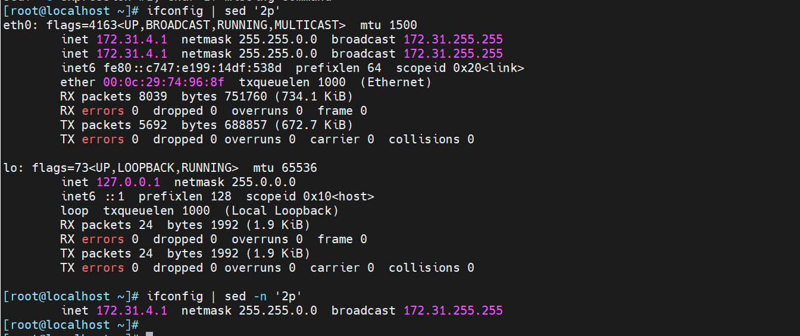

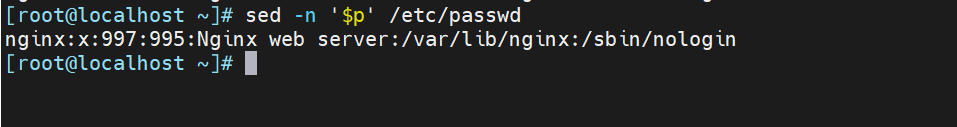

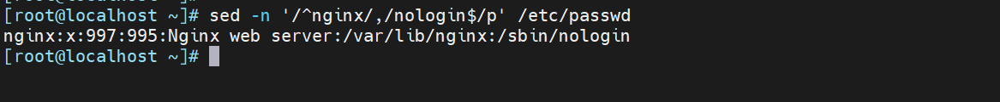

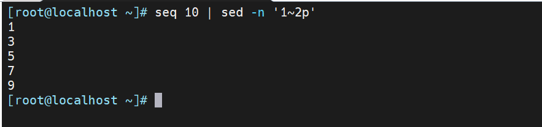

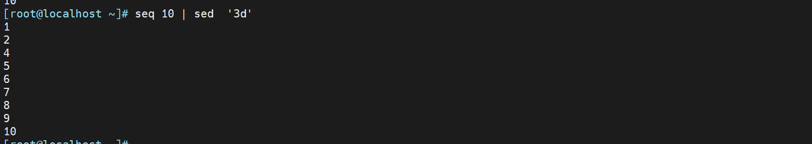

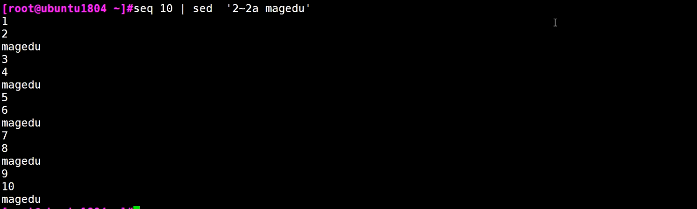

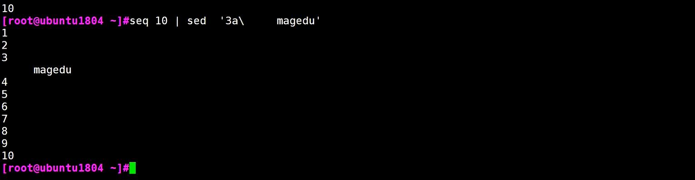

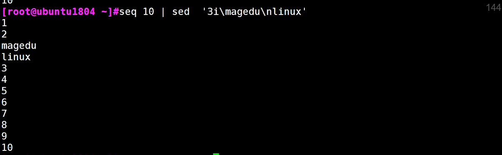

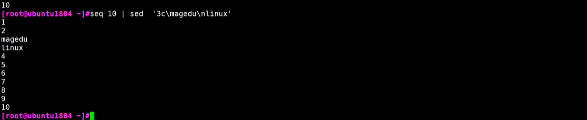


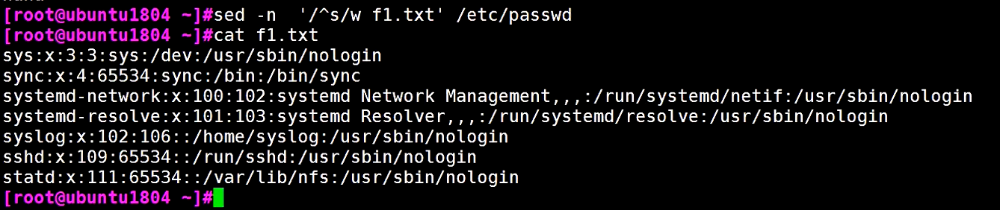

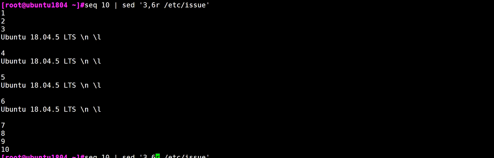

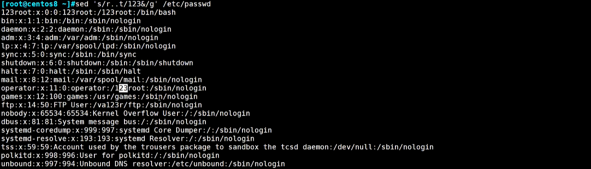

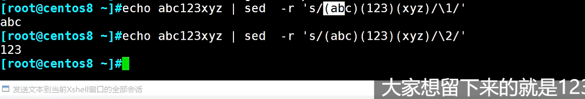

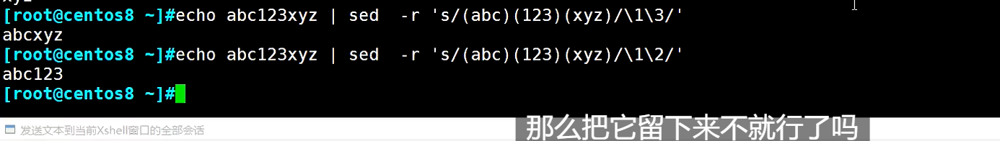


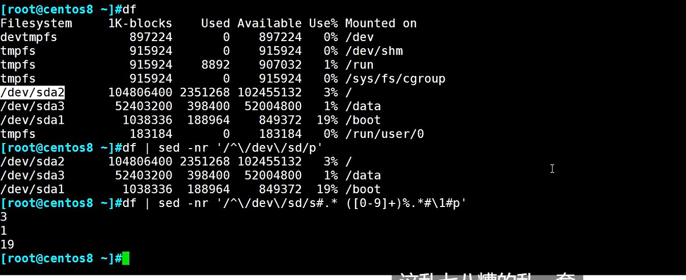


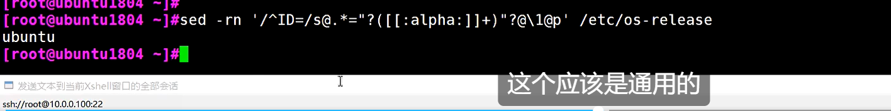

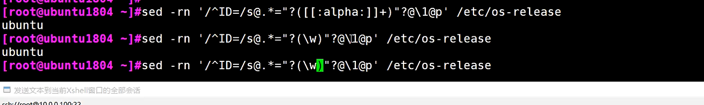


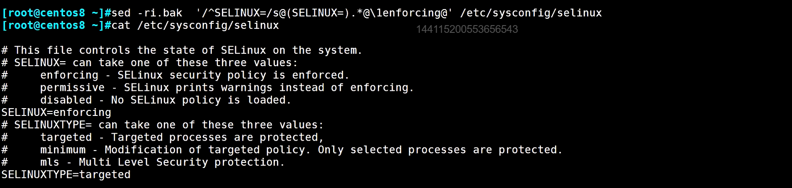

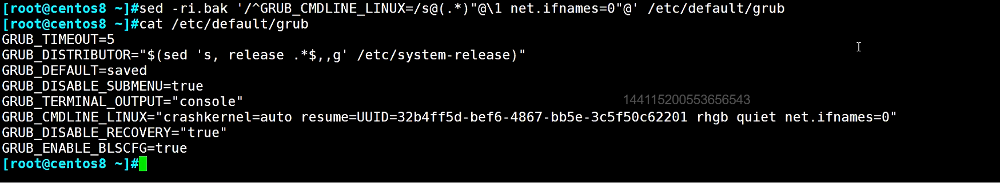