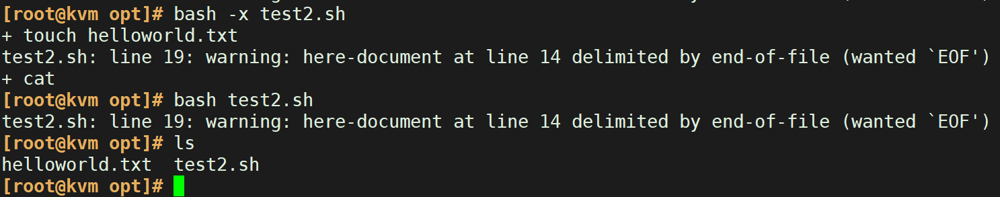
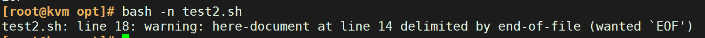

# **shell 脚本基本结构**

```plsql
格式要求：首行shebang机制
#!/bin/bash
```

# **shell脚本执行过程**

```plsql
1. 第一行必须包括shell声明序列：
#!/bin/bash
2. 第二步：加执行权限
chmod +x xxx.sh
3. 第三步：运行脚本
#执行方法1
[root@centos8 ~]#bash /data/hello.sh

#执行方法2
[root@centos8 ~]#cat /data/hello.sh | bash

#执行方法3
[root@centos8 ~]#chmod +x /data/hello.sh

#绝对路径
[root@centos8 ~]#/data/hello.sh

#相对路径
[root@centos8 ~]#cd /data/
[root@centos8 ~]#./hello.sh

#执行方法4，本方法可以实现执行远程主机的shell脚本
[root@centos8 ~]#curl -s http://10.0.0.8/hello.sh|bash

```

# **shell脚本自动声明**

```plsql
在家目录编辑以下 .vimrc 文件
[root@litao ~]# vim .vimrc
set ts=4
set expandtab
set ignorecase
set cursorline
set autoindent
autocmd BufNewFile *.sh exec ":call SetTitle()"
func SetTitle()
	if expand("%:e") == 'sh'
	call setline(1,"#!/bin/bash") 
	call setline(2,"#") 
	call setline(3,"#********************************************************************") 
	call setline(4,"#Author:		    litao") 
	call setline(5,"#QQ: 			    286365813") 
	call setline(6,"#Date: 			    ".strftime("%Y-%m-%d"))
	call setline(7,"#FileName：		    ".expand("%"))
	call setline(8,"#URL: 			    http://www.litao.com")
	call setline(9,"#Description：		The test script") 
	call setline(10,"#Copyright (C): 	".strftime("%Y")." All rights reserved")
	call setline(11,"#********************************************************************") 
	call setline(12,"") 
	endif
endfunc
autocmd BufNewFile * normal G

[root@litao ~]# vim shell.sh
#!/bin/bash
#
#**********************************************************************************************
#Author:        litao
#QQ:            286365813
#Date:          2023-09-27
#FileName:      shell.sh
#URL:           www.baidu.com
#Description:   The test script
#Copyright (C): 2023 All rights reserved
#*********************************************************************************************
#经典写法
echo "hello, world"
#流行写法
echo 'Hello, world!'      

```

# **shell脚本语法检查**

语法错误不会执行后面的命令，**命令错误则会继续执行后面的脚本**

**shell不支持别名**

**总结： 命令错误、逻辑错误、语法错误**

```plsql

bash -n test.sh   检查脚本语法，并不会真正的执行
bash -x test.sh   查看脚本执行处理的逻辑，逐行的显示处理结果，会执行脚本

语法错误
脚本内容
[root@kvm opt]# cat -A test2.sh 
#!/bin/bash$
touch helloworld.txt$
$
cat >>  helloworld.txt <<EOF$
myname is litao$
i am from china$
i love you$
EOF  $
echo "hello,world"$

```

跟踪脚本执行过程



使用bash -n 检查语法



> 说明：
> 
> 跟踪脚本执行，因为EOF位置发生语法错误，后面的echo "ehllo.world"没有执行。
> 
> shell脚本中的语法错误，会导致后面的命令无法执行。可以使用bash -n检查出来。

# **shell脚本安全 -set**

```plsql
help set
-u   替换时将未设置的变量视为错误。 -o
-e   如果命令以非零状态退出，则立即退出。

```
```bash

[root@litao ~]# bash test.sh
test.sh: line 14: DIr: unbound variable

[root@litao ~]# cat test.sh
#!/bin/bash
set -u
DIR=/root/test/test2
cd $DIr                   //定义错误变量
rm -rf *

进去一个没有设置的变量会进入家目录
[root@litao ~]# cd test
[root@litao test]# cd $aa
[root@litao ~]# 

```