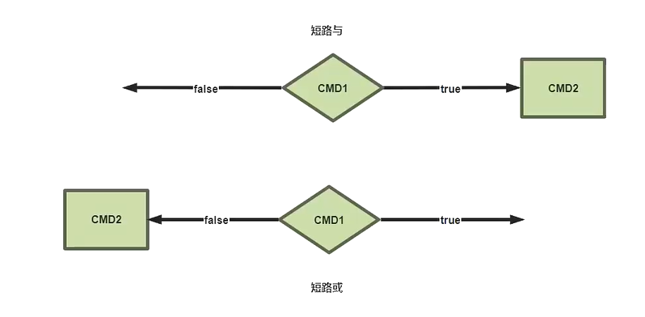
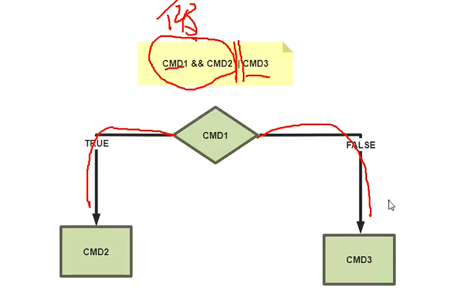
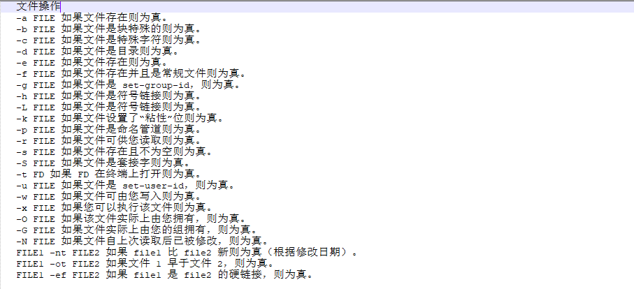
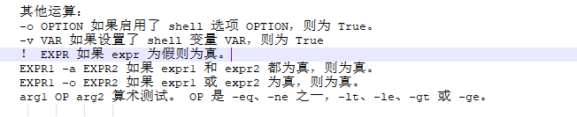
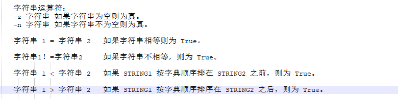
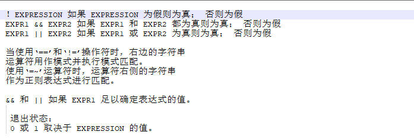
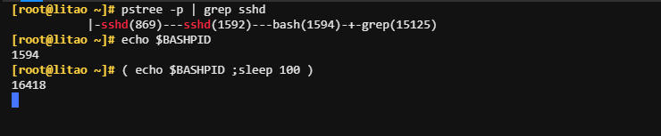
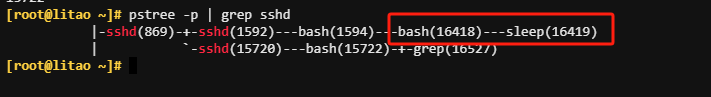
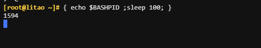
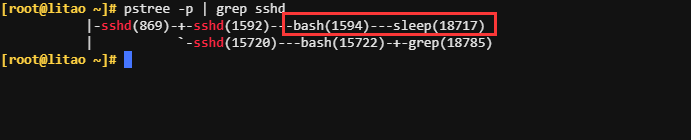

# 算数运算

```shell
id++ id--  变量的后递增和后递减
++id --id  变量的预递增和预递减
- +    一元减号和加号
！ ~   逻辑和位否定
```

## 实现算术运算：

```shell
1. let var=算数运算
[root@litao ~]# X=1;Y=2;let Z=X+Y;echo $Z

2. var=$((算数运算))
[root@litao ~]# X=2; Y=2; Z=$((X + Y)); echo $Z

3. var=$[ 算数运算 ]
[root@litao ~]# X=3;Y=3;Z=$[ X+Y ];echo $Z

4. var=$(( 算数运算 ))
[root@litao ~]# X=4;Y=4;Z=$(( X+Y ));echo $Z

5. expr 算数运算
[root@litao ~]# exper 5 + 5
[root@litao ~]# Z=$(expr 5 + 4); echo $Z

6. i++ 和 ++i的区别
[root@litao ~]# i=3; let j=i++ ; echo i=$i, j=$j
i=4, j=3
[root@litao ~]# i=4; let j=++i ; echo i=$i, j=$j
i=5, j=5

i++ 是 “先用后加”，先使用 i 的当前值，然后再将 i 的值加1。
++i 是 “先加后用”，先将 i 的值加1，然后再使用新的值。
```

# 逻辑运算

## 与& 或 | 运算

```shell
1 true
0 false

与 &：和0相与，结果为0，和1相与，结果保留原值 , 只有都是真才为真,只要有一个为假,结果就为假
1 与 1 = 1
1 与 0 = 0
0 与 1 = 0
0 与 0 = 0
例子：
[root@litao ~]# echo $[8&4]
0
在这个例子中，8 的二进制表示是 1000，4 的二进制表示是 0100。按位与操作会将两者对应的位进行比较，只有在两者都是1的位置才会得到1，否则得到0。

或 |：和1相或结果为1，和0相或，结果保留原值,只要有一个是真,结果就是真,只有都为假,结果才为假
1 或 1 = 1
1 或 0 = 1
0 或 1 = 1
0 或 0 = 0

[root@litao ~]# echo $[8|4]
12
```

## 非 ！ 异或^ 运算

```shell

非：！
! 1 = 0   ! true
! 0 = 1 ! false

异或：^
异或的两个值，相同为假，不同为真。两个数字X,Y异或得到结果Z，Z再和任意两者之一X异或，将得出另一个值Y
1 ^ 1 = 0
0 ^ 0 = 0 
0 ^ 1 = 1
1 ^ 0 = 1
```

## 短路与 && 短路或 || 运算





```shell
短路与 &&
CMD1 短路与 CMD2
第一个CMD1结果为真 (1)，第二个CMD2必须要参与运算，才能得到最终的结果 
第一个CMD1结果为假 (0)，总的结果必定为0，因此不需要执行CMD2

短路或 ||
CMD1 短路或 CMD2
第一个CMD1结果为真 (1)，总的结果必定为1，因此不需要执行CMD2
第一个CMD1结果为假 (0)，第二个CMD2 必须要参与运算,才能得到最终的结果
```
```shell

```

# **条件测试命令**

```shell
help test

若真，则状态码变量 $? 返回0
若假，则状态码变量 $? 返回1

条件测试命令；
test EXPRESSION
[ EXPRESSION ] #和test 等价，建议使用 [ ]
[[ EXPRESSION ]] 相当于增强版的test, 且支持正则表达式和通配符
```





###### **变量测试**

```shell
[root@litao ~]# [ -v $X ];echo $?
1
[root@litao ~]# X=2;test -v $X;echo $?

注意：  [ ] 需要空格，否则会报下面错误
[root@litao ~]# [-v $X ];
-bash: [-v: command not found
```

###### 数值测试

```shell
-eq 是否等于
-ne 是否不等于
-gt 是否大于
-ge 是否大于等于
-lt 是否小于
-le 是否小于等于

[root@litao ~]# X=10;Y=20
[root@litao ~]# [ $X -lt $Y ];echo $?
0
[root@litao ~]# [ $X -ge $Y ];echo $?
1
```

###### 算数表达式测试

```shell
<= >= < > 

[root@litao ~]# x=10;y=20;(( x > y ));echo $?
1
[root@litao ~]# x=10;y=20;(( x < y ));echo $?
0
```

###### 字符串测试



**在比较字符串时，建议变量放在“ ”中**

```shell
[root@litao ~]# X=10
[root@litao ~]# [ -z "$X" ];echo $?
1
[root@litao ~]# [ -z "$y" ];echo $?

[root@litao ~]# [ -n "$X" ];echo $?
0
[root@litao ~]# [ -n "$y" ];echo $?
1

字符串不相等则为 0
[root@litao ~]# CTO=litao;CEO=xiaoming;echo $CTO;echo $CEO
litao
xiaoming
[root@litao ~]# [ $CTO != $CEO ];echo $?
0

字符串相等则为 0
[root@litao ~]# CFO=litao;echo $CFO
litao
[root@litao ~]# [ "$CFO" = "$CTO" ];echo $?
0
```

-   使用 [\[ ]\] 正则表达式



```shell
[[a =~ b]]，则=~ 做为正则表达式进行匹配

正则的使用方法
[root@litao ~]# file=litao.sh;[[ $file =~ .*\.sh$ ]] && echo "这是一个脚本"
这是一个脚本

[root@litao ~]# file=a.txt;[[ $file =~ .*\.sh$ ]] && echo "这是一个脚本"
[root@litao ~]# 

通配符号使用的方法
[root@litao ~]# file=litao.sh;[[ $file == *.sh ]] && echo "这是一个脚本"
这是一个脚本
```

###### 文件测试


```shell
[root@litao ~]# [ -a litao.sh ];echo $?
0
[root@litao ~]# [ -d /root/test ];echo $?
0
[root@litao ~]# [ -d /root/test.sh ];echo $?
```

# "{ }" 和 "( )"区别

使用"( )"会开启子shell,影响括号外的环境变量，"{ }"则不会，注意使用"{ }"必须使用 " ; "进行结尾

```shell
会开启子shell，影响当前变量
[root@litao ~]# { name='litao'; echo $name; echo $BASHPID; };echo $name echo $BASHPID
litao
1568
litao echo 1568

不会开启子shell，不影响当前变量
[root@litao ~]# ( name='litao'; echo $name; echo $BASHPID; );echo $name echo $BASHPID
litao
36690
litao echo 1568
```

"( )"测试





"{ }"测试



