# **使用 read 命令来接受输入**

```shell
-p   指定要显示的提示
-s   静默输入，一般用于密码
-n N 指定输入的字符长度N
-d '字符'   输入结束符
-t N TIMEOUT为N秒

#!/bin/bash
read -p " Are you ok? " answer                    
[[ $answer =~ ^[Yy]$|^[Yy][Ee][Ss]$ ]] && { echo "YES"; exit; }
[[ $answer =~ ^[Nn]$|^[Nn][Oo]$ ]] && { echo "NO"; exit; }

```

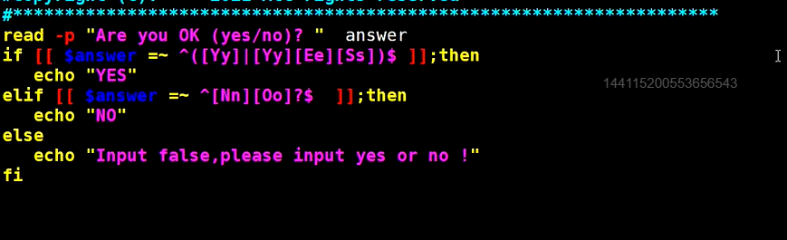

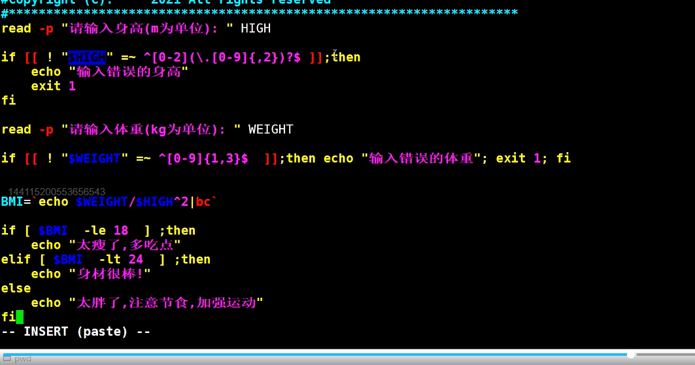

## **条件判断**

单分支结构

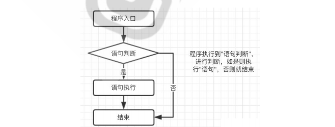

多分支结构

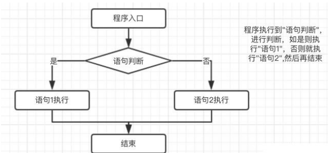

### **条件判断** if 语句

```shell
语法：
if COMMANDS; then COMMANDS; [ elif COMMANDS; then COMMANDS; ]... [ else COMMANDS; ] fi

例子：
#!/bin/bash
read -p "Are you ok? " answer

if [[ $answer =~ ^[Yy]$|^[Yy][Ee][Ss]$ ]]; then
    echo "YES"
elif [[ $answer =~ ^[Nn]$|^[Nn][Oo]$ ]]; then
    echo "NO"
else
    echo "输入错误，请重新输入"
fi    

```

### **条件判断 case 语句**

```shell
#!/bin/bash
read -p " Are you ok? " answer
case $answer in
[Yy]|[Yy][Ee][Ss])
    echo "YES"
    ;;
[Nn]|[Nn][Oo])
    echo "NO"
    ;;
*)
    echo "输入错误，请重新输入"
    ;;
esac
```

# 循环

## for循环

**语法 1: for: for NAME [in WORDS ... ] ; do COMMANDS; done 对列表每个元素执行**

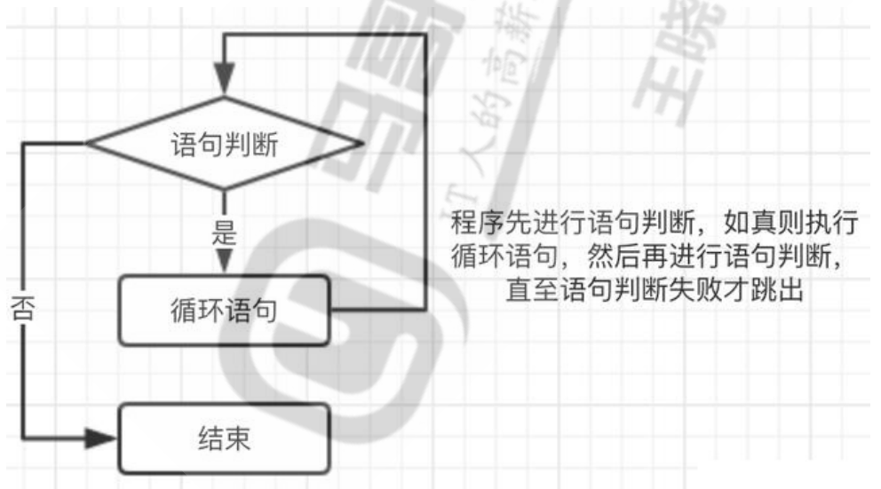

```bash
计算1到100的和

#!/bin/bash
sum=0
for i in {1..100};
    do let sum+=$i;
done
    echo $sum

```

**语法 2 ：((: for (( exp1; exp2; exp3 )); do COMMANDS; done 适用于算数循环**

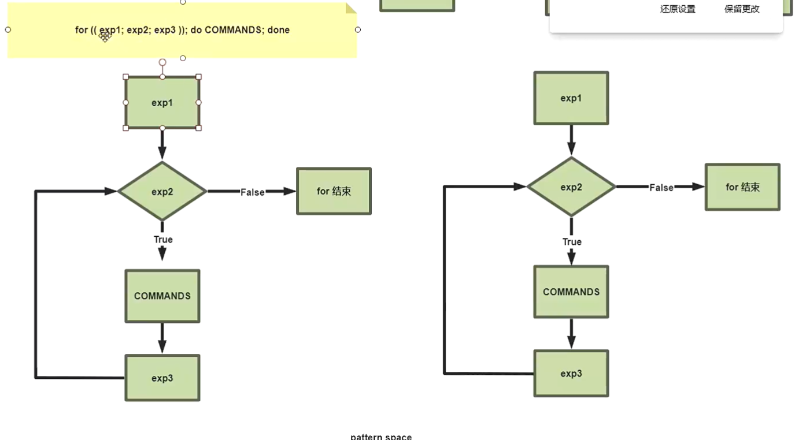

```bash
计算1到100的和
#!/bin/bash
sum=0  
for (( i=1;i<=100;i++ ))  
do  
    let "j=sum+i"  
        sum=$((j))  
        done  
        echo $sum
```

## 控制循环语句

### continue

continue [N]：提前结束第N层的本轮循环，而直接进入下一轮判断；最内层为第1层

```shell
#!/bin/bash
for ((j=0;j<5;j++));do
  for ((i=0;i<10;i++));do
       if [ $i -eq 5 ];then
           continue 2
           fi
           echo i=$i
  done
           echo j=$j
done

在内层循环中，如果 i 等于 5，那么 continue 2 会跳过当前的内层循环以及外层循环，直接进入外层循环的下一轮。如果 i 不等于 5，则会输出当前的 i 的值。

输出：
i=0
i=1
i=2
i=3
i=4
i=0
i=1
i=2
i=3
i=4
i=0
i=1
i=2
i=3
i=4
i=0
i=1
i=2
i=3
i=4
i=0
i=1
i=2
i=3
i=4

#!/bin/bash
for ((j=0;j<5;j++));do
  for ((i=0;i<10;i++));do
       if [ $i -eq 5 ];then
           continue 1
           fi
           echo i=$i
  done
           echo j=$j
done

在内层循环中，如果 i 等于 5，那么 continue 1 会跳过当前的内层循环，直接进入下一轮内层循环。如果 i 不等于 5，则会输出当前的 i 的值。

输出
i=0
i=1
i=2
i=3
i=4
i=6
i=7
i=8
i=9
j=0
i=0
i=1
i=2
i=3
i=4
i=6
i=7
i=8
i=9
j=1
i=0
i=1
i=2
i=3
i=4
i=6
i=7
i=8
i=9
j=2
i=0
i=1
i=2
i=3
i=4
i=6
i=7
i=8
i=9
j=3
i=0
i=1
i=2
i=3
i=4
i=6
i=7
i=8
i=9
j=4
```

### **break**

break [N]：提前结束第N层整个循环，最内层为第1层

```bash
for ((j=0;j<5;j++));do
  for ((i=0;i<10;i++));do
       if [ $i -eq 5 ];then
           break 2                                                                                                                       
           fi
           echo i=$i
  done
           echo j=$j
done

输出结果;
i=0
i=1
i=2
i=3
i=4
j=0
i=0
i=1
i=2
i=3
i=4
j=1
i=0
i=1
i=2
i=3
i=4
j=2
i=0
i=1
i=2
i=3
i=4
j=3
i=0
i=1
i=2
i=3
i=4
j=4

for ((j=0;j<5;j++));do
  for ((i=0;i<10;i++));do
       if [ $i -eq 5 ];then
           break 22 
           fi
           echo i=$i
  done
           echo j=$j
done

[root@litao ~]# bash break.sh 
i=0
i=1
i=2
i=3
i=4

```

## while循环

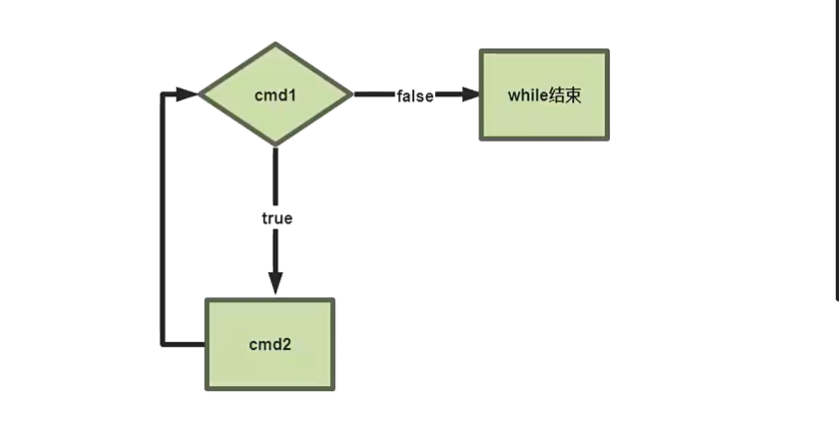

```bash
[root@litao ~]# help while
while: while COMMANDS; do COMMANDS; done
    Execute commands as long as a test succeeds.  只要测试成功，就执行命令
```

案例1：while 后面的 " : "，代表永远返回真；可以用ture替代

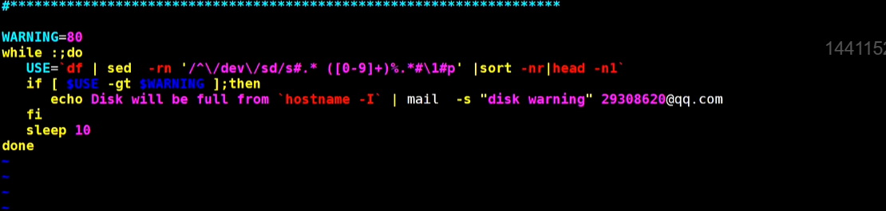

案例2：

```bash
#!/bin/bash
i=1
sum=0
while [ $i -le 100 ];do
    let sum+=i             sum += i 表示将 i 的值添加到 sum 的当前值上，并将结果存储回 sum 中
    let i++
done
echo $sum
```

案例3：

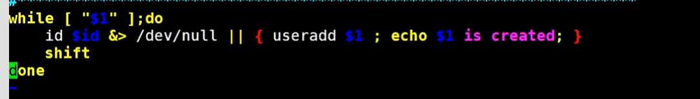

## until 循环

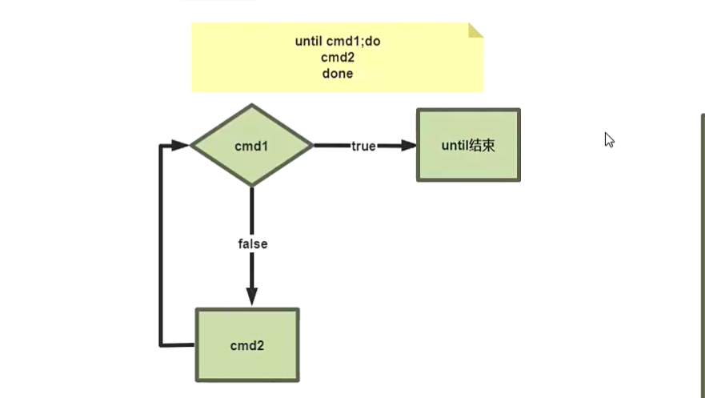

```bash
[root@litao ~]# help until
until: until COMMANDS; do COMMANDS; done
    Execute commands as long as a test does not succeed.    只要测试不成功，就执行命令；
```

## **循环控制 shift 命令**

shift [n] 用于将参量列表 list 左移指定次数，缺省为左移一次。 参量列表 list 一旦被移动，最左端的那个参数就从列表中删除。while 循环遍历位置参量列表时，常用 到 shift

```plsql
#!/bin/bash
while [ "$1" ];do
    id $1 &> /dev/null || { useradd $1; echo $1 is created; }
    shift
    done

[root@litao ~]# bash shift.sh tom aial litao
tom is created
aial is created
litao is created
```

## **while read 遍历文本每一行**

while 循环的特殊用法，遍历文件或文本的每一行

```plsql
#!/bin/bash
while read line;do 
    echo $line
    done

[root@litao ~]# bash whileread.sh 
1
1
2
2

这个脚本会从输入把变量读取到 line变量当中

[root@litao ~]# df | sed -nr '/^\/dev\/sd/s#^([^ ]+).* ([0-9]+)%.*#\1 \2#p'
/dev/sda2 5
/dev/sda3 1
/dev/sda1 15
```

**例子：**

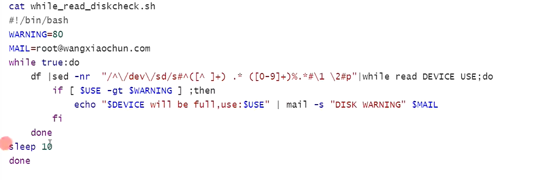

## **select 循环与菜单**

```xml
select NAME [in WORDS ... ;] do COMMANDS; done
```

-   select 循环主要用于创建菜单，按数字顺序排列的菜单项显示在标准错误上，并显示 PS3 提示 符，等待用户输入
-   select 是个无限循环，因此要用 break 命令退出循环，或用 exit 命令终止脚本。也可以按 ctrl+c 退出循环
-   select 经常和 case 联合使用

例子;

```shell
select menu in 初始化 备份 升级 降级 跑路;do 
    echo $menu
done
```

执行结果会有问题

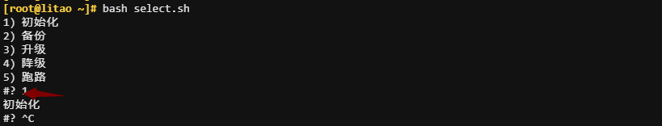

添加一个PS3的变量参数

```shell
PS3="请选择（1-5)"
select menu in 初始化 备份 升级 降级 跑路;do 
    echo $menu
done
```

执行的结果

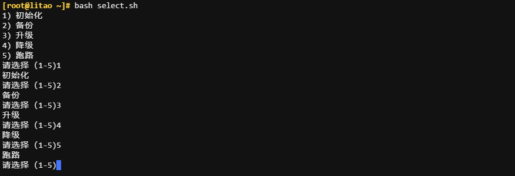

配合case使用

```plsql
PS3="请选择（1-5)"
select menu in 初始化 备份 升级 降级 跑路; do
    echo $menu
    case "${REPLY}" in
        1)
            echo "进行初始化"
            ;;
        2)
            echo "进行备份"
            ;;
        3)
            echo "进行升级"
            ;;
        4)
            echo "进行降级"
            ;;
        5)
            echo "进行跑路"
            break
            ;;
        *)
            echo "输入错误"
            ;;
    esac
done
```

  

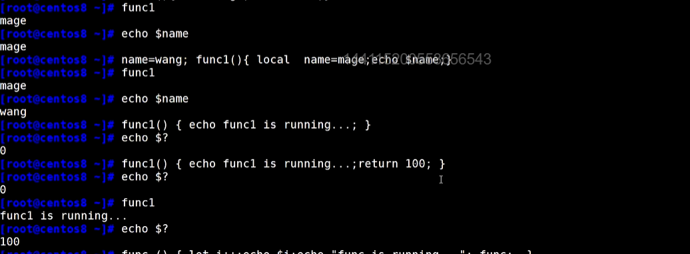

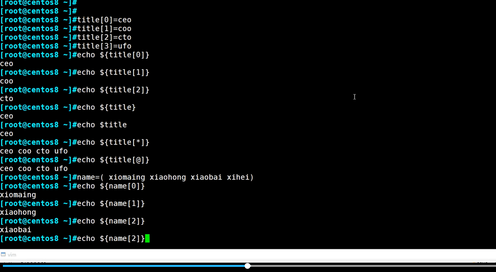

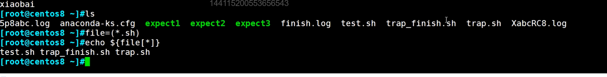

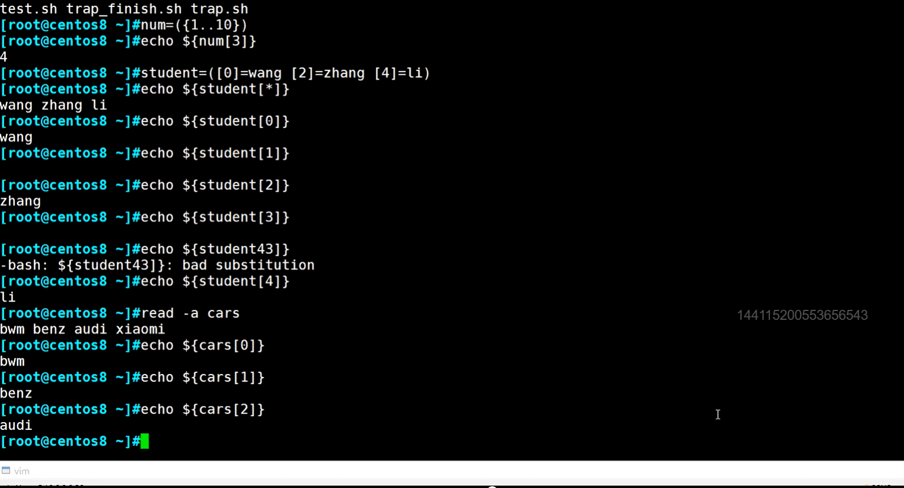

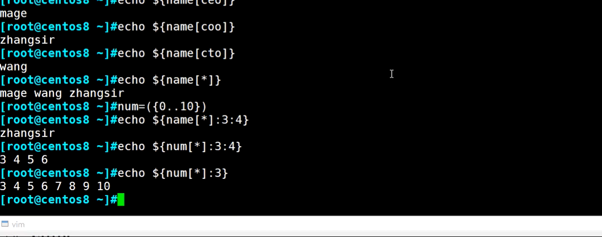