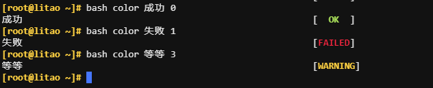

# **定义函数**

```bash
#语法一：
func_name （）{
 ...函数体...
}
#语法二：
function func_name {
 ...函数体...
}
```

# 函数查看

```bash
[root@litao ~]# func1() { echo func1 is running; }

函数查看
[root@litao ~]# declare -F
declare -f func1

[root@litao ~]# declare -f
func1 () 
{ 
    echo func1 is running
}

[root@litao ~]# declare -f func1
func1 () 
{ 
    echo func1 is running
}

[root@litao ~]# declare -F func1
func1
```

# 函数删除

```bash
unset func_name
```

# 函数调用

函数退出当前shell就会失效，要永久使用就要保存到一个文件，写脚本时候再调用；例如实现操作系统判断

```bash
[root@litao ~]# cat os_type 
os_type (){
    if grep -i -q centos /etc/os-release;then
        echo centos
    elif grep -i -q unbunt /etc/os-release;then
        echo unbunt
    else
        echo "其他系统"
   fi
}
```

在shell脚本中引用函数

```bash
[root@litao ~]# cat install_httpd.sh 
#!/bin/bash
. os_type

if [ `os_type` = 'unbunt' ];then
    apt install apache2 -y
elif [ `os_type` = 'centos' ];then
    yum install httpd -y
else
    echo "操作系统不支持"
fi
```

# **函数参数**

```bash
[root@litao ~]# func2() { echo 1st is $1; echo 2st is $2; }
[root@litao ~]# func2 litao dashabi
1st is litao
2st is dashabi
```

显示颜色代码

```bash
color () {
    RES_COL=60
    MOVE_TO_COL="echo -en \\033[${RES_COL}G"
    SETCOLOR_SUCCESS="echo -en \\033[1;32m"
    SETCOLOR_FAILURE="echo -en \\033[1;31m"
    SETCOLOR_WARNING="echo -en \\033[1;33m"
    SETCOLOR_NORMAL="echo -en \E[0m"
    echo -n "$1" && $MOVE_TO_COL
    echo -n "["
    if [ $2 = "success" -o $2 = "0" ] ;then
        ${SETCOLOR_SUCCESS}
        echo -n $"  OK  "    
    elif [ $2 = "failure" -o $2 = "1"  ] ;then 
        ${SETCOLOR_FAILURE}
        echo -n $"FAILED"
    else
        ${SETCOLOR_WARNING}
        echo -n $"WARNING"
    fi
    ${SETCOLOR_NORMAL}
    echo -n "]"
    echo 
}

[ $# -eq 0 ] && echo "Usage: `basename $0` {success|failure|warning}"

color  $1 $2
```



# 函数变量

在函数fuc1内定义了变量和外部都定义了变量，函数的变量扰乱了外面变量name=wang；可以在函数内部添加local，让变量只在函数内有效。

```bash
[root@litao ~]# name=litao;func1() { name=xiaoming;echo $name; }
[root@litao ~]# echo $name
litao
[root@litao ~]# func1
xiaoming
[root@litao ~]# echo $name
xiaoming
```

上面例子只要执行函数func1就会扰乱外部定义的$name，可以在函数内部添加local。

```bash
[root@litao ~]# name=litao;func1() { local name=xiaoming;echo $name; }
[root@litao ~]# echo $name
litao
[root@litao ~]# func1
xiaoming
[root@litao ~]# echo $name
litao
```

# 函数返回值

经过试验测试，return返回值不能大于255。

```bash
root@litao ~]# func1() { echo func1 is running...;return 255; } 
[root@litao ~]# func1
func1 is running...
[root@litao ~]# echo $?
255
```

**​**