# find

默认当前路径为当前目录；默认表达式为打印。 find 是实时查找工具，通过遍历指定路径完成文件查找

`find [-H] [-L] [-P] [-Olevel] [-D help|tree|search|stat|rates|opt|exec] [path...] [expression]`

`find [OPTION]... [查找路径] [查找条件] [处理动作]`

## 指定搜索目录层级

```bash
-maxdepth  level  最大搜索目录深度；指定目录下的文件为1级。
-mindepth  level  最小搜索目录深度。
```

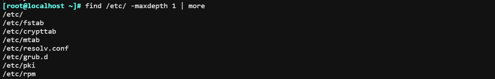

## 先处理目录文件

下图所示；默认先搜索目录然后再处理文件；可以使用 \-depth 反过来先处理文件再处理目录。

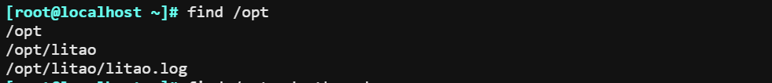

\-depth 选项

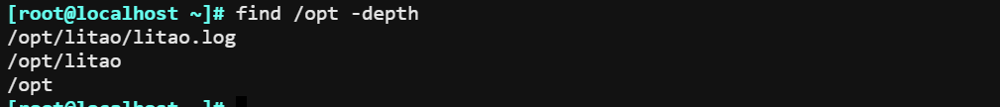

## 根据文件名和inode查找

```bash
-name "文件名称"：支持使用glob，如：*, ?, [], [^],通配符要加双引号引起来
-iname "文件名称"：不区分字母大小写
-inum n  按inode号查找
-samefile name  相同inode号的文件
-links n   链接数为n的文件
-regex “PATTERN”：以PATTERN匹配整个文件路径，而非文件名称
```

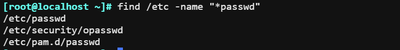

\-regex “PATTERN”：以PATTERN匹配整个文件路径，而非文件名称。**".\*\\conf$"**

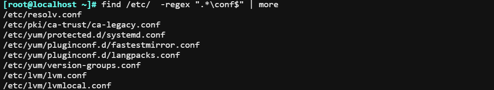

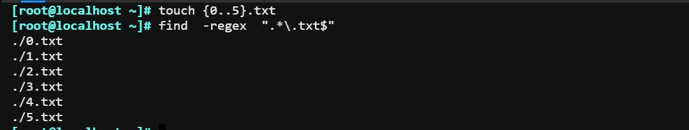

## 根据属主、属组查找

```bash
-user USERNAME：查找属主为指定用户(UID)的文件
-group GRPNAME: 查找属组为指定组(GID)的文件
-uid UserID：查找属主为指定的UID号的文件
-gid GroupID：查找属组为指定的GID号的文件
-nouser：查找没有属主的文件
-nogroup：查找没有属组的文件
```

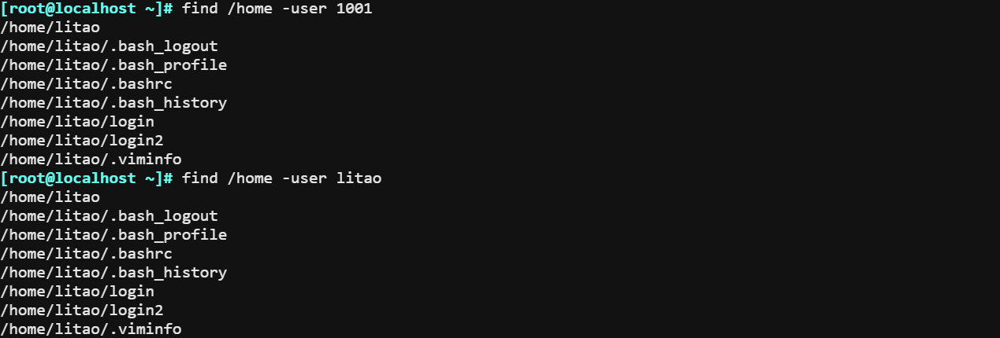

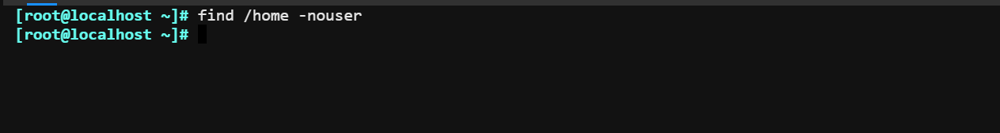

## 根据文件类型查找

```plsql
-type 
f: 普通文件
d: 目录文件
l: 符号链接文件
s：套接字文件
b: 块设备文件
c: 字符设备文件
p: 管道文件
```

找出/home的目录

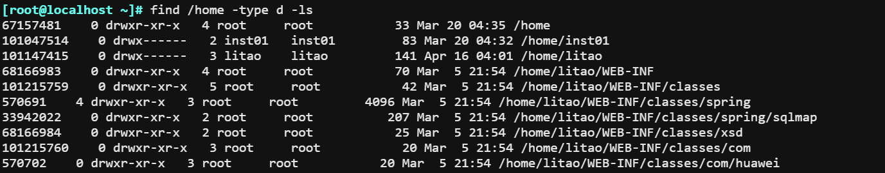

找出类型为非文件

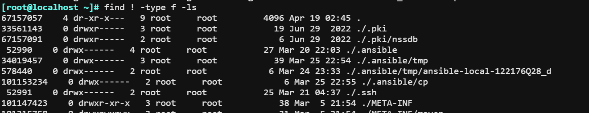

### 空文件或目录

查找空的目录

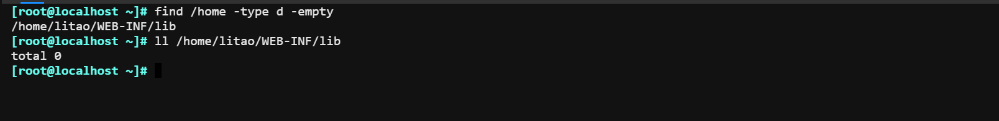

## 组合条件

```bash
与：-a ，默认多个条件是与关系
或：-o , \(  -o \)
非：-not   !  
```

例子1：找出user为litao和group为inst01的文件

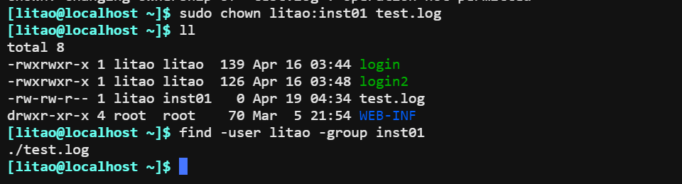

例子2：非，user=litao;group=inst01

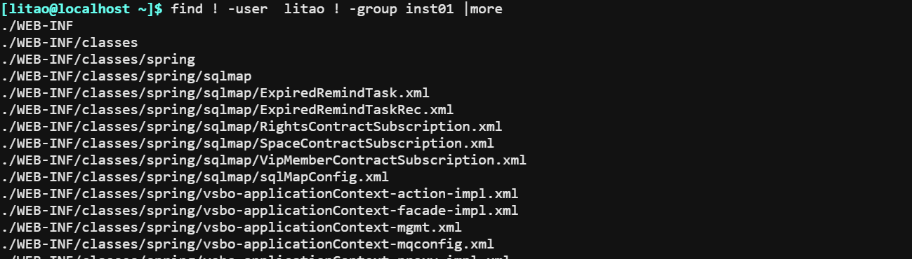

例子3：非，user=litao；inst01

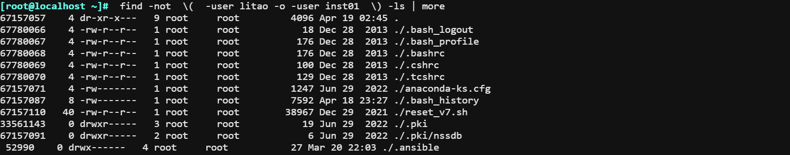

例子4：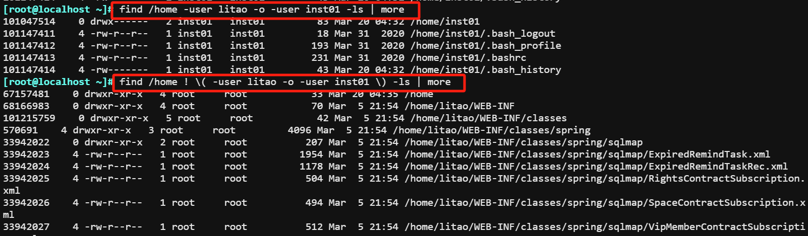

## 排除目录

1.  查找/etc/下，除/etc/security目录的其它所有.conf后缀的文件

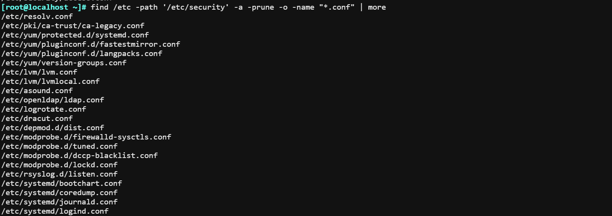

2.  查找/etc/下，除/etc/security和/etc/systemd两个目录的所有.conf后缀的文件

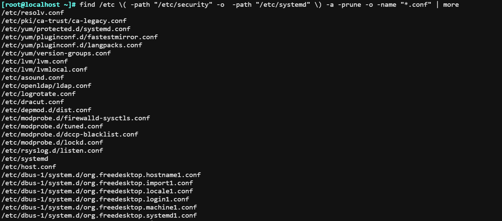

## 根据文件大小来查找

```bash
-size [+|-]#UNIT
		常用单位：k, M, G，c（byte）,注意大小写敏感
UNIT: find -size 5K
		如：5k 表示 4k到5k之间
-UNIT: find -size -5K
		如：-5K 表示 0K到5K
+UNIT：find -size -5k
		如：表示6K以上。
```

1.  1K-2K

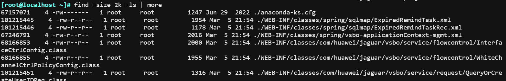

2.  0K-2K

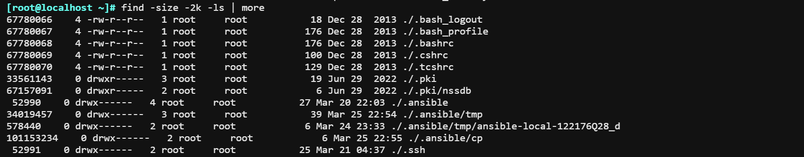

3.  2K以上

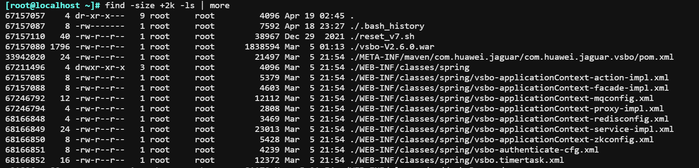

## 根据时间戳

```bash
#以“天”为单位
-atime [+|-]# 
-mtime
-ctime

 #: [#,#+1) 
 -#: [0,#)
 +#: [#+1,∞]

 以“分钟”为单位
 -amin
 -mmin
 -cmin
```

## 根据权限来查询

```bash
-perm 777 精确匹配
-perm /600 这里的6代表uid可以是r也可以是w; r+w任意一个权限。这里的0,代表不关心gid的任何权限，可以是rwx、r-x等等。 
	例如:/006;00代表不关心uid,gid的权限；other是权限为r=4或者w=2任意权限。

-perm -600 对象都必须同时拥有指定权限。-600，代表uid必须是rw权限。
```

1.  精确匹配777的权限

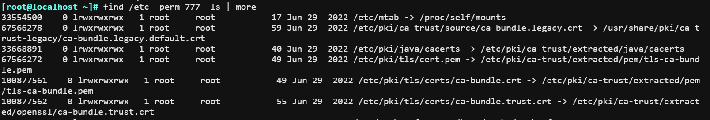

2.  匹配/600权限，这里的/代表或者。

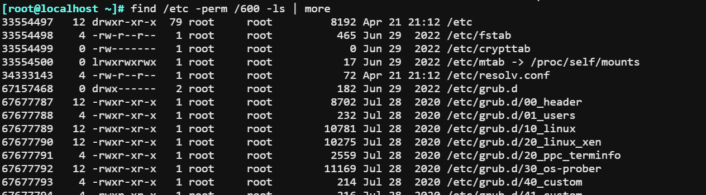

3.  精确匹配uid为6权限的文件。

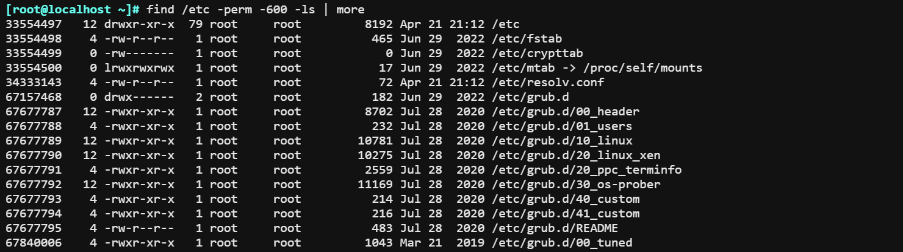

## 处理动作

```bash
-ls：类似于对查找到的文件执行"ls -dils"命令格式输出。
-fls file：查找到的所有文件的长格式信息保存至指定文件中，相当于 -ls > file
-ok COMMAND {} \; 对查找到的每个文件执行由COMMAND指定的命令，对于每个文件执行命令之前，都会
交互式要求用户确认
-exec COMMAND {} \; 对查找到的每个文件执行由COMMAND指定的命令 ；{}: 用于引用查找到的文件名称自身
-delete：删除查找到的文件，慎用！
```

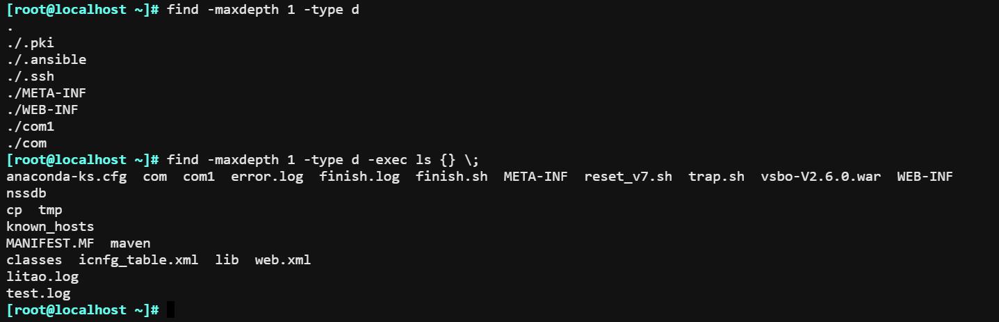

# 参数替换 xargs

由于很多命令不支持管道|来传递参数，xargs用于产生某个命令的参数，xargs 可以读入 stdin 的数据。

1.  删除当前目录下的大量文件

```bash
ls  | xargs   
```

2.  xargs -nx，代表可以一次性传送2个参数

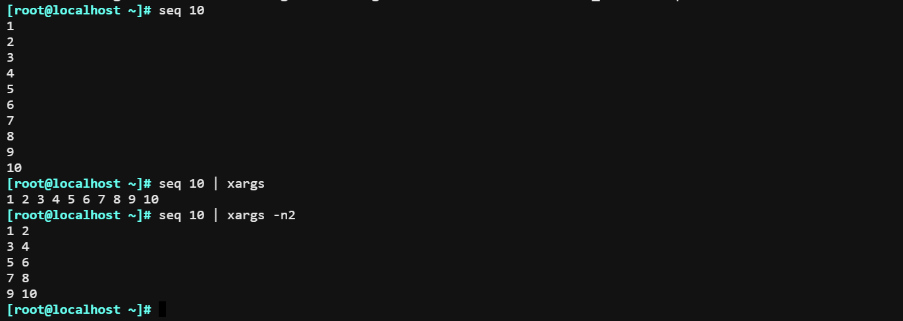