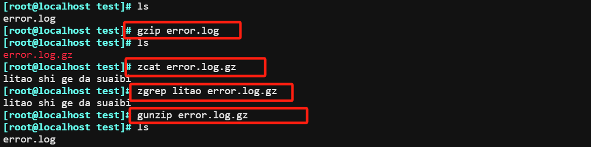
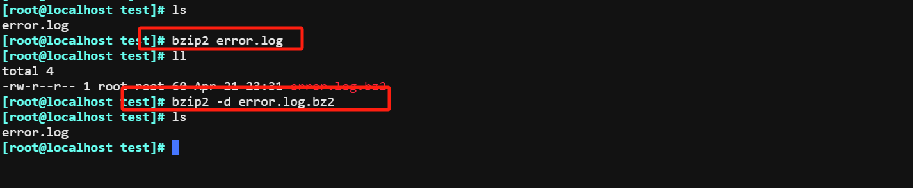
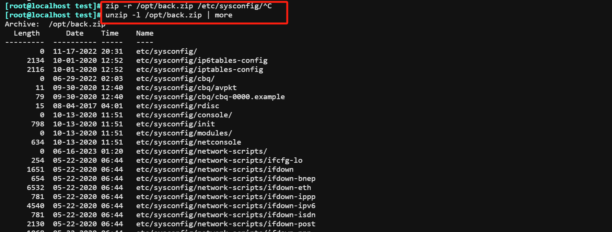
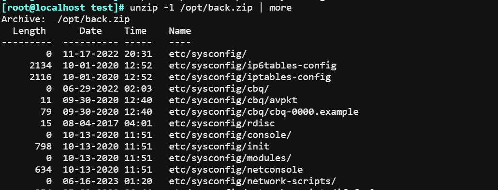
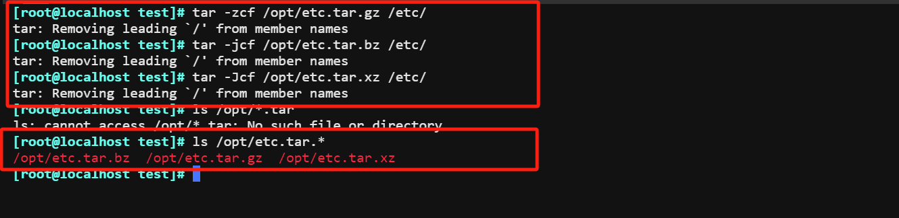
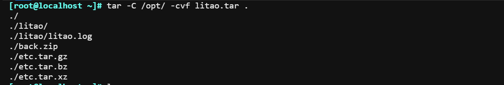
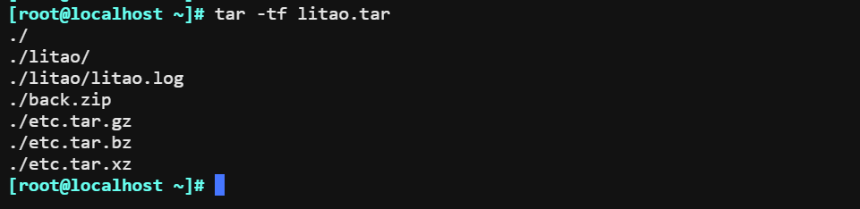

# gzip和gunzip

`Usage: gzip [OPTION]... [FILE]...`

```bash
-k  keep, 保留原文件,CentOS 8 新特性
-d  解压缩，相当于gunzip
-c  结果输出至标准输出，保留原文件不改变
-#  指定压缩比，#取值为1-9，值越大压缩比越大
```

1.  压缩文件和解压文件和查看文件



# bzip2和bunzip2

```bash
-k  keep, 保留原文件
-d  解压缩,相当于unxz 
-c  结果输出至标准输出，保留原文件不改变
-#  压缩比，取值1-9，默认为6
```



# xz和unxz

`xz [OPTION]... FILE ...`

```bash
-k  keep, 保留原文件
-d  解压缩,相当于unxz 
-c  结果输出至标准输出，保留原文件不改变
-#  压缩比，取值1-9，默认为6
```
```bash
unxz file.xz  解压缩
xzcat file.xz  不显式解压缩的前提下查看文本文件内容
```

# zip和unzip ，1.2.3只支持单个文件压缩

zip 可以实现打包目录和多个文件成一个文件并压缩，但可能会丢失文件属性信息，如：所有者和组信 息，一般建议使用 tar 代替 。

`zip [-options] [-b path] [-t mmddyyyy] [-n suffixes] [zipfile list] [-xi list]`

1.  打包并压缩，zip压缩包含目录  
    
2.  不包括目录本身，只打包目录内的文件和子目

```bash
cd  /etc/sysconfig; zip -r /root/sysconfig.zip *
```

3.  解压缩至指定目录,

```bash
如果指定目录不存在，会在其父目录（必须事先存在）下自动生成  
unzip /backup/sysconfig.zip  -d /tmp/config 
```

4.  查看压缩内容



# tar 打包和解压缩包

`tar [OPTION...] [FILE]...`

```bash
1. 创建归档文档
-c：创建新的归档文件。
-v：详细模式，显示处理的文件列表。
-f：指定归档文件名。

2.解压
-xjvf bzip解压
-xzvf gzip解压
-xJvf xz解压

3. 结合压缩工具实现：归档并压缩   
-z 相当于gzip压缩工具
-j 相当于bzip2压缩工具
-J 相当于xz压缩工具

4. 指定目录
-C 

5.不解压缩查看 .tar包
tar -tf litao.tar
```

1.  压缩文件



2.  解压文件

```bash
tar -jxf /opt/etc.tar.bz -C /root/test
tar -zxf /opt/etc.tar.gz -C /root/test
tar -Jxf /opt/etc.tar.xz -C /root/test
```

3.  打包指定目录文件



4.  预览tar包的内容

