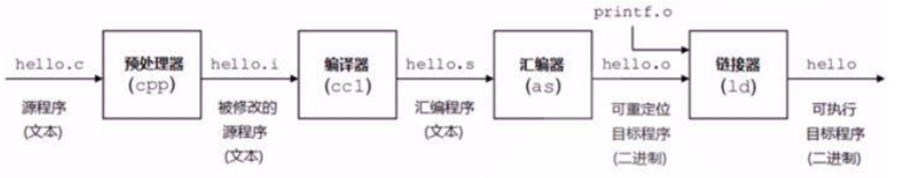
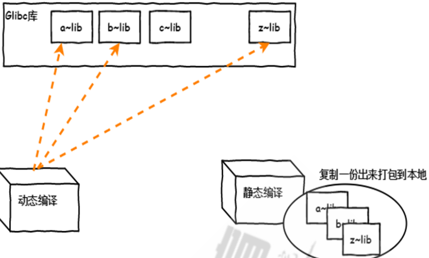

# 软件运行和编译

C 程序源代码 --> 预处理 --> 编译 --> 汇编 --> 链接

C语言的程序编译主要经过四个过程：



gcc 编译过程 :

```shell
# 分步骤编译运行
gcc -E hello.c -o hello.i 对hello.c文件进行预处理，生成了hello.i 文件
gcc -S hello.i -o hello.s 对预处理文件进行编译，生成了汇编文件
gcc -c hello.s -o hello.o 对汇编文件进行编译，生成了目标文件
gcc hello.o -o hello 对目标文件进行链接，生成可执行文件
# 一步实现编译过程
gcc hello.c -o hello 直接编译链接成可执行目标文件
```

在Linux系统中，编译完成的软件包通常被称为“二进制包”或者简称为“二进制”。这是因为在编译过程中，源代码被转换成了计算机可执行的二进制文件。这些二进制文件通常包含了程序的可执行文件、库文件和其他必要的资源。


# 软件模块的静态和动态链接

链接主要作用是把各个模块之间相互引用的部分处理好，使得各个模块之间能够正确地衔接，分为静态和动态链接 。



静态链接 ： 生成模块文件libxxx.a ， 把程序对应的依赖库复制一份到包

动态链接： 只把依赖加做一个动态链接 ，生成模块文件libxxx.so

## Linux的模块（库）文件

查看ls命令依赖哪些库

```shell
[root@localhost ~]# which ls
alias ls='ls --color=auto'
        /usr/bin/ls

[root@localhost ~]# ldd /usr/bin/ls
]       linux-vdso.so.1 =>  (0x00007ffec33c4000)
        libselinux.so.1 => /lib64/libselinux.so.1 (0x00007f2d44ceb000)
        libcap.so.2 => /lib64/libcap.so.2 (0x00007f2d44ae6000)
        libacl.so.1 => /lib64/libacl.so.1 (0x00007f2d448dd000)
        libc.so.6 => /lib64/libc.so.6 (0x00007f2d4450f000)
        libpcre.so.1 => /lib64/libpcre.so.1 (0x00007f2d442ad000)
        libdl.so.2 => /lib64/libdl.so.2 (0x00007f2d440a9000)
        /lib64/ld-linux-x86-64.so.2 (0x00007f2d44f12000)
        libattr.so.1 => /lib64/libattr.so.1 (0x00007f2d43ea4000)
        libpthread.so.0 => /lib64/libpthread.so.0 (0x00007f2d43c88000)
```

# 软件包和包管理器

## 软件包中的文件分类

二进制文件、库文件、配置文件、帮助文件

## 程序包管理器

-   redhat：rpm文件, rpm 包管理器
-   debian：deb文件, dpkg 包管理器

## 包命名

bash-4.2.46-34.el7.x86\_64.rpm

> 包名称-版本-编译次数.适用版本.硬件版本.rpm

## 分类和拆包

软件包为了管理和使用的便利，会将一个大的软件分类，放在不同的子包中。

> -   Application-VERSION-ARCH.rpm: 主包
> -   Application-**devel**\-VERSION-ARCH.rpm 开发子包
> -   Application-**utils**\-VERSION-ARHC.rpm 其它子包
> -   Application-**libs**\-VERSION-ARHC.rpm 其它子包

# 最小化安装包建议

```bash
sudo apt install iproute2 ntpdate tcpdump telnet traceroute nfs-kernel-server nfs-common lrzsz tree openssl libssl-dev libpcre3 libpcre3-dev zlib1g-dev gcc openssh-server iotop unzip zip purge ufw lxd lxd-client lxcfs liblxc-common
```
```bash
yum install gcc make autoconf gcc-c++ glibc glibc-devel pcre openssl-devel systemd-devel zlib-devel vim lrzsz tree tmux net-tools iotop bc bzip2 zip unzip nfs-utils man-pages pcre-devel openssl lsof tcpdump wget -y
```

​