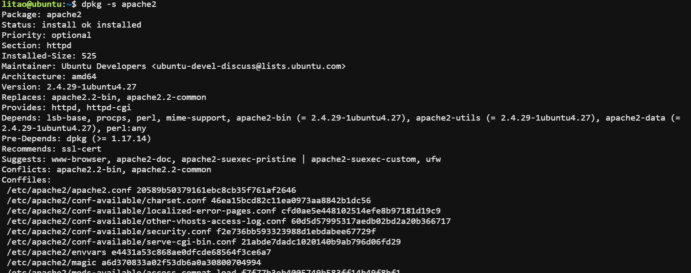
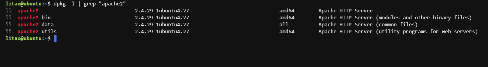
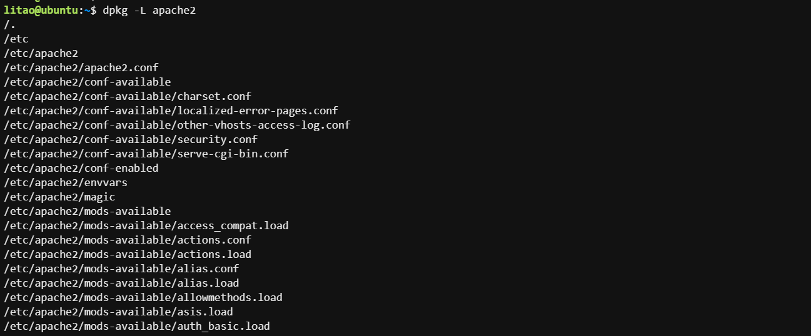
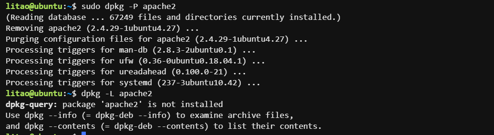
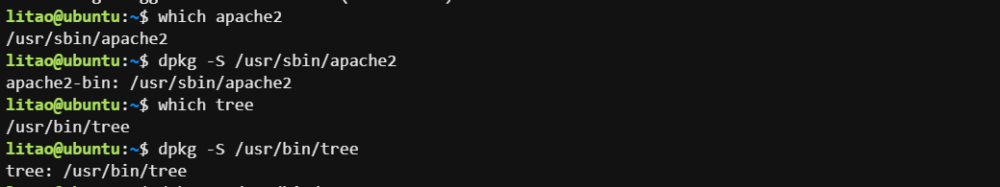
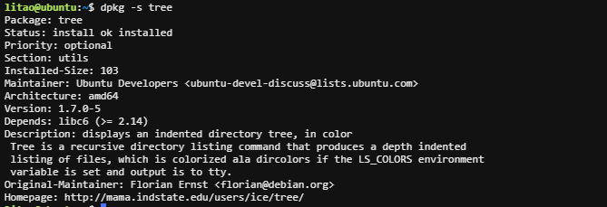
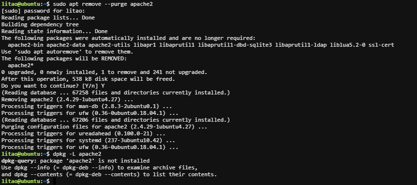
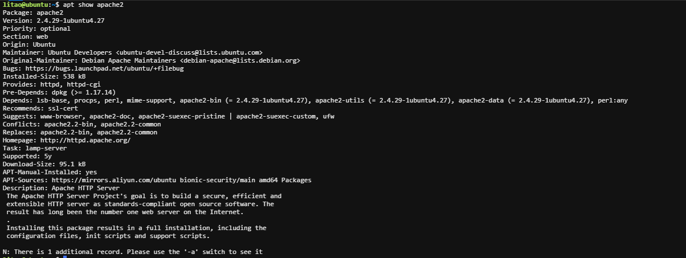
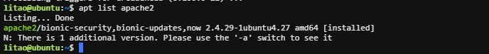
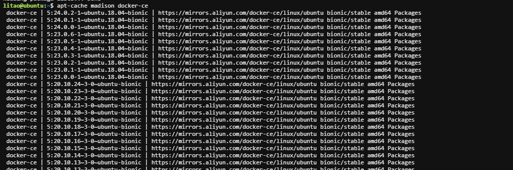

-   dpkg：package manager for Debian，类似于rpm， dpkg是基于Debian的系统的包管理器。可 以安装，删除和构建软件包，但无法自动下载和安装软件包或其依赖项 。
-   apt：Advanced Packaging Tool，功能强大的软件管理工具，甚至可升级整个Ubuntu的系统，基 于客户/服务器架构，类似于yum

**光盘包的存放路劲： pool/main**


# 常用命令

## dpkg

```bash
安装包      rpm -i
litao@ubuntu:~$ dpkg -i /mnt/pool/main/a/apache2/apache2_2.4.29-1ubuntu4.13_amd64.deb

删除包，不会删除依赖
dpkg -r  package

删除包（包括配置文件）
dpkg -P package

列出当前已安装的包   rpm -qa
dpkg -l | less
litao@ubuntu:~$ dpkg -l apache2

显示该包的简要说明，--rpm –qi
dpkg -s package

显示已安装包的相关文件  rpm -ql
litao@ubuntu:~$ dpkg -L apache2

列出 deb 包的内容，类似rpm –qpl 
dpkg -c package.deb 

查看已安装的包来自哪个软件
litao@ubuntu:~$ which tree
/usr/bin/tree
litao@ubuntu:~$ dpkg -S /usr/bin/tree
tree: /usr/bin/tree
```



\-l 列出已经安装的包 `dpkg -l | grep "apache2"`



\-L 查看已安装的配置文件 `dpkg -L apache2`



\-P 连配置文件都删除 `dpkg -P apache2`



\-S 查看已经安装软件来自哪个包（已安装软件）



\-s 查看已安装软件的具体信息



## apt

```bash
1. 安装包
apt install apache2
apt install nginx=1.14.0-0ubuntu1.6 # 下载指定版本

2.移除包   #添加--purge选项会删除包配置文件，谨慎使用
litao@ubuntu:~$ sudo apt remove apache2 

3.搜索安装包
apt search nginx

4.删除安装包并解决依赖关系
apt autoremove apache2 

5.卸载单个软件包删除配置⽂件
apt purge apache2 

6.查看仓库中软件包有哪些版本可以安装
apt-cache madison nginx 

7.列出包含条件的包（已安装，可升级等）
apt list | grep apache2

8.更新索引；在安装软件之前都要跟新一下
apt update

9.查看版本信息
apt show apache2

10.查看未安装的软件来自哪个包
apt-file search /usr/bin/tree

11.卸载包  --purge选项会删除包配置文件
litao@ubuntu:~$ apt update 
litao@ubuntu:~$ sudo apt update 

12.查询仓库中包含的版本
apt-cache madison docker-ce 

13.查看软件依赖的包
apt depends keepalived
```

`apt remove --purge apache2` 卸载apache2包，并且删除配置文件；apt remove 默认不会删除配置文件



`apt show apache2` 查看未安装软件版本信息



`apt list apache2`查看已经安装的版本信息



`apt-cache madison docker-ce` 查询仓库中包含的版本



# 编辑 源列表

APT包索引配置文件

-   /etc/apt/sources.list 相当于 /etc/yum.repos.d/\*.repo
-   /etc/apt/sources.list.d 也可以将sources.list存放于这个这里

```bash
1. 编辑/etc/apt/sources.list
litao@ubuntu:~$ sudo apt edit-sources
deb https://mirrors.aliyun.com/ubuntu/ bionic main restricted universe multiverse
deb-src https://mirrors.aliyun.com/ubuntu/ bionic main restricted universe multiverse

deb https://mirrors.aliyun.com/ubuntu/ bionic-security main restricted universe multiverse
deb-src https://mirrors.aliyun.com/ubuntu/ bionic-security main restricted universe multiverse

deb https://mirrors.aliyun.com/ubuntu/ bionic-updates main restricted universe multiverse
deb-src https://mirrors.aliyun.com/ubuntu/ bionic-updates main restricted universe multiverse

# deb https://mirrors.aliyun.com/ubuntu/ bionic-proposed main restricted universe multiverse
# deb-src https://mirrors.aliyun.com/ubuntu/ bionic-proposed main restricted universe multiverse

deb https://mirrors.aliyun.com/ubuntu/ bionic-backports main restricted universe multiverse
deb-src https://mirrors.aliyun.com/ubuntu/ bionic-backports main restricted universe multiverse

```

# 最小化安装包建议：

```bash
sudo apt install iproute2 ntpdate tcpdump telnet traceroute nfs-kernel-server nfs-common lrzsz tree openssl libssl-dev libpcre3 libpcre3-dev zlib1g-dev gcc openssh-server iotop unzip zip purge ufw lxd lxd-client lxcfs liblxc-common
```