# 常用命令 - rpm

## 安装

> \-i 安装包
> 
> \-v 显示过程
> 
> \-h 以“#”开头显示过程

```shell
[root@localhost Packages]# rpm -ivh ftp-0.17-67.el7.x86_64.rpm 
Preparing...                          ################################# [100%]
Updating / installing...
   1:ftp-0.17-67.el7                  ################################# [100%]
```

## 查询

> \-q 查询安装的包
> 
> \-a 所有包
> 
> \-l 显示包的文件列表
> 
> \-c 只查看配置文件
> 
> \-d 文档
> 
> \-i 查看版本信息
> 
> \-f 后面跟 /usr/bin/tree 类似的配置文件可以查询包的来源；数据来自 /var/lib/rpm
> 
> `-p`：指定一个 `.rpm` 文件，而不是已经安装的软件包。
> 
> 注意：以上的选项都要配合 -q的选项
> 
> \--scripts：程序包自带的脚本
> 
> ​  

### 查询已安装包

```shell
rpm -q 查看指定软件包是否安装
[root@localhost Packages]# rpm -q ftp    ## 包名一定要写全，否则查不出来
ftp-0.17-67.el7.x86_64

[root@localhost Packages]# rpm -q ft*    ##通配符不适用
package ftp-0.17-67.el7.x86_64.rpm is not installed

rpm-qa 查看系统中已安装的所有RPM软件包列表 
[root@localhost Packages]# rpm -qa | grep ft   ## 可以借用-a选项配合grep进行模糊查询
nss-softokn-freebl-3.44.0-8.el7_7.x86_64
ftp-0.17-67.el7.x86_64
nss-softokn-3.44.0-8.el7_7.x86_64

或者以下方式
[root@localhost Packages]# rpm -qa "ft*"
ftp-0.17-67.el7.x86_64

查询安装后执行的脚本
[root@localhost ~]# rpm -q --scripts bash
postinstall scriptlet (using <lua>):
nl        = '\n'
sh        = '/bin/sh'..nl
bash      = '/bin/bash'..nl

```

### 配置文件查询

```shell
查询安装包的所有文件
[root@localhost ~]# rpm -ql ftp
/usr/bin/ftp
/usr/bin/pftp
/usr/share/man/man1/ftp.1.gz
/usr/share/man/man1/pftp.1.gz
/usr/share/man/man5/netrc.5.gz

查询安装包的配置文件
[root@localhost ~]# rpm -qc bash
/etc/skel/.bash_logout
/etc/skel/.bash_profile
/etc/skel/.bashrc

查看安装包的目录
[root@localhost ~]# rpm -qd bash
/usr/share/doc/bash-4.2.46/COPYING
/usr/share/info/bash.info.gz
/usr/share/man/man1/..1.gz
/usr/share/man/man1/:.1.gz
/usr/share/man/man1/[.1.gz
/usr/share/man/man1/alias.1.gz
/usr/share/man/man1/bash.1.gz

查看未安装安装包的信息
[root@localhost ~]# rpm -qip ftp
Name        : ftp
Version     : 0.17
Release     : 67.el7
Architecture: x86_64
Install Date: Mon 18 Dec 2023 03:46:53 AM EST     ## 安装时间
Group       : Applications/Internet
Size        : 98723
License     : BSD with advertising
Signature   : RSA/SHA256, Sun 20 Nov 2016 12:45:48 PM EST, Key ID 24c6a8a7f4a80eb5
Source RPM  : ftp-0.17-67.el7.src.rpm
Build Date  : Sat 05 Nov 2016 11:04:49 AM EDT
Build Host  : worker1.bsys.centos.org
Relocations : (not relocatable)
Packager    : CentOS BuildSystem <http://bugs.centos.org>
Vendor      : CentOS
URL         : ftp://ftp.linux.org.uk/pub/linux/Networking/netkit

查询未安装软件包的文件
[root@localhost Packages]# rpm -qlp /mnt/Packages/samba-4.10.16-5.el7.x86_64.rpm
/etc/openldap/schema
/etc/openldap/schema/samba.schema
/etc/pam.d/samba
/usr/bin/smbstatus
/usr/lib/systemd/system/nmb.service
/usr/lib/systemd/system/smb.service
/usr/lib64/samba/auth
/usr/lib64/samba/auth/script.so
```

### 强制安装

> \-- force 强制重新安装（升级和降级）
> 
> \-- nodeps 忽略依赖关系（卸载和安装）

```shell
[root@localhost ~]# rpm -ql tree
/usr/bin/tree
/usr/share/doc/tree-1.6.0
/usr/share/doc/tree-1.6.0/LICENSE
/usr/share/doc/tree-1.6.0/README
/usr/share/man/man1/tree.1.gz
[root@localhost ~]# rm -rf /usr/bin/tree 

[root@localhost ~]# rpm -qf /usr/bin/tree
tree-1.6.0-10.el7.x86_64

[root@localhost ~]# mount /dev/cdrom /mnt
mount: /dev/sr0 is write-protected, mounting read-only

[root@localhost Packages]# ls tree*
tree-1.6.0-10.el7.x86_64.rpm

如果软件包存在, 强制再次安装
[root@localhost Packages]# rpm -ivh tree-1.6.0-10.el7.x86_64.rpm --force

安装samba服务需要依赖其他组件, 使用--nodeps可重新强制安装
[root@xuliangwei ~]# rpm -ivh --nodeps  /mnt/Packages/tree-1.6.0-10.el7.x86_64.rpm

```

### 升级

```shell
# wget  https://mirrors.aliyun.com/zabbix/zabbix/3.0/rhel/7/x86_64/zabbix-agent-3.0.9-1.el7.x86_64.rpm
# wget  https://mirrors.aliyun.com/zabbix/zabbix/4.2/rhel/7/x86_64/zabbix-agent-4.2.0-1.el7.x86_64.rpm
 
1.先安装低版本
[root@www.xuliangwei.com ~]# rpm -ivh zabbix-agent-3.0.9-1.el7.x86_64.rpm
        
2.尝试安装高版本(会出现错误)
[root@www.xuliangwei.com ~]# rpm -ivh zabbix-agent-4.2.0-1.el7.x86_64.rpm
        
3.使用升级的方式,完美解决替换
[root@www.xuliangwei.com ~]# rpm -Uvh zabbix-agent-4.2.0-1.el7.x86_64.rpm
```

  

# 常用命令 - yum、dnf

CentOS 使用 yum, dnf 解决rpm的包依赖关系。 yum/dnf 是基于C/S 模式 。

实现方式：

> 先在yum服务器上创建 yum repository（仓库），在仓库中事先存储了众多rpm包，以及包的相关的 元数据文（放置于特定目录repodata下），当yum客户端利用yum/dnf工具进行安装时包时，会自动 下载repodata中的元数据，查询远数据是否存在相关的包及依赖关系，自动从仓库中找到相关包下载并 安装。 **只有\*.rpm和repodata才能组成一个yum源**


yum服务器的仓库可以多种形式存在：

```shell
1. file:// 本地路径
2. http://
3. https://
4. ftp://
```

**注意：yum仓库指向的路径一定必须是repodata目录所在目录**

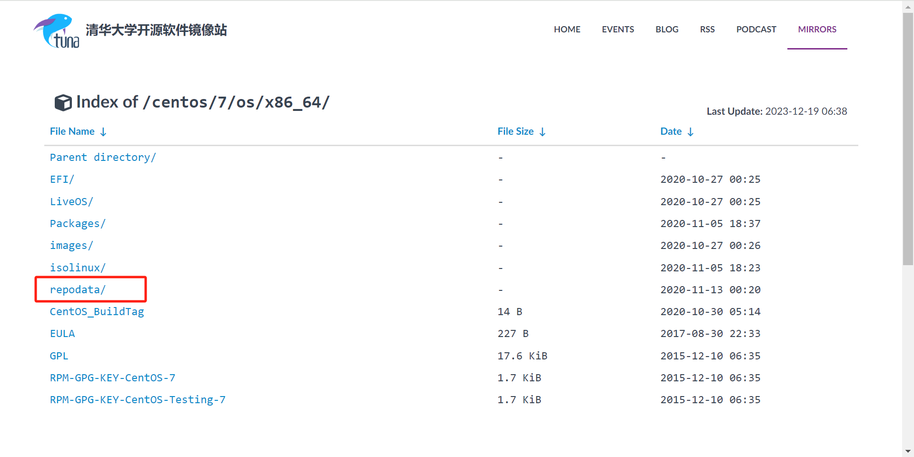

## yum客户端配置

### yum客户端配置文件

> /etc/yum.conf 为所有仓库提供公共配置
> 
> /etc/yum.repos.d/\*.repo 为每个仓库的提供配置文件

### yum相关变量

```shell
yum相关变量：
$releasever: 当前OS的发行版的主版本号，如：8，7，6
$arch: CPU架构，如：aarch64, i586, i686，x86_64等
$basearch：系统基础平台；i386, x86_64
$contentdir：表示目录，比如：centos-8，centos-7
```
```shell
1.centos8 (AppStream、BaseOS;centos8 具备两个仓库)
https://mirrors.tuna.tsinghua.edu.cn/centos/8-stream/AppStream/x86_64/os/
https://mirrors.tuna.tsinghua.edu.cn/centos/8-stream/BaseOS/x86_64/os/
2.centos7
https://mirrors.tuna.tsinghua.edu.cn/centos/7/os/x86_64/
```

## centos8配置仓库：

以下每个"\*.repo"都为一个仓库

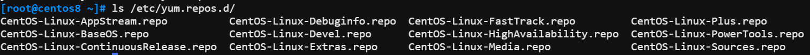

```shell
1. 备份原来的仓库
[root@centos8 ~]# cd /etc/yum.repos.d/
[root@centos8 yum.repos.d]# mkdir backup
[root@centos8 yum.repos.d]# mv *.repo backup/

2.创建centos8.repo文件，注意baseurl后面跟的路径要对齐
[root@centos8 ~]# cat /etc/yum.repos.d/Centos8.repo 
[BaseOS]
name=BaseOS
baseurl=https://mirrors.tuna.tsinghua.edu.cn/centos/$releasever/BaseOS/$basearch/os/
        https://mirrors.huaweicloud.com/centos/$releasever/BaseOS/$basearch/os/
        https://mirrors.aliyun.com/centos/$releasever/BaseOS/$basearch/os/
gpgcheck=0
enabled=1

[AppStream]
name=AppStream
baseurl=https://mirrors.tuna.tsinghua.edu.cn/centos/$releasever/AppStream/$basearch/os/
        https://mirrors.huaweicloud.com/centos/$releasever/AppStream/$basearch/os/
        https://mirrors.aliyun.com/centos/$releasever/AppStream/$basearch/os/
gpgcheck=0
enabled=1

[EPEL]
name=EPEL
baseurl=https://mirrors.tuna.tsinghua.edu.cn/epel/$releasever/Everything/$basearch/
        https://mirrors.aliyun.com/epel/$releasever/Everything/$basearch/
        https://mirrors.huaweicloud.com/epel/$releasever/Everything/$basearch/
gpgcheck=0
enabled=1

[extras]
name=extras
baseurl=https://mirrors.tuna.tsinghua.edu.cn/centos/$releasever/extras/$basearch/os/
        https://mirrors.aliyun.com/centos/$releasever/extras/$basearch/os/
        https://mirrors.huaweicloud.com/centos/$releasever/extras/$basearch/os/
gpgcheck=0
enabled=1

3.查看配置的仓库
[root@centos8 yum.repos.d]# yum repolist
repo id                                                              repo name
AppStream                                                            AppStream
BaseOS                                                               BaseOS

4. 清除Yum缓存并重建缓存
[root@centos8 yum.repos.d]# yum clean all
[root@centos8 yum.repos.d]# yum makecache

```

## centos7网络仓库：

```shell
[base]
name=base
baseurl=https://mirrors.aliyun.com/centos/$releasever/os/$basearch/
        https://mirrors.huaweicloud.com/centos/$releasever/os/$basearch/
        https://mirrors.cmecloud.cn/centos/$releasever/os/basearch/
gpgcheck=0
enabled=1

[epel]
name=epel
baseurl=https://mirrors.aliyun.com/epel/$releasever/x86_64/
        https://mirrors.huaweicloud.com/epel/$releasever/x86_64/       
gpgcheck=0
enabled=1

```

## 常用命令

```shell
1. 查看软件包信息
[root@centos8 ~]# yum info ftp
Last metadata expiration check: 0:00:29 ago on Wed 20 Dec 2023 12:20:06 AM CST.
Available Packages
Name         : ftp
Version      : 0.17
Release      : 78.el8
Architecture : x86_64

2.安装和卸载
[root@centos8 ~]# yum install cowsay
[root@centos8 ~]# yum remove cowsay

3.查看所有安装和未安装的包
[root@centos8 ~]# yum list | less     -- 建议配合grep使用或者less

4. 查看镜像仓库
yum repolist 
yum repolist all

5.列出所有仓库的包；使用grep过滤
[root@centos8 home]# yum list available | grep docker
ansible-collection-community-docker.noarch                        2.6.0-1.el8                                                       EPEL     
pcp-pmda-docker.x86_64                                            5.3.1-5.el8                                                       AppStream
podman-docker.noarch                                              3.3.1-9.module_el8.5.0+988+b1f0b741                               AppStream
python-docker-tests.noarch                                        5.0.0-2.el8                                                       EPEL   
                        
```

包名---版本号---仓库**（带“@”是已经安装了的）**，anaconda是按照操作系统时候安装上的

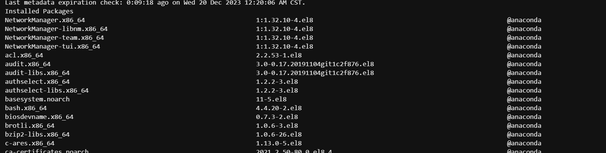

```shell
4. 查看已经安装的包
[root@centos8 ~]# yum list installed | less

5.只下载不安装
download：指定要下载包而不是安装它。
--downloadonly：告诉Yum仅下载包，不进行安装或更新。
--resolve：尝试解决包的依赖关系并下载它们，但不会安装这些依赖关系。
[root@centos8 home]# yum download --downloadonly --resolve cowsay --destdir=/root/
或者
[root@centos8 ~]# yum install cowsay --downloadonly --destdir=/root/

```

### 解决缺依赖问题

**安装httpd时候提示缺依赖：**

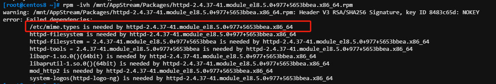

```bash
yum provides 可以根据路径查看来自哪个包
[root@centos8 ~]# yum provides /etc/mime.types

只知道文件名称不知道路径
[root@centos8 ~]# yum provides */mime.types

```

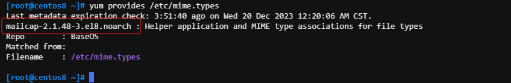

# 仓库缓存

```bash
[root@centos8 ~]# du -sh /var/cache/dnf/   centos7路径/var/cache/yum/
70M     /var/cache/dnf/

[root@centos8 ~]# yum clean all

缓存构建：
[root@centos8 ~]#yum makecache

```

# 实现私用 yum仓库

## 利用光盘制作yum仓库

```bash
1.关闭防火墙和selinux
[root@centos8 ~]# systemctl disable --now firewalld
[root@centos8 ~]# vim /etc/selinux/config 
SELINUX=disable

2.创建镜像存放位置并上传镜像
[root@centos8 ~]# mkdir /data/isos -pv
[root@centos8 ~]# ls /data/isos/
CentOS-7-x86_64-Everything-2009.iso  CentOS-8.5.2111-x86_64-dvd1_2.iso

3.下载http；并设置开机启动
[root@centos8 ~]# yum install httpd -y
[root@centos8 ~]# systemctl enable --now httpd

4.创建并挂载；
[root@centos8 ~]# mkdir /var/www/html/centos/{7,8} -pv
[root@centos8 ~]# mount /data/isos/CentOS-7-x86_64-Everything-2009.iso /var/www/html/centos/7
[root@centos8 ~]# mount /data/isos/CentOS-8.5.2111-x86_64-dvd1_2.iso /var/www/html/centos/8

5.浏览器输入访问 http://172.31.5.1/centos/
```

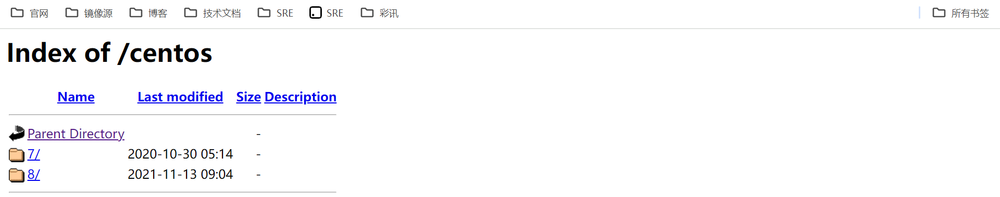

```bash
6.使用另外的centos7（172.31.4.1）测试
[root@localhost yum.repos.d]# cat test.repo 
[test]
name=test
baseurl=http://172.31.5.1/centos/$releasever/
gpgcheck=0
enabled=1

[root@localhost yum.repos.d]# yum repolist all
```

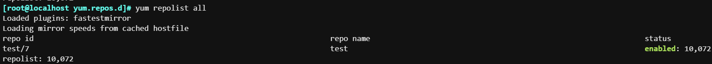

```bash
7. 测试下载
[root@localhost yum.repos.d]# yum install httpd -y
[root@localhost yum.repos.d]# yum info httpd
```

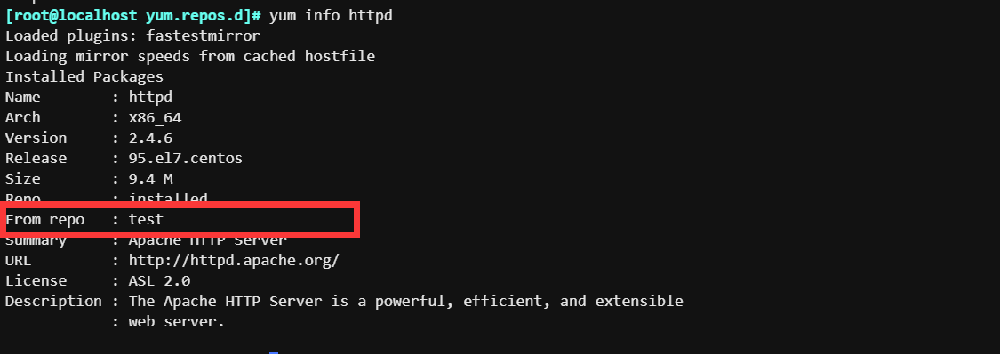

## 下载extras源，制作私有yum源

有一些仓库不是镜像提供的，需要下载并制作；前提是你作为服务的**需要提前配置好extras源，epel源同理。**

```bash
1. 前提配置好extras的yum
[root@centos8 yum.repos.d]# yum repolist
repo id                                                                         repo name
AppStream                                                                       AppStream
BaseOS                                                                          BaseOS
EPEL                                                                            EPEL
extras                                                                          extras

2.创建下载yum的路径和下载包
[root@centos8 ~]# mkdir /var/www/html/centos/extras_8 -pv
[root@centos8 ~]# yum reposync --repoid=extras --download-metadata -p  /var/www/html/centos/extras_8

3.查看extras的repodata数据路径
[root@centos8 ~]# ls /var/www/html/centos/extras_8/extras/
Packages  repodata

4.在172.31.4.1配置extras.repo
[root@localhost yum.repos.d]# cat extras.repo 
[extras]
name=extras
baseurl=http://172.31.5.1/centos/extras_8/extras/
gpgcheck=0
enabled=1

5.禁用所有repo并测试下载
yum --disablerepo=* --enablerepo=extras list available 
yum -y install epel-release

```

## 4.3 只有自己创建的rpm包，设置yum

```plsql
1. 准备一个rpm包
[root@centos8 ~]# mkdir /var/www/html/centos/litao =pv
[root@centos8 ~]# yum install tree --downloadonly --destdir=/var/www/html/centos/litao/
[root@centos8 ~]# ls /var/www/html/centos/litao/
tree-1.7.0-15.el8.x86_64.rpm

2. 创建repo，要在rpm包目录下面创建
[root@centos8 ~]# cd /var/www/html/centos/litao/
[root@centos8 litao]# createrepo .
[root@centos8 litao]# ls
repodata  tree-1.7.0-15.el8.x86_64.rpm
```

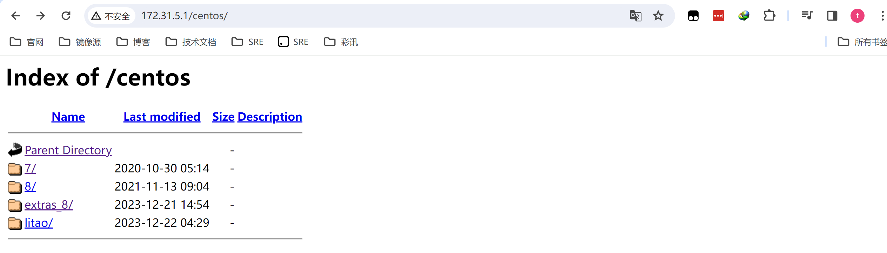

```plsql
3.使用172.31.4.1测试下载
[root@localhost yum.repos.d]# cat litao.repo 
[litao]
name=litao
baseurl=http://172.31.5.1/centos/litao/
gpgcheck=0
enabled=1

```

# 程序包编译

## C 语言源代码编译安装过程

1.  **. /configure**  
    (1) 通过选项传递参数，指定安装路径、启用特性等；执行时会参考用户的指定以及Makefile.in文件**生成Makefile文件  
    **(2)检查依赖到的外部环境，如依赖的软件包
2.  **make**  
    根据Makefile文件，会检测依赖的环境，进行构建应用程序，
3.  **make install**  
    复制文件到相应路径

注意：安装前可以通过查看README，INSTALL获取帮助

## 编译安装http

1.  下载源码包

```plsql
[root@localhost ~]# wget https://dlcdn.apache.org/httpd/httpd-2.4.58.tar.gz -P /usr/local/src
```

2.  解压源码包

```plsql
[root@localhost src]# cd /usr/local/src/
[root@localhost src]# tar -zxvf httpd-2.4.58.tar.gz 
```

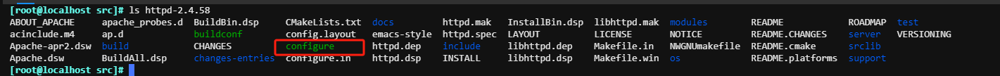

3.  执行. /configure --help 和 cat INSTALL（安装方法和步骤）

> 默认安装路径为 /usr/local/apache2

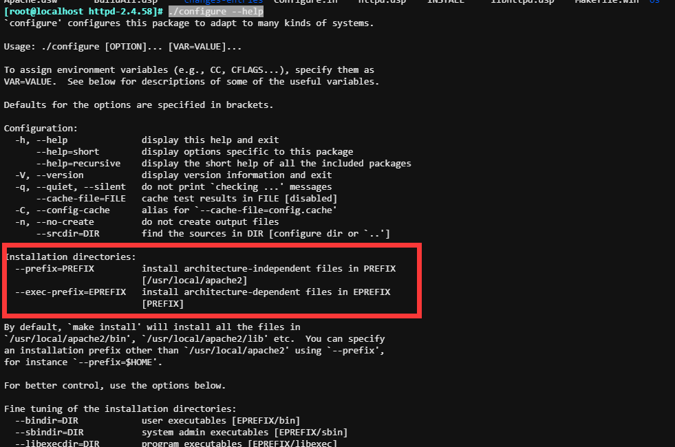

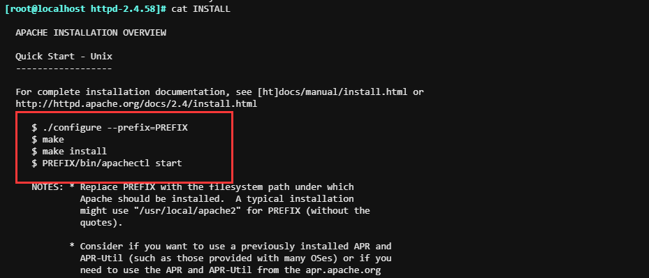

4.  执行编译

```plsql
./configure --prefix=/apps/httpd    这里的路径没有的话，会自动生成
```

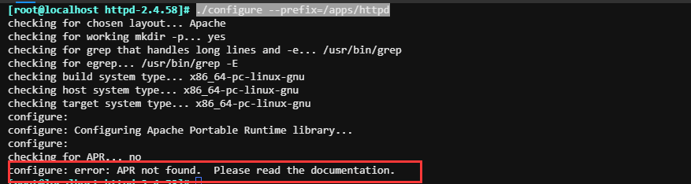

```plsql
 yum install apr-devel     不论提示什么都在后面加 -devel，并且小写；
 安装完成后再次执行  
 ./configure --prefix=/apps/httpd
 
```

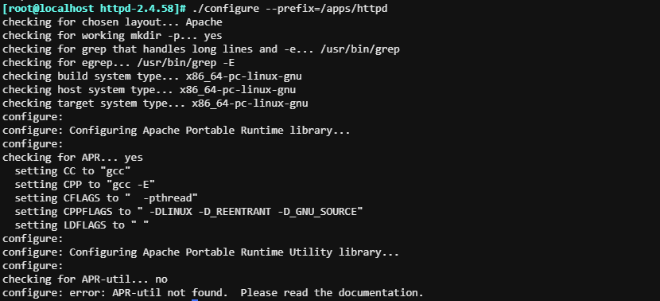

```plsql
提示报错：configure: error: APR-util not found.  Please read the documentation.
yum install apr-util-devel -y
 ./configure --prefix=/apps/httpd
```

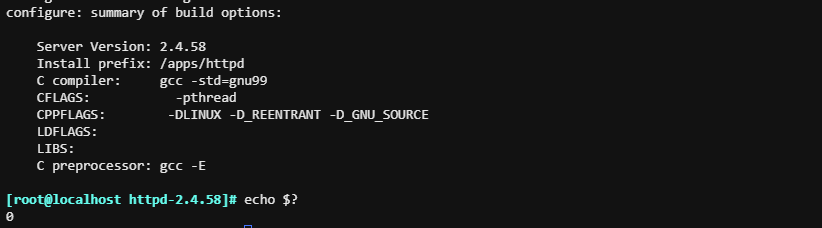

查看生成了makefile文件

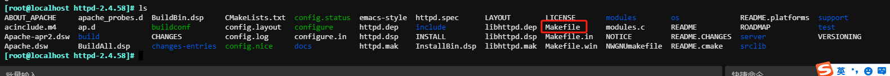

5.  执行make

> 正常流程是应该把编译所依赖的包安装上去后再执行./configure；如发现不可排查问题，可以先把目录删除了然后重新解压源码包进行再次的安装。
> 
> 如发现提示：“no such file or directory”的提示，可以使用yum provides查询所依赖的包进行安装

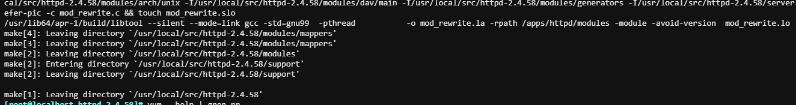

生成可执行文件http

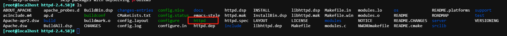

6.  执行make install

> ./configure --prefix=/apps/httpd 的路径会自动生成

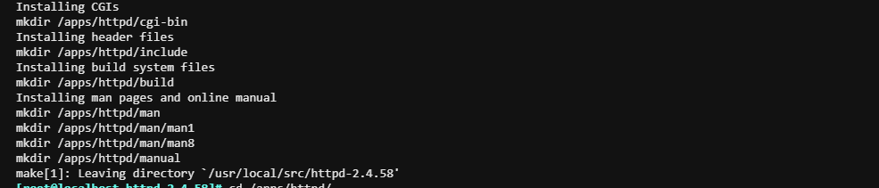

7.  添加环境变量 启动

```plsql
根据INSTALL文件启动方法为：$ PREFIX/bin/apachectl start
或者
[root@localhost httpd-2.4.58]# echo 'PATH=/apps/httpd/bin/:$PATH' > /etc/profile.d/httpd.sh
[root@localhost httpd-2.4.58]# . /etc/profile.d/httpd.sh 
[root@localhost httpd-2.4.58]# echo $PATH
/apps/httpd/bin/:/usr/local/sbin:/usr/local/bin:/usr/sbin:/usr/bin:/root/bin

两次TAB建就出来了
[root@localhost httpd-2.4.58]# ap    
apachectl           applygnupgdefaults  apr-1-config        apropos          
```

8.  创建组和用户、修改配置文件

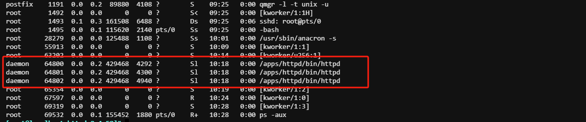

```plsql
groupadd -g 88 -r apache
useradd -u 88 -r -g apache -d /apps/httpd -s /sbin/nologin apache
```
```plsql
[root@localhost httpd-2.4.58]# vim  /apps/httpd/conf/httpd.conf 
User apache
Group apache
```

9.  启动

```plsql
apachectl -k restart
```

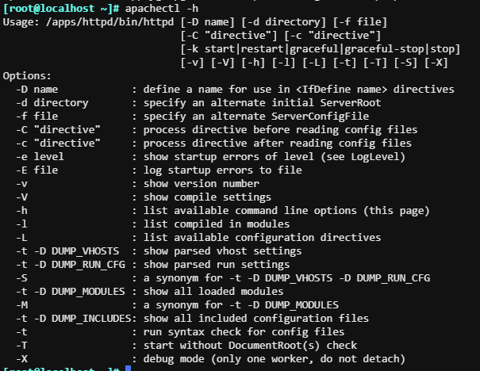

​  

​