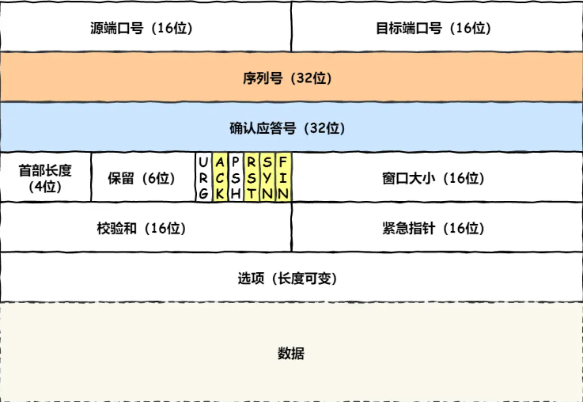
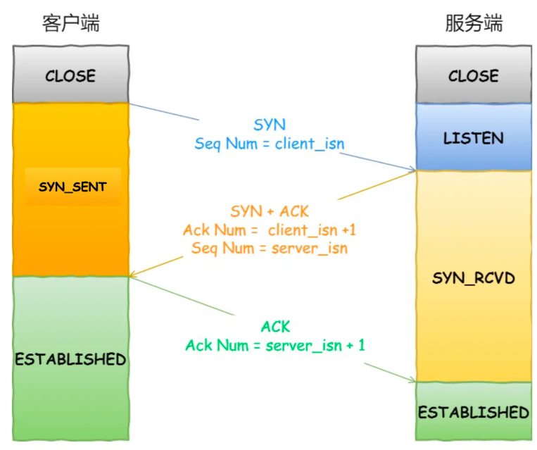
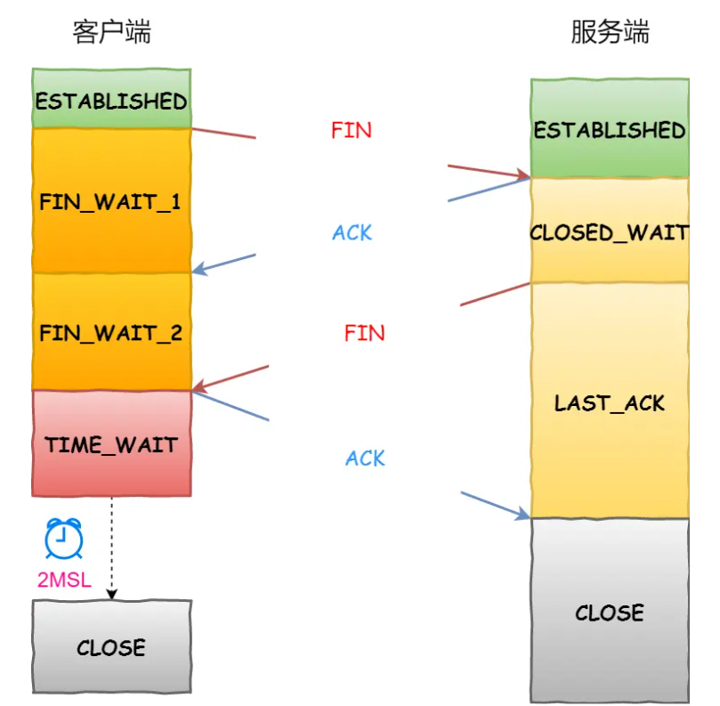
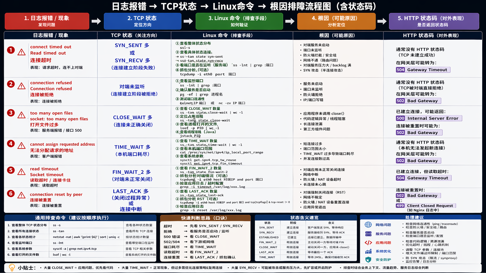

# TCP 头部



# TCP 连接建立

## TCP 三次握手过程是怎样的？



## TCP 四次挥手过程是怎样的？



# 运维最常见的几种异常状态

## TIME\_WAIT 过多

服务器出现大量 TIME\_WAIT 状态的原因有哪些？

-   HTTP 没有使用长连接
-   HTTP 长连接超时
-   HTTP 长连接的请求数量达到上限

## CLOSE\_WAIT 很多（❗最危险）

-   代码bug
-   线程卡死
-   IO阻塞

  

排查思路

```plain
netstat -nat | grep CLOSE_WAIT | wc -l
```

定位进程：

```plain
ss -anp | grep CLOSE_WAIT
```

👉 找到 PID 后：

```plain
lsof -p PID
```

👉 看线程：

```plain
top -Hp PID
```

👉 Java：

```plain
jstack PID
```

✔️ 结论：👉 **CLOSE\_WAIT 多 = 程序问题，不是内核问题**

---

## ​ **FIN\_WAIT\_2 很多**

👉 **表示：****对方没发 FIN**

**原因：**

-   **对端程序没关闭**
-   **网络异常**

**一般不用太管，但多了说明：  
**👉 **对端服务不规范**

---

## ​**LAST\_ACK 堆积**

👉 **表示：****服务端在等最后 ACK**

**原因：**

-   **客户端没响应**
-   **网络丢包**

# 这些连接数过多，会有什么影响

| 资源 | 被谁影响 |
| --- | --- |
| FD耗尽 | CLOSE_WAIT / TIME_WAIT |
| 端口耗尽 | TIME_WAIT（客户端） |
| 内存上涨 | 所有连接 |
| CPU升高 | 重传 / 大量连接 |
| 新连接失败 | SYN_RECV / FD满 |

常见报错

| TCP状态异常 | 接口表现 | 常见报错 |
| --- | --- | --- |
| SYN_SENT 多 | 连不上对端 | connection timeout / No route to host |
| SYN_RECV 多 | 服务端接不住 | connection timeout |
| CLOSE_WAIT 多 | 服务端资源耗尽 | too many open files / connection reset |
| TIME_WAIT 多 | 端口耗尽 | cannot assign requested address |
| FIN_WAIT_2 多 | 连接卡住 | read timeout |
| LAST_ACK 多 | 关闭异常 | connection reset |

常见报错和状态

| 报错 | TCP阶段 | HTTP状态码 |
| --- | --- | --- |
| connect timed out | 未建立 | ❌ 无 |
| connection refused | 未建立 | ❌ 无 / 502 |
| too many open files | 建立失败/处理中 | 500 / ❌ |
| cannot assign requested address | 本机失败 | ❌ |
| connection reset | 中断 | 499 / 502 |

  

