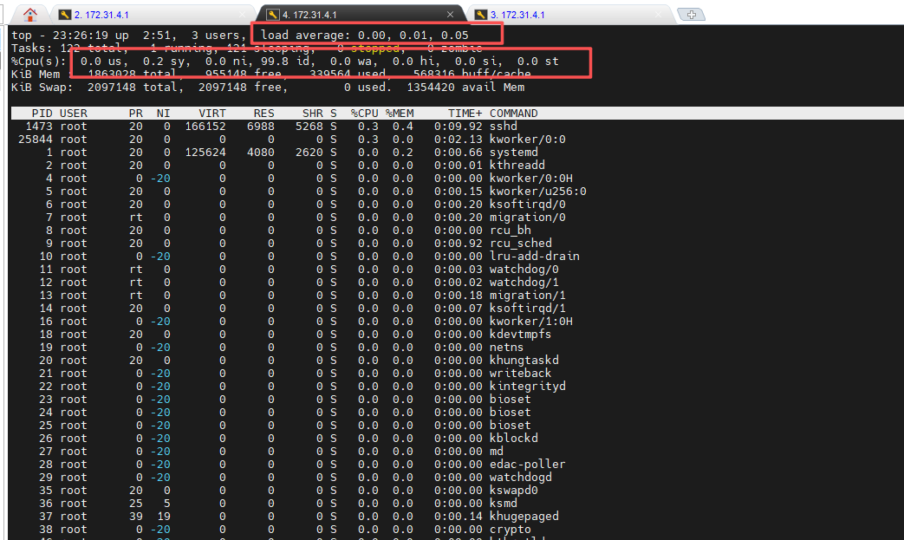
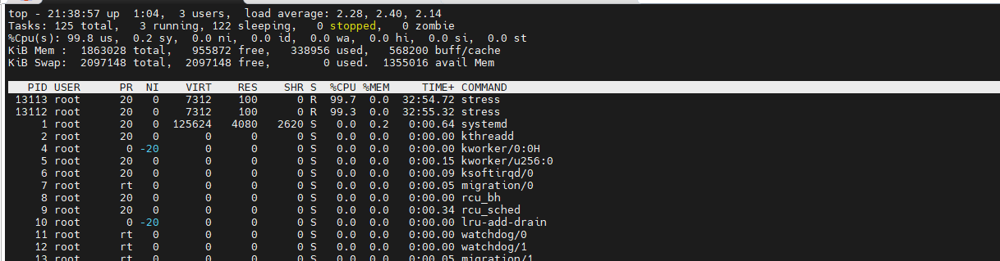
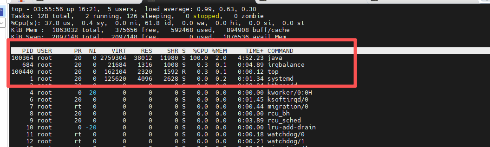
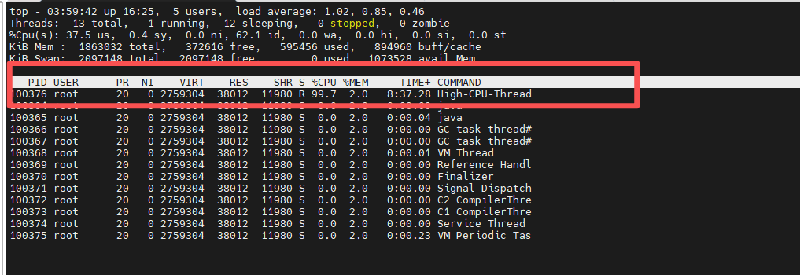

# CPU

1.  查看 CPU

```bash
# 查看逻辑 CPU 总数（包括超线程）
grep -c processor /proc/cpuinfo

# 查看物理核心数
grep 'core id' /proc/cpuinfo | sort -u | wc -l
```

# top 命令

| 按键 | 作用 |
| --- | --- |
| P | 按CPU排序 |
| M | 按内存排序 |
| k | 杀进程 |
| q | 退出 |



### 重点关注的值

1.  CPU 负载

```bash
load average: 0.00, 0.01, 0.05    -- 1分钟   10分钟  15分钟负载

CPU 使用率超 70% 需预警，超 90% 要紧急处理；负载平均值超 CPU 核心数两倍为严重异常。
```

2.  看 CPU 使用率

```bash
%Cpu(s):  us sy ni id wa hi si st

字段	含义
us	用户CPU
sy	系统CPU
id	空闲
wa	IO等待（重点）
st  被偷走的CPU

wa 50%   磁盘IO被打爆了
us 90%   应用代码在疯狂消耗CPU，查程序问题
sy 10%   磁盘IO、网络、内核频繁操作
id       id越大越闲，id很低，说明CPU忙爆了
st > 5%   说明云主机超配，邻居抢你资源
```

3.  常见字段

```yaml
PID USER PR NI VIRT RES SHR S %CPU %MEM TIME+ COMMAND
| 字段      | 含义      | 重点程度  |
| ------- | ------- | ----- |
| PID     | 进程ID    | ⭐     |
| USER    | 进程所属用户  | ⭐     |
| PR      | 进程优先级   | ⭐⭐    |
| NI      | nice值   | ⭐⭐    |
| VIRT    | 虚拟内存    | ⭐⭐⭐   |
| RES     | 实际物理内存  | ⭐⭐⭐⭐⭐ |
| SHR     | 共享内存    | ⭐⭐    |
| S       | 进程状态    | ⭐⭐⭐   |
| %CPU    | CPU使用率  | ⭐⭐⭐⭐⭐ |
| %MEM    | 内存占比    | ⭐⭐⭐⭐⭐ |
| TIME+   | 累计CPU时间 | ⭐⭐⭐   |
| COMMAND | 进程名     | ⭐⭐⭐   |
```

# 实验

## CPU 问题排查实例

1.  先启动一个吃CPU的程序

```bash
yum install -y epel-release
yum install -y stress

2个线程疯狂吃CPU
stress --cpu 2
```

2.  使用`top`查看 CPU 高的进程；按 `P`可以从大小排序



3.  使用`ps -ef` 查看使用率高的进程

```bash

[root@zk1 ~]# ps -ef | grep stress
root      13111   6845  0 21:05 pts/1    00:00:00 stress --cpu 2
root      13112  13111 99 21:05 pts/1    00:37:39 stress --cpu 2
root      13113  13111 99 21:05 pts/1    00:37:39 stress --cpu 2

```

4.  杀死进程

```bash
kill -9 13111 13112  13113
```

## Java某个线程死循环 导致CPU飙高

1.  模拟程序

```bash
创建目录
mkdir /root/cpu-test
cd /root/cpu-test

模拟程序
vim HighCPU.java
public class HighCPU {

    public static void main(String[] args) {

        Thread t1 = new Thread(() -> {

            while (true) {

                // 死循环
            }

        }, "High-CPU-Thread");

        t1.start();
    }
}

编译
javac HighCPU.java

运行
java HighCPU
```

2.  使用`top`观察 CPU 很高



3.  查看线程

```bash
top -Hp 100364

-H 线程
-p 进程
```



这里的 100376 就是高 CPU 线程

4.  转换线程ID为16进制（关键）

```bash
[root@localhost ~]# printf "%x\n" 100376
18818
```

5.  使用 jstack 定位代码

```bash
jstack 12345 > /tmp/jstack.log
```

# CPU 固定排查思路

先执行：

```plain
top
top -Hp PID
```

找到线程后：

```plain
printf "%x\n" TID
```

再：

```plain
jstack PID > stack.log
```

搜索：

```plain
 在 jstack.txt 中搜索  nid=0x线程ID
```